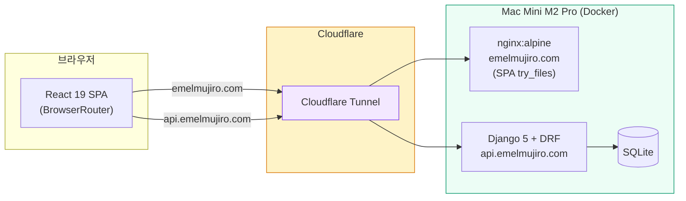

# 에멜무지로 (Emelmujiro) - AI 교육 & 컨설팅 플랫폼

<div align="center">

[](https://github.com/researcherhojin/emelmujiro/actions/workflows/main-ci-cd.yml)
[](https://www.typescriptlang.org/)
[](LICENSE)

**[Live Site](https://emelmujiro.com)** | **[Report Bug](https://github.com/researcherhojin/emelmujiro/issues)**

</div>

## 프로젝트 개요

**에멜무지로**는 2022년부터 축적한 AI 교육 노하우와 실무 프로젝트 경험을 바탕으로, 기업 맞춤형 AI 솔루션을 제공하는 전문 컨설팅 플랫폼입니다.

### 핵심 서비스

- **AI 교육 & 강의** - 기업 맞춤 AI 교육 프로그램 설계 및 운영
- **AI 컨설팅** - AI 도입 전략 수립부터 기술 자문까지
- **LLM/생성형 AI** - LLM 기반 서비스 설계 및 개발
- **Computer Vision** - 영상 처리 및 비전 AI 솔루션

## 현재 상태 (v0.9.10)

| 항목       | 상태    | 세부사항                                                   |
| ---------- | ------- | ---------------------------------------------------------- |
| **빌드**   | ✅ 정상 | Vite 8 (oxc/rolldown) 빌드                                 |
| **CI/CD**  | ✅ 정상 | GitHub Actions (Node 24, Python 3.12) ~2분                 |
| **테스트** | ✅ 통과 | Frontend 1048 통과 (67 파일), Backend 90 통과              |
| **타입**   | ✅ 100% | TypeScript Strict Mode                                     |
| **보안**   | ✅ 안전 | 취약점 0건                                                 |
| **배포**   | ✅ 정상 | Mac Mini Docker + Cloudflare Tunnel (프론트 + 백엔드 통합) |
| **도메인** | ✅ 활성 | `emelmujiro.com` (프론트) + `api.emelmujiro.com` (백엔드)  |

## 빠른 시작

```bash
# 설치
git clone https://github.com/researcherhojin/emelmujiro.git
cd emelmujiro
npm install

# 실행
npm run dev              # 전체 실행 (Frontend + Backend)
npm run dev:clean        # 포트 정리 후 실행

# 접속
# Frontend: http://localhost:5173
# Backend: http://localhost:8000
```

### 백엔드 (별도 설치 필요)

```bash
cd backend
uv sync                  # 의존성 설치 (uv 필요)
uv run python manage.py migrate
uv run python manage.py runserver
```

## 기술 스택

**Frontend**<br/>


**Testing**<br/>


**Backend**<br/>


**Infra**<br/>


## 아키텍처

### 시스템 구성도



### 핵심 설계 결정

| 영역           | 선택                                                                | 이유                                                            |
| -------------- | ------------------------------------------------------------------- | --------------------------------------------------------------- |
| 라우팅         | `createBrowserRouter` + `React.lazy`                                | 클린 URL (`/about`), nginx `try_files` SPA 폴백, 코드 스플리팅  |
| 상태 관리      | React Context 5개 (UI, Auth, Blog, Form, Chat)                      | `useMemo`/`useCallback`으로 리렌더 방지, 외부 라이브러리 불필요 |
| API 클라이언트 | Axios + Mock/Real 자동 전환                                         | `VITE_API_URL` 유무로 결정, httpOnly 쿠키 JWT, 401 자동 갱신    |
| i18n           | `react-i18next` + 크롤러 한국어 강제                                | 브라우저 언어 감지, SEO 봇은 `htmlTag`(`ko`) 고정               |
| 테스트         | Vitest (1048) + Playwright E2E (5 spec)                             | 전역 모킹(`setupTests.ts`) + `renderWithProviders` 자동화       |
| 빌드           | sitemap → `tsc` → Vite 8 (oxc/rolldown)                             | 프로덕션 시 `console`/`debugger` 자동 제거                      |
| 배포           | 프론트 + 백엔드: Mac Mini (Docker + Cloudflare Tunnel)              | 전체 자체 호스팅으로 비용 최소화, nginx SPA 라우팅 200 보장     |
| Provider 계층  | `HelmetProvider > ErrorBoundary > UI > Auth > Blog > Form > Router` | ChatProvider는 under construction으로 제외                      |

### 프로젝트 구조

```
emelmujiro/
├── frontend/               # React 19 + TypeScript + Vite + Tailwind 3.x
│   ├── src/
│   │   ├── components/     # common/ home/ blog/ chat/ layout/ pages/ profile/
│   │   ├── contexts/       # React Context 5개 (UI, Auth, Blog, Form, Chat)
│   │   ├── services/       # API 클라이언트 (Mock + Real, Axios)
│   │   ├── i18n/           # 다국어 (ko/en JSON)
│   │   ├── config/         # 환경변수 (env.ts)
│   │   ├── hooks/          # useScrollAnimation, useDebounce 등
│   │   ├── data/           # 정적 데이터 (blogPosts, services, footerData)
│   │   ├── types/          # TypeScript 타입 정의
│   │   ├── utils/          # logger, sentry, webVitals
│   │   └── test-utils/     # renderWithProviders, MSW
│   ├── e2e/                # Playwright E2E 테스트 (5 spec)
│   └── vitest.config.ts
├── backend/                # Django 5 + DRF + JWT
│   ├── api/                # 단일 앱: models, views, serializers, urls
│   ├── config/             # settings.py, urls.py, asgi.py
│   └── pyproject.toml      # uv 의존성 관리
├── .github/workflows/      # main-ci-cd.yml, pr-checks.yml
├── docker-compose.yml      # 프로덕션 (backend + SQLite, PostgreSQL은 --profile postgres)
└── docker-compose.dev.yml  # 개발 (hot-reload)
```

## 주요 기능

| 기능                 | 상태           | 설명                                              |
| -------------------- | -------------- | ------------------------------------------------- |
| **홈페이지**         | ✅ 완료        | Hero, 서비스 소개, 통계, CTA                      |
| **프로필**           | ✅ 완료        | CEO 경력/학력/프로젝트 포트폴리오                 |
| **다크 모드**        | ✅ 완료        | 시스템 설정 연동                                  |
| **다국어 (i18n)**    | ✅ 완료        | 전체 컴포넌트 i18n 전환 완료 (ko/en)              |
| **반응형**           | ✅ 완료        | 모바일/태블릿/데스크톱 최적화                     |
| **SEO**              | ✅ 완료        | React Helmet, 사이트맵, 구조화 데이터             |
| **블로그**           | ✅ 활성        | 실제 백엔드 API 연동 (Mac Mini)                   |
| **문의하기**         | ✅ Google Form | Google Form 임베드 (자동 메일 설정 TODO)          |
| **JWT 인증**         | ✅ 완료        | httpOnly 쿠키 기반 JWT (XSS 방어 강화)            |
| **관리자 대시보드**  | ✅ 완료        | 실제 백엔드 API 연동 (통계 + 콘텐츠 관리)         |
| **Google Analytics** | ✅ 완료        | 페이지 뷰 + CTA 클릭 추적 (`VITE_GA_TRACKING_ID`) |
| **Sentry**           | ✅ 준비 완료   | ErrorBoundary 연동 완료, DSN 설정만 하면 활성화   |
| **실시간 채팅**      | ⏸️ 1.0 이후    | WebSocket/Redis 필요, 1.0 범위에서 제외           |

## 주요 명령어

| 명령어                   | 설명                                              |
| ------------------------ | ------------------------------------------------- |
| `npm run dev`            | 개발 서버 시작                                    |
| `npm run build`          | 프로덕션 빌드 (sitemap → tsc → vite)              |
| `npm test`               | 테스트 실행 (watch)                               |
| `npm run test:run`       | 테스트 단일 실행                                  |
| `npm run test:ci`        | CI 테스트 실행                                    |
| `npm run deploy`         | GitHub Pages 수동 배포 (백업, 현재 Mac Mini 사용) |
| `npm run type-check`     | TypeScript 체크                                   |
| `npm run lint:fix`       | ESLint 자동 수정                                  |
| `npm run validate`       | lint + type-check + test                          |
| `npm run test:coverage`  | 테스트 커버리지 리포트                            |
| `npm run analyze:bundle` | 번들 크기 분석                                    |

### 백엔드 명령어

| 명령어                              | 설명                        |
| ----------------------------------- | --------------------------- |
| `uv sync`                           | 의존성 설치                 |
| `uv run python manage.py runserver` | 개발 서버                   |
| `uv run python manage.py test`      | 테스트 실행                 |
| `uv run black .`                    | 코드 포맷 (line-length 120) |
| `uv run flake8 .`                   | 린트                        |
| `uv run isort .`                    | import 정렬                 |
| `uv run ruff check .`               | 빠른 린트                   |

### Makefile 단축 명령어

| 명령어            | 설명                  |
| ----------------- | --------------------- |
| `make install`    | 전체 의존성 설치      |
| `make dev-local`  | 로컬 개발 서버        |
| `make dev-docker` | Docker 개발 환경      |
| `make test`       | 프론트/백 전체 테스트 |
| `make lint`       | 프론트/백 전체 린트   |

## 앞으로 할 것

> **1.0 범위**: Blog ✅ + Contact (Google Form) ✅ + Auth (httpOnly JWT) ✅ + Admin Dashboard ✅ — 남은: A1, A4, B4 | **1.0 이후**: 실시간 채팅, Notification, SSG

| #   | 작업                           | 우선순위 | 설명                                                                      |
| --- | ------------------------------ | -------- | ------------------------------------------------------------------------- |
| A1  | **Google Form 자동 메일 설정** | 높음     | Apps Script 트리거 등록 → 신청자 확인 메일 + 운영자 알림 메일 (하단 참조) |
| A4  | **OG 이미지 제작**             | 낮음     | 1200x630 전용 이미지 디자인 (현재 `logo512.png` 사용 중)                  |
| B4  | **이메일 발송 연동**           | 중간     | Contact 폼 SMTP/SendGrid 연동 (현재 Google Form 임베드 사용 중)           |
| D8  | **SiteVisit cron 실제 등록**   | 낮음     | `scripts/cleanup-sitevisits.sh` 작성 완료, Mac Mini crontab 등록 필요     |
| C2  | **SSG / Prerendering**         | 장기     | 정적 HTML 생성 → 크롤러 완성된 HTML 수신 (react-snap 또는 Next.js)        |
| C3  | **`hreflang` 다국어 SEO**      | 장기     | `/ko/about`, `/en/about` + `hreflang` 태그                                |
| C4  | **실시간 채팅**                | 1.0 이후 | WebSocket/Redis/Channels 구현, `ChatWidget` AppLayout 복원                |
| C5  | **Notification 모델**          | 1.0 이후 | `consumers.py` 스텁 → Django 모델 + REST API + WebSocket 핸들러           |

<details>
<summary>Mac Mini vs 클라우드 비교</summary>

| 항목      | Mac Mini (선택)                      | 클라우드 (AWS/GCP 등)    |
| --------- | ------------------------------------ | ------------------------ |
| 월 비용   | 전기세만 (~₩3,000~5,000)             | 월 ₩30,000~수십만원      |
| 성능      | M2 Pro + 32GB (클라우드 ₩100,000+급) | 돈 내는 만큼 확장        |
| 안정성    | 정전/인터넷 끊김에 취약 (UPS 권장)   | 99.9% 가용성             |
| 외부 접근 | Cloudflare Tunnel (무료, HTTPS 자동) | 기본 제공                |
| 확장성    | 트래픽 폭증 시 한계                  | 자동 확장 가능           |
| 적합 용도 | 개인 프로젝트, 소규모 서비스         | 상용 서비스, 글로벌 대상 |

**현재 선택 이유**: 개인 프로젝트 + 소규모 트래픽 + 비용 최소화. SQLite로 운영 부담 최소화 (DB 컨테이너 불필요, 백업은 파일 복사 한 줄). 서비스가 커지면 같은 Docker 이미지를 클라우드에 올리고 `DATABASE_URL`만 바꿔 PostgreSQL로 전환 가능.

</details>

## 배포 가이드

<details>
<summary>Mac Mini 보안 체크리스트 (클릭하여 펼치기)</summary>

> Mac Mini를 외부에 노출하면 보안이 중요합니다. Cloudflare Tunnel을 사용하면 공유기 포트를 열 필요가 없어 공격 표면이 크게 줄어들지만, 아래 항목들을 반드시 점검해야 합니다.

#### 네트워크 보안

| 항목                    | 설정                                   | 이유                                                           |
| ----------------------- | -------------------------------------- | -------------------------------------------------------------- |
| **포트 직접 노출 금지** | 공유기 포트포워딩 사용하지 않음        | Cloudflare Tunnel만 사용하면 외부에서 Mac Mini IP를 알 수 없음 |
| **DDoS 방어**           | Cloudflare 기본 제공                   | 터널 경유 트래픽은 Cloudflare 프록시를 거침                    |
| **macOS 방화벽**        | 시스템 설정 → 네트워크 → 방화벽 → 켜기 | 불필요한 인바운드 연결 차단                                    |
| **공유기 방화벽**       | 외부 → 내부 차단 기본값 유지           | 포트포워딩 설정 절대 하지 않음                                 |

#### SSH 보안

| 항목                    | 설정                                                   | 이유                                             |
| ----------------------- | ------------------------------------------------------ | ------------------------------------------------ |
| **키 기반 인증만 허용** | `/etc/ssh/sshd_config`에서 `PasswordAuthentication no` | 브루트포스 공격 차단                             |
| **root 로그인 금지**    | `PermitRootLogin no`                                   | 기본값이지만 확인 필수                           |
| **SSH 포트**            | 기본 22번 유지 (외부 미노출이므로)                     | Cloudflare Tunnel 경유 시 SSH도 터널로 접근 가능 |

```bash
# MacBook에서 SSH 키 생성 (아직 없는 경우)
ssh-keygen -t ed25519 -C "your-email@example.com"

# Mac Mini에 공개키 복사
ssh-copy-id user@mac-mini.local

# Mac Mini에서 비밀번호 로그인 비활성화
sudo sed -i '' 's/#PasswordAuthentication yes/PasswordAuthentication no/' /etc/ssh/sshd_config
sudo launchctl stop com.openssh.sshd
sudo launchctl start com.openssh.sshd
```

#### 애플리케이션 보안

| 항목                     | 설정                                    | 이유                                   |
| ------------------------ | --------------------------------------- | -------------------------------------- |
| **SECRET_KEY**           | `secrets.token_urlsafe(50)` 이상        | 약한 키는 세션 위조/CSRF 우회 가능     |
| **DEBUG=False**          | 프로덕션 필수                           | True일 경우 스택 트레이스, 설정값 노출 |
| **ALLOWED_HOSTS**        | `api.emelmujiro.com` 만 허용            | Host 헤더 공격 방지                    |
| **CORS**                 | `emelmujiro.com` 만 허용                | 임의 도메인에서 API 호출 차단          |
| **CSRF_TRUSTED_ORIGINS** | CORS와 동일                             | Django CSRF 검증                       |
| **Rate Limiting**        | 이미 구현됨 (anon 100/hr, contact 5/hr) | 무차별 대입 방지                       |
| **HTTPS 강제**           | Cloudflare Tunnel이 자동 처리           | 평문 통신 차단                         |

#### Docker 보안

| 항목                  | 설정                                                                | 이유                         |
| --------------------- | ------------------------------------------------------------------- | ---------------------------- |
| **SQLite 파일 보호**  | Docker 볼륨(`sqlite_data`)에 저장, 컨테이너 외부에서 직접 접근 불가 | DB 파일 변조 방지            |
| **non-root 컨테이너** | Dockerfile에서 `USER appuser` (이미 적용됨)                         | 컨테이너 탈출 시 피해 최소화 |
| **이미지 업데이트**   | 정기적으로 `docker compose pull && docker compose up -d`            | 베이스 이미지 보안 패치      |
| **볼륨 백업**         | `sqlite_data` 볼륨 정기 백업                                        | 데이터 유실 방지             |

```bash
# SQLite 백업 (cron 등록 권장) — 파일 하나 복사하면 끝
docker cp emelmujiro-backend:/app/data/db.sqlite3 ~/backups/emelmujiro_$(date +%Y%m%d).sqlite3
```

#### 물리/운영 보안

| 항목                     | 설정                                                  | 이유                            |
| ------------------------ | ----------------------------------------------------- | ------------------------------- |
| **UPS (무정전전원장치)** | 소형 UPS 연결                                         | 정전 시 DB 손상 방지, 안전 종료 |
| **자동 업데이트**        | macOS 자동 업데이트 활성화                            | OS 보안 패치                    |
| **FileVault**            | 시스템 설정 → 개인 정보 보호 및 보안 → FileVault 켜기 | 디스크 암호화 (도난 대비)       |
| **자동 잠금**            | 화면 보호기 + 즉시 암호 요구                          | 물리적 접근 차단                |

</details>

<details>
<summary>개발/배포 워크플로우 (클릭하여 펼치기)</summary>

> **원칙**: 코드 작업은 MacBook에서, Mac Mini는 배포만 담당. Mac Mini에서 직접 코드를 수정하지 않음.

```
MacBook (개발)                          Mac Mini (배포)
┌─────────────────────┐                ┌───────────────────────────────┐
│ 코드 작성/테스트     │                │ git pull                      │
│ git push → GitHub   │───────────────→│ npm run build (frontend)      │
│ CI 통과 확인        │                │ docker compose up -d (backend)│
└─────────────────────┘                └───────────────────────────────┘
                                                │
                                                ▼
                                        Cloudflare Tunnel
                                        ├── emelmujiro.com → nginx:8080
                                        └── api.emelmujiro.com → Django:8000
```

**배포 과정:**

1. MacBook에서 코드 작성, 테스트, `git push`
2. GitHub Actions CI 통과 확인
3. Mac Mini에서 프론트엔드 + 백엔드 업데이트:

```bash
# 프론트엔드 업데이트 (nginx가 build/ 볼륨 마운트 → 컨테이너 재시작 불필요)
cd ~/workspace/emelmujiro/frontend
git pull && VITE_API_URL=https://api.emelmujiro.com/api npm run build

# 백엔드 업데이트 (코드 변경 시)
cd ~/workspace/emelmujiro
docker compose up -d --build
```

</details>

<details>
<summary>Mac Mini 배포 가이드 (클릭하여 펼치기)</summary>

### Phase 1: Mac Mini 기본 세팅

```bash
# 1. SSH 활성화
# 시스템 설정 → 일반 → 공유 → 원격 로그인 켜기

# 2. Docker Desktop 설치
# https://www.docker.com/products/docker-desktop/ 에서 Apple Silicon 버전 다운로드

# 3. 프로젝트 클론
git clone https://github.com/researcherhojin/emelmujiro.git
cd emelmujiro

# 4. 환경변수 설정
cp backend/.env.example backend/.env
# backend/.env 편집 — SECRET_KEY 생성, ALLOWED_HOSTS 등 설정

# 5. Docker Compose 실행 (SQLite — DB 컨테이너 불필요)
SECRET_KEY=$(python3 -c "import secrets; print(secrets.token_urlsafe(50))") \
docker compose up -d

# 6. DB 마이그레이션 + 관리자 계정
docker exec emelmujiro-backend uv run python manage.py migrate
docker exec -it emelmujiro-backend uv run python manage.py createsuperuser

# 7. 동작 확인
curl http://localhost:8000/api/health/

# 참고: PostgreSQL이 필요해지면 프로필로 추가 가능
# docker compose --profile postgres up -d
# DATABASE_URL=postgresql://postgres:postgres@db:5432/emelmujiro
```

### Phase 2: Cloudflare Tunnel (외부 접근)

```bash
# 1. cloudflared 설치
brew install cloudflared

# 2. Cloudflare 로그인
cloudflared tunnel login

# 3. 터널 생성
cloudflared tunnel create emelmujiro

# 4. DNS 연결
cloudflared tunnel route dns emelmujiro api.emelmujiro.com
cloudflared tunnel route dns emelmujiro emelmujiro.com

# 5. 설정 파일 (~/.cloudflared/config.yml)
cat > ~/.cloudflared/config.yml << 'EOF'
tunnel: <터널 ID>
credentials-file: ~/.cloudflared/<터널 ID>.json

ingress:
  - hostname: api.emelmujiro.com
    service: http://localhost:8000
  - hostname: emelmujiro.com
    service: http://localhost:8080
  - service: http_status:404
EOF

# 6. 시스템 config에 복사
sudo cp ~/.cloudflared/config.yml /etc/cloudflared/config.yml

# 7. 서비스 등록 (자동 시작)
sudo cloudflared service install

# 8. 터널 재시작
sudo launchctl kickstart -k system/com.cloudflare.cloudflared
```

### Phase 3: 프론트엔드 배포 (nginx)

```bash
# 1. 프론트엔드 빌드
cd ~/workspace/emelmujiro/frontend
VITE_API_URL=https://api.emelmujiro.com/api npm run build

# 2. nginx 컨테이너 시작 (build/ 볼륨 마운트)
docker run -d \
  --name emelmujiro-frontend \
  --restart unless-stopped \
  --network emelmujiro_emelmujiro-network \
  --network-alias frontend \
  -p 8080:80 \
  -v $(pwd)/build:/usr/share/nginx/html:ro \
  -v $(pwd)/nginx.conf:/etc/nginx/nginx.conf:ro \
  nginx:alpine

# 3. 확인 (모든 SPA 라우트가 200 반환)
curl -s -o /dev/null -w "%{http_code}" https://emelmujiro.com/about  # → 200
```

> **업데이트 시**: `git pull && VITE_API_URL=https://api.emelmujiro.com/api npm run build`만 실행하면 nginx가 즉시 반영 (컨테이너 재시작 불필요)

### Phase 4: 운영

```bash
# Docker 자동 시작 (Docker Desktop → Settings → General → Start Docker Desktop when you sign in)

# UPS(무정전전원장치) 연결 권장 — 정전 시 안전 종료

# 상태 확인
docker ps  # emelmujiro-backend, emelmujiro-frontend 확인
curl https://api.emelmujiro.com/api/health/
curl -s -o /dev/null -w "%{http_code}" https://emelmujiro.com/about

# MacBook에서 접근 (같은 네트워크)
# http://mac-mini.local:8080/ (프론트엔드)
# http://mac-mini.local:8000/api/health/ (백엔드)
```

### 커스텀 도메인 (✅ 완료)

- Cloudflare Tunnel DNS: `emelmujiro.com` → Mac Mini nginx (`:8080`)
- Cloudflare Tunnel DNS: `api.emelmujiro.com` → Mac Mini Django (`:8000`)
- `frontend/src/utils/constants.ts` → `SITE_URL = 'https://emelmujiro.com'`
- `frontend/public/CNAME` → `emelmujiro.com` (GitHub Pages 백업용)
- `vite.config.ts` → `base: '/'`

</details>

<details>
<summary>자동 배포 — GitHub Actions → Mac Mini Webhook (클릭하여 펼치기)</summary>

GitHub에 push → CI 통과 → Mac Mini에 자동 배포. Webhook 서버가 배포 요청을 수신하고 `auto-deploy.sh` 실행.

- **Webhook 서버**: `scripts/deploy-webhook.js` (Node.js, 포트 9000, 의존성 없음)
- **배포 스크립트**: `scripts/auto-deploy.sh` (git pull → frontend build → backend rebuild)
- **인증**: `X-Deploy-Secret` 헤더 + `DEPLOY_SECRET` 환경변수 (timing-safe 비교)

#### Mac Mini 초기 설정 (1회)

```bash
# 1. 배포 시크릿 생성
export DEPLOY_SECRET=$(python3 -c "import secrets; print(secrets.token_urlsafe(32))")
echo "DEPLOY_SECRET=$DEPLOY_SECRET" >> ~/.zshrc

# 2. Cloudflare DNS에 deploy.emelmujiro.com 추가 (CNAME → 터널 ID)
# Cloudflare Dashboard → DNS → Add Record → CNAME → deploy → <tunnel-id>.cfargotunnel.com

# 3. Cloudflare Tunnel config 수정
# ~/.cloudflared/config.yml ingress에 추가:
#   - hostname: deploy.emelmujiro.com
#     service: http://localhost:9000

# 4. 터널 재시작
sudo cp ~/.cloudflared/config.yml /etc/cloudflared/config.yml
sudo launchctl kickstart -k system/com.cloudflare.cloudflared

# 5. Webhook 서버 시작 (테스트)
DEPLOY_SECRET=$DEPLOY_SECRET node scripts/deploy-webhook.js

# 6. GitHub Secrets에 등록
# Settings → Secrets → New: MAC_MINI_DEPLOY_SECRET = (위에서 생성한 시크릿)
```

#### Webhook을 launchd 데몬으로 등록

```bash
cat > ~/Library/LaunchAgents/com.emelmujiro.deploy-webhook.plist << EOF
<?xml version="1.0" encoding="UTF-8"?>
<!DOCTYPE plist PUBLIC "-//Apple//DTD PLIST 1.0//EN" "http://www.apple.com/DTDs/PropertyList-1.0.dtd">
<plist version="1.0">
<dict>
    <key>Label</key>
    <string>com.emelmujiro.deploy-webhook</string>
    <key>ProgramArguments</key>
    <array>
        <string>/usr/local/bin/node</string>
        <string>$HOME/workspace/emelmujiro/scripts/deploy-webhook.js</string>
    </array>
    <key>EnvironmentVariables</key>
    <dict>
        <key>DEPLOY_SECRET</key>
        <string>YOUR_SECRET_HERE</string>
    </dict>
    <key>RunAtLoad</key>
    <true/>
    <key>KeepAlive</key>
    <true/>
    <key>StandardOutPath</key>
    <string>$HOME/logs/deploy-webhook.log</string>
    <key>StandardErrorPath</key>
    <string>$HOME/logs/deploy-webhook.log</string>
</dict>
</plist>
EOF

mkdir -p ~/logs
launchctl load ~/Library/LaunchAgents/com.emelmujiro.deploy-webhook.plist
```

</details>

<details>
<summary>서버 다운 시 점검 페이지 — Cloudflare Worker (클릭하여 펼치기)</summary>

Mac Mini가 다운되면 Cloudflare 기본 에러 대신 브랜딩된 503 점검 페이지를 보여주는 Worker. 서버 복구 시 자동 복귀 (수동 개입 불필요).

- **스크립트**: `scripts/maintenance-worker.js`
- **동작**: 정상 응답 → 그대로 반환, 5xx/연결 실패 → 503 점검 페이지 (브라우저: HTML, API: JSON)
- **비용**: 무료 (일 10만 요청)

#### 배포

1. [Cloudflare Dashboard](https://dash.cloudflare.com/) → **Workers & Pages** → **Create Worker**
2. Worker 이름: `emelmujiro-maintenance`
3. `scripts/maintenance-worker.js` 내용 붙여넣기 → **Deploy**
4. **Websites** → `emelmujiro.com` → **Workers Routes** → **Add Route**:

| Route                  | Worker                   |
| ---------------------- | ------------------------ |
| `emelmujiro.com/*`     | `emelmujiro-maintenance` |
| `api.emelmujiro.com/*` | `emelmujiro-maintenance` |

#### 테스트

```bash
# 서버 중지 → 점검 페이지 확인
docker stop emelmujiro-backend emelmujiro-frontend
open https://emelmujiro.com
curl -s https://api.emelmujiro.com/api/health/ | python3 -m json.tool

# 서버 복구 → 정상 복귀 확인
docker start emelmujiro-backend emelmujiro-frontend
curl -s -o /dev/null -w "%{http_code}" https://emelmujiro.com  # → 200
```

</details>

<details>
<summary>Google Form 자동 메일 설정 (클릭하여 펼치기)</summary>

현재 `/contact` 페이지는 Google Form 임베드 사용 중. 아래 설정을 완료하면 신청자 + 운영자 양쪽에 자동 메일 발송:

- [ ] **Google Forms 설정** → 응답 → "응답자에게 응답 사본 보내기" → "항상" 활성화
- [ ] **Google Forms 설정** → 응답 → "새로운 응답에 대한 이메일 알림 받기" 체크
- [ ] **Apps Script 등록** — Google Forms 편집 → ⋮ → 스크립트 편집기 → 아래 코드 추가:

```javascript
function onFormSubmit(e) {
  var responses = e.namedValues;
  var email = responses['이메일 (필수)'][0];
  var name = responses['성함 / 기관명 (필수)'][0];
  var field = responses['상담 분야 (필수)'][0];
  var request = responses['요청 내용 (필수)'][0];
  var schedule = responses['희망 일정 (필수)'][0];

  // 1. Confirmation email to the submitter
  var userSubject = '[에멜무지로] 온라인 미팅 신청이 접수되었습니다';
  var userBody =
    name +
    '님, 안녕하세요.\n\n' +
    '에멜무지로에 문의해 주셔서 감사합니다.\n' +
    '접수하신 내용을 확인 후, 기재하신 연락처로 빠른 시일 내에 회신드리겠습니다.\n\n' +
    '── 접수 내용 ──\n' +
    '상담 분야: ' +
    field +
    '\n' +
    '요청 내용: ' +
    request +
    '\n' +
    '희망 일정: ' +
    schedule +
    '\n\n' +
    '감사합니다.\n에멜무지로 드림';
  MailApp.sendEmail(email, userSubject, userBody);

  // 2. Notification email to the operator
  var adminEmail = 'researcherhojin@gmail.com';
  var adminSubject = '[에멜무지로] 새 미팅 신청: ' + name + ' (' + field + ')';
  var adminBody =
    '새로운 온라인 미팅 신청이 접수되었습니다.\n\n' +
    '성함/기관명: ' +
    name +
    '\n' +
    '이메일: ' +
    email +
    '\n' +
    '연락처: ' +
    (responses['연락처 (선택)'] || ['미입력'])[0] +
    '\n' +
    '상담 분야: ' +
    field +
    '\n' +
    '요청 내용: ' +
    request +
    '\n' +
    '희망 일정: ' +
    schedule +
    '\n' +
    '예산 범위: ' +
    (responses['예산 범위 (선택)'] || ['미입력'])[0] +
    '\n' +
    '기타 의견: ' +
    (responses['기타 의견이나 제안사항이 있다면 자유롭게 적어 주십시오.'] || [
      '없음',
    ])[0];
  MailApp.sendEmail(adminEmail, adminSubject, adminBody);
}
```

- [ ] **트리거 설정** — 스크립트 편집기 → 시계 아이콘 → + 트리거 추가 → 함수: `onFormSubmit`, 이벤트: "양식 제출 시" → 저장
- [ ] **테스트 제출** — 양식 제출 후 신청자 메일 + 운영자 메일(researcherhojin@gmail.com) 수신 확인

</details>

## 리팩토링 백로그

> **전량 해소 완료.** 18차에 걸친 코드 감사를 통해 식별된 모든 항목을 해결했습니다.

| 감사  | 날짜        | 해결 건수 | 주요 내용                                                                                                                                                                                                                          |
| ----- | ----------- | --------- | ---------------------------------------------------------------------------------------------------------------------------------------------------------------------------------------------------------------------------------- |
| 19차  | 2026.03.13  | 4건       | KakaoTalk 흰화면 근본 원인 수정 — `AppLoaded`를 AppLayout 내부로 이동 (`__appLoaded` 조기 설정 → 에러 핸들러 무력화 버그 해결), 미사용 redirect div/script 제거, `__legacyFailed`·`__isInAppBrowser` 플래그 제거, CLAUDE.md 동기화 |
| 18차  | 2026.03.12  | 10건      | KakaoTalk 리다이렉트 제거→React 정상 로딩, og-image→logo512 교체, SEO 강화, ContactRateThrottle 수정, docker SECRET_KEY, email 정규화, SW try-catch, iOS 배너 전용화, Android 에러 가시성 강화                                     |
| 17차  | 2026.03.10  | 3건       | KakaoTalk Android 흰 화면 근본 수정 — 다층 폴백 → `document.write()` 즉시 리다이렉트 전환, `main.tsx` React 초기화 차단, 5초 폴백 `#root` 직접 타겟으로 수정                                                                       |
| 16차  | 2026.03.10  | 7건       | cleanup_sitevisits 필드명 버그 수정, 미도달 WebSocket 핸들러 제거, 미사용 swagger 파라미터/sentry 함수/constants 제거, API 테스트 4파일→2파일 통합 (-955줄)                                                                        |
| 15차  | 2026.03.10  | 6건       | Prettier 설정 충돌 해소, MessageList XSS 강화(innerHTML→DOM, 파일명 sanitize), CSP frame-src reCAPTCHA 허용, 페이지네이션 MAX_PAGE_SIZE 보호, SiteVisit 정리 명령어                                                                |
| 14차  | 2026.03.10  | 8건       | WebSocket timezone.now() 통일, ContactAttempt 원자적 증가(F()), 잘못된 메시지 타입 거부, 클립보드 실패 시 복사 표시 방지, SESSION_SAVE_EVERY_REQUEST 제거, tsconfig.ci strict, Dependabot 루트 npm, Dockerfile.dev non-root        |
| 13차  | 2026.03.10  | 9건       | GH Actions 최신 안정 버전 통일 (checkout/setup-node@v6, cache@v5, artifact@v6), Lighthouse URL 프리뷰 포트, Dependabot vitest+백엔드 그룹, Codecov 플래그 분리, 이메일 설정 안전장치                                               |
| 12차  | 2026.03.10  | 5건       | SEO 하드코딩 영어→i18n 전환 (StructuredData/SEOHelmet), ESLint 9→10 업그레이드, global.d.ts 타입 보강, backend uv.lock 동기화                                                                                                      |
| 11차  | 2026.03.10  | 7건       | CI 파이프라인 수정 (uv --extra dev, Trivy 0.35.0, SECRET_KEY), Django 5.2.12 보안패치, react-helmet-async v3, 백엔드 black/flake8 수정                                                                                             |
| 10차  | 2026.03.10  | 8건       | KakaoTalk 인앱 브라우저 백지 문제 해결 (다층 폴백), 배너 i18n 전환, Android intent 스킴, 인라인 스타일 스켈레톤                                                                                                                    |
| 9차   | 2026.03.09  | 5건       | CSP localhost 제거, sitemap/Lighthouse에 /contact 추가, UnderConstruction dead type/test 제거                                                                                                                                      |
| 8차   | 2026.03.09  | 8건       | TS 빌드 오류, ESLint 워크스페이스 호이스팅, ESLint 경고 21건 → 0건                                                                                                                                                                 |
| 7차   | 2026.03.09  | 18건      | SEO 크롤러 한국어 강제, slug 원자성, MD5→SHA256, Docker non-root                                                                                                                                                                   |
| 6차   | 2026.03.08  | 7건       | i18n fallback 제거 50+건, `title→aria-label`, `onKeyPress→onKeyDown`                                                                                                                                                               |
| 5차   | 2026.03.07  | 확인      | 3~4차 전량 해소 확인, 배포 대기 항목만 잔여                                                                                                                                                                                        |
| 4차   | 2026.03.07  | 15건      | 비밀번호 정책, `key={index}` 19곳 교체, `crypto.randomUUID()` 통일                                                                                                                                                                 |
| 3차   | 2026.03.07  | 47건      | 미들웨어 미등록, ObjectURL 누수, JWT 블랙리스트, 컴포넌트 분할                                                                                                                                                                     |
| 1~2차 | ~2026.03.07 | 21건      | HashRouter 버그, Zustand 제거, i18n 전환, Sentry 초기화, Docker 버전 통일                                                                                                                                                          |

**총 해결: Critical 13 / High 29 / Medium 59 / Low 41 / Backend 7 / 이슈 아님 6건**

## 변경 이력

### 0.9.10 (2026.03.17)

- **JWT httpOnly 쿠키 이전** (B5 완료)
  - `localStorage` 토큰 → httpOnly 쿠키 기반 인증으로 완전 이전 (XSS 방어 강화)
  - `CookieJWTAuthentication` 커스텀 클래스 (`api/authentication.py`) — 쿠키 우선, Authorization 헤더 폴백
  - 모든 auth 엔드포인트에 쿠키 자동 설정/해제 (`_set_jwt_cookies`, `_clear_jwt_cookies`)
  - 프론트엔드: localStorage 토큰 관리 코드 전면 제거, `withCredentials: true`로 쿠키 자동 전송
- **Admin 대시보드 API 연동** (B6 완료)
  - 백엔드: `/api/admin/stats/` (통계), `/api/admin/content/` (콘텐츠 목록) 엔드포인트 추가 (`IsAdminUser`)
  - UserSerializer에 `role` 필드 추가 (admin/staff/user)
  - 프론트엔드: AdminDashboard가 실제 API 데이터 사용 (하드코딩 제거)
- **Google Analytics 연동** (A2 완료)
  - `analytics.ts` — `initAnalytics()`, `trackPageView()`, `trackCtaClick()` 구현
  - 페이지 뷰 자동 추적 (ScrollToTop), CTA 버튼 클릭 추적 (Hero, CTASection)
  - CSP 업데이트: `script-src`에 googletagmanager, `connect-src`에 GA 도메인 추가
- **Sentry ErrorBoundary 연동** (A3 완료)
  - `ErrorBoundary.componentDidCatch` → `reportErrorBoundary()` 호출 추가
  - React 19 `ErrorInfo.componentStack` 타입 호환성 수정 (`string | null | undefined`)
- **SiteVisit 정리 스크립트** (B9 완료)
  - `scripts/cleanup-sitevisits.sh` — Docker exec 기반 cron 스크립트
- **블로그 다크 모드** — BlogCard, BlogDetail, BlogComments, BlogInteractions, BlogSearch 다크 모드 지원
- **20차 감사 D1-D7 완료**
  - D1-D3: 백엔드 테스트 21개 추가 (admin API 8, CookieJWT 5, token_refresh 8) → 90 tests
  - D4: `analytics.ts` 테스트 7개 추가 → 67 파일 1048 tests
  - D5: AdminDashboard 네비게이션 핸들러 `useNavigate` 연결
  - D6: AdminDashboard 서브컴포넌트 추출 (AdminSidebar, AdminOverview, AdminContentTable, DeleteConfirmModal)
  - D7: ChatContext 미사용 useState → 상수 전환
- **ESLint 0 경고 복구**: ChatContext `ChatSettings` 미사용 import 제거
- **테스트**: 67 파일, 1048 테스트, 0 실패 / Backend 90 테스트, 0 실패

### 0.9.9 (2026.03.17)

- **프론트엔드 Mac Mini 통합 배포**
  - GitHub Pages → Mac Mini nginx Docker 컨테이너로 전환
  - Cloudflare Tunnel: `emelmujiro.com` → `localhost:8080` (nginx)
  - nginx `try_files $uri $uri/ /index.html`로 SPA 라우팅 HTTP 200 보장 (GitHub Pages 404 문제 해결)
  - 빌드 결과물 볼륨 마운트 → 재빌드 시 컨테이너 재시작 불필요
- **BrowserRouter 전환** (C1 완료)
  - `createHashRouter` → `createBrowserRouter` — 클린 URL (`/#/about` → `/about`)
  - SEO 관련 23개 파일 URL 패턴 업데이트 (SEOHelmet, StructuredData, sitemap, E2E 등)
- **CSP 수정**: `data:` 를 `script-src`에 추가 (`@vitejs/plugin-legacy` 모듈 감지 스크립트 허용)
- **SQLite + Mac Mini 배포 설정**: Docker Compose SQLite 볼륨, cloudflared 서비스 등록
- **테스트**: 66 파일, 1041 테스트, 0 실패

### 0.9.8 (2026.03.07 ~ 03.17)

- **KakaoTalk 인앱 브라우저**: React 정상 로딩 전환 (`@vitejs/plugin-legacy` nomodule 폴백), `AppLayout` 내부 `__appLoaded` 근본 수정
- **SEO**: FAQPage/Course 구조화 데이터, OG 이미지 `logo512.png` 교체, 메타 태그 키워드 강화
- **Vite 8 마이그레이션**: oxc/rolldown 번들러, `manualChunks` 함수 전환, 네이티브 `tsconfigPaths`
- **Lighthouse CI 자동화**: `pr-checks.yml` LHCI job 추가
- **로고 시스템 리뉴얼**: 파트너사 로고 20개, LogosSection 3x 복제 무한 스크롤
- **보안 패치**: black CVE-2026-32274, PyJWT CVE-2026-32597, Django 5.2.12
- **코드베이스 정리**: 리팩토링 백로그 전량 해소 (18차 감사), Prettier 124파일 포맷팅, Node.js 22→24 LTS
- **테스트**: 66 파일, 1042 테스트, 0 실패

### 0.9.7 이하

| 버전             | 주요 내용                                                                        |
| ---------------- | -------------------------------------------------------------------------------- |
| 0.9.7 (03.04~05) | Android(갤럭시) 호환성 개선, PWA 제거, 코드베이스 딥 오딧 (-3,580줄)             |
| 0.9.6 (03.04)    | ProfilePage UX 리팩토링, Hero CTA mailto 전환                                    |
| 0.9.5 (03.03)    | Django 보안 강화, 파일 업로드 검증, Mock API 자동 전환                           |
| 0.9.0~0.9.4      | i18n 전체 전환, P0 보안 수정, 접근성 개선, dead code 정리, 테스트 정리           |
| 0.8.0 이전       | Jest → Vitest, Tailwind 3.x 전환, CI/CD 구축, 번들 52% 감소, Node 22→Python 3.12 |

## 라이선스

Apache License 2.0 — 자세한 내용은 [LICENSE](LICENSE) 파일을 참조하세요.

---

**문의**: [Issues](https://github.com/researcherhojin/emelmujiro/issues) | **사이트**: [emelmujiro.com](https://emelmujiro.com)
