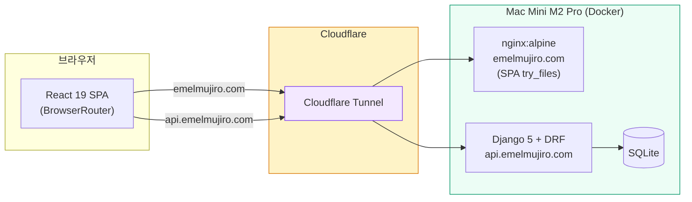

# 에멜무지로 (Emelmujiro) - AI 교육 & 컨설팅 플랫폼

<div align="center">

[](https://github.com/researcherhojin/emelmujiro/actions/workflows/main-ci-cd.yml)
[](https://www.typescriptlang.org/)
[](LICENSE)

**[Live Site](https://emelmujiro.com)** | **[Report Bug](https://github.com/researcherhojin/emelmujiro/issues)**

</div>

## 프로젝트 개요

**에멜무지로**는 2022년부터 축적한 AI 교육 노하우와 실무 프로젝트 경험을 바탕으로, 기업 맞춤형 AI 솔루션을 제공하는 전문 컨설팅 플랫폼입니다.

### 핵심 서비스

- **AI 교육 & 강의** - 기업 맞춤 AI 교육 프로그램 설계 및 운영
- **AI 컨설팅** - AI 도입 전략 수립부터 기술 자문까지
- **LLM/생성형 AI** - LLM 기반 서비스 설계 및 개발
- **Computer Vision** - 영상 처리 및 비전 AI 솔루션

## 현재 상태 (v1.0)

| 항목       | 상태    | 세부사항                                                          |
| ---------- | ------- | ----------------------------------------------------------------- |
| **빌드**   | ✅ 정상 | Vite 8 (oxc/rolldown) + SSG 프리렌더 12 routes                    |
| **CI/CD**  | ✅ 정상 | GitHub Actions → Mac Mini 자동 배포 (webhook)                     |
| **테스트** | ✅ 통과 | Frontend 880 통과 (58 파일), Backend 104 통과                     |
| **타입**   | ✅ 100% | TypeScript Strict Mode                                            |
| **보안**   | ✅ 안전 | 취약점 0건, httpOnly JWT 쿠키                                     |
| **배포**   | ✅ 정상 | Mac Mini Docker + Cloudflare Tunnel + 자동 배포 + 점검 페이지     |
| **도메인** | ✅ 활성 | `emelmujiro.com` + `api.emelmujiro.com` + `deploy.emelmujiro.com` |

## 빠른 시작

```bash
# 설치
git clone https://github.com/researcherhojin/emelmujiro.git
cd emelmujiro
npm install

# 실행
npm run dev              # 전체 실행 (Frontend + Backend)
npm run dev:clean        # 포트 정리 후 실행

# 접속
# Frontend: http://localhost:5173
# Backend: http://localhost:8000
```

### 백엔드 (별도 설치 필요)

```bash
cd backend
uv sync                  # 의존성 설치 (uv 필요)
uv run python manage.py migrate
uv run python manage.py runserver
```

## 기술 스택

**Frontend**<br/>


**Testing**<br/>


**Backend**<br/>


**Infra**<br/>


## 아키텍처

### 시스템 구성도



### 핵심 설계 결정

| 영역           | 선택                                                                | 이유                                                            |
| -------------- | ------------------------------------------------------------------- | --------------------------------------------------------------- |
| 라우팅         | `createBrowserRouter` + `React.lazy`                                | 클린 URL (`/about`), nginx `try_files` SPA 폴백, 코드 스플리팅  |
| 상태 관리      | React Context 4개 (UI, Auth, Blog, Form)                            | `useMemo`/`useCallback`으로 리렌더 방지, 외부 라이브러리 불필요 |
| API 클라이언트 | Axios + Mock/Real 자동 전환                                         | `VITE_API_URL` 유무로 결정, httpOnly 쿠키 JWT, 401 자동 갱신    |
| i18n           | `react-i18next` + URL 기반 언어 라우팅                              | `/about` (ko), `/en/about` (en), hreflang SEO                   |
| 테스트         | Vitest (1048) + Playwright E2E (5 spec)                             | 전역 모킹(`setupTests.ts`) + `renderWithProviders` 자동화       |
| 빌드           | sitemap → `tsc` → Vite 8 → Playwright 프리렌더                      | SSG: 12 정적 HTML (6 routes × 2 langs), hydration               |
| 배포           | 프론트 + 백엔드: Mac Mini (Docker + Cloudflare Tunnel)              | 전체 자체 호스팅으로 비용 최소화, nginx SPA 라우팅 200 보장     |
| Provider 계층  | `HelmetProvider > ErrorBoundary > UI > Auth > Blog > Form > Router` | 외부 라이브러리 없이 Context 기반 상태 관리                     |

### 프로젝트 구조

```
emelmujiro/
├── frontend/               # React 19 + TypeScript + Vite + Tailwind 3.x
│   ├── src/
│   │   ├── components/     # common/ home/ blog/ layout/ pages/ profile/
│   │   ├── contexts/       # React Context 4개 (UI, Auth, Blog, Form)
│   │   ├── services/       # API 클라이언트 (Mock + Real, Axios)
│   │   ├── i18n/           # 다국어 (ko/en JSON)
│   │   ├── config/         # 환경변수 (env.ts)
│   │   ├── hooks/          # useScrollAnimation, useDebounce 등
│   │   ├── data/           # 정적 데이터 (blogPosts, services, footerData)
│   │   ├── types/          # TypeScript 타입 정의
│   │   ├── utils/          # logger, sentry, webVitals
│   │   └── test-utils/     # renderWithProviders, MSW
│   ├── e2e/                # Playwright E2E 테스트 (5 spec)
│   └── vitest.config.ts
├── backend/                # Django 5 + DRF + JWT
│   ├── api/                # 단일 앱: models, views, serializers, urls
│   ├── config/             # settings.py, urls.py, asgi.py
│   └── pyproject.toml      # uv 의존성 관리
├── .github/workflows/      # main-ci-cd.yml, pr-checks.yml
├── docker-compose.yml      # 프로덕션 (backend + SQLite, PostgreSQL은 --profile postgres)
└── docker-compose.dev.yml  # 개발 (hot-reload)
```

## 주요 기능

| 기능                 | 상태           | 설명                                            |
| -------------------- | -------------- | ----------------------------------------------- |
| **홈페이지**         | ✅ 완료        | Hero, 서비스 소개, 통계, CTA                    |
| **프로필**           | ✅ 완료        | CEO 경력/학력/프로젝트 포트폴리오               |
| **다크 모드**        | ✅ 완료        | 시스템 설정 연동                                |
| **다국어 (i18n)**    | ✅ 완료        | URL 기반 언어 라우팅 (`/about`, `/en/about`)    |
| **반응형**           | ✅ 완료        | 모바일/태블릿/데스크톱 최적화                   |
| **SEO**              | ✅ 완료        | SSG 프리렌더, hreflang, 사이트맵, 구조화 데이터 |
| **알림 시스템**      | ✅ 백엔드 완료 | Notification 모델 + REST API + WebSocket        |
| **블로그**           | ✅ 활성        | 실제 백엔드 API 연동 (Mac Mini)                 |
| **문의하기**         | ✅ Google Form | Google Form 임베드 (자동 메일 설정 TODO)        |
| **JWT 인증**         | ✅ 완료        | httpOnly 쿠키 기반 JWT (XSS 방어 강화)          |
| **관리자 대시보드**  | ✅ 완료        | 실제 백엔드 API 연동 (통계 + 콘텐츠 관리)       |
| **Google Analytics** | ✅ 활성        | 페이지 뷰 + CTA 클릭 추적 (`G-LTDH6E8740`)      |
| **Sentry**           | ✅ 활성        | 에러 모니터링 + ErrorBoundary 연동              |

## 주요 명령어

| 명령어                   | 설명                                              |
| ------------------------ | ------------------------------------------------- |
| `npm run dev`            | 개발 서버 시작                                    |
| `npm run build`          | 프로덕션 빌드 (sitemap → tsc → vite → prerender)  |
| `npm test`               | 테스트 실행 (watch)                               |
| `npm run test:run`       | 테스트 단일 실행                                  |
| `npm run test:ci`        | CI 테스트 실행                                    |
| `npm run deploy`         | GitHub Pages 수동 배포 (백업, 현재 Mac Mini 사용) |
| `npm run type-check`     | TypeScript 체크                                   |
| `npm run lint:fix`       | ESLint 자동 수정                                  |
| `npm run validate`       | lint + type-check + test                          |
| `npm run test:coverage`  | 테스트 커버리지 리포트                            |
| `npm run analyze:bundle` | 번들 크기 분석                                    |

### 백엔드 명령어

| 명령어                              | 설명                        |
| ----------------------------------- | --------------------------- |
| `uv sync`                           | 의존성 설치                 |
| `uv run python manage.py runserver` | 개발 서버                   |
| `uv run python manage.py test`      | 테스트 실행                 |
| `uv run black .`                    | 코드 포맷 (line-length 120) |
| `uv run flake8 .`                   | 린트                        |
| `uv run isort .`                    | import 정렬                 |
| `uv run ruff check .`               | 빠른 린트                   |

### Makefile 단축 명령어

| 명령어            | 설명                  |
| ----------------- | --------------------- |
| `make install`    | 전체 의존성 설치      |
| `make dev-local`  | 로컬 개발 서버        |
| `make dev-docker` | Docker 개발 환경      |
| `make test`       | 프론트/백 전체 테스트 |
| `make lint`       | 프론트/백 전체 린트   |

## 앞으로 할 것

| 작업               | 유형   | 설명                                    |
| ------------------ | ------ | --------------------------------------- |
| 블로그 글 작성     | 콘텐츠 | LLM, AI 에이전트, RAG 등 테크 블로그 글 |
| 카카오톡 채널 연동 | 마케팅 | 문의 채널 다변화                        |

### 완료된 항목

| 작업                       | 완료일     | 설명                                                      |
| -------------------------- | ---------- | --------------------------------------------------------- |
| Google Search Console 등록 | 2026-03-18 | 소유권 확인 (HTML 메타태그) + 사이트맵 제출 완료 (12 URL) |
| SEO 구조화 데이터 보강     | 2026-03-18 | BlogDetail Article 스키마, SharePage SEOHelmet 추가       |
| Sentry 에러 모니터링       | 2026-03-18 | DSN 등록 + auto-deploy 환경변수 설정                      |
| Google Analytics 연동      | 2026-03-18 | GA4 측정 ID 등록 (`G-LTDH6E8740`)                         |

## 라이선스

Apache License 2.0 — 자세한 내용은 [LICENSE](LICENSE) 파일을 참조하세요.

---

**문의**: [Issues](https://github.com/researcherhojin/emelmujiro/issues) | **사이트**: [emelmujiro.com](https://emelmujiro.com)
