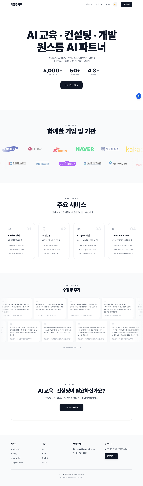
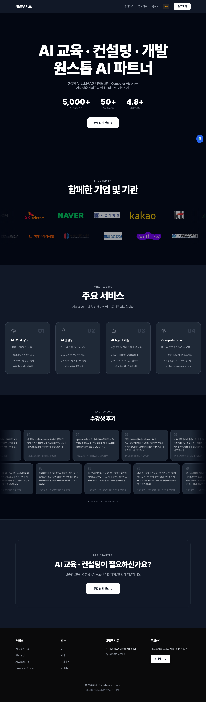
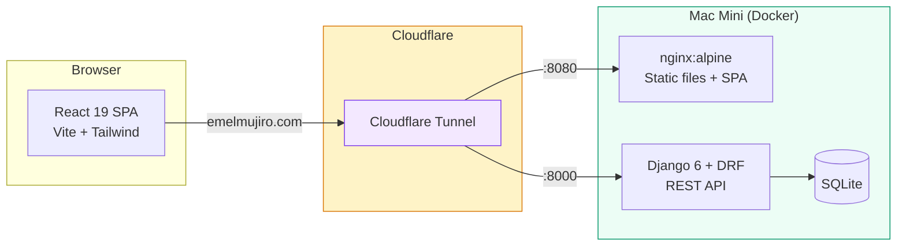

# Emelmujiro

<div align="center">

[](https://github.com/researcherhojin/emelmujiro/actions/workflows/main-ci-cd.yml)
[](https://codecov.io/gh/researcherhojin/emelmujiro)
[](LICENSE)

**[Live Site](https://emelmujiro.com)** | **[Contributing](CONTRIBUTING.md)** | **[Issues](https://github.com/researcherhojin/emelmujiro/issues)**

</div>

Official website for Emelmujiro, an AI education & consulting company. React 19 + Django 6 monorepo, self-hosted on Mac Mini.

<p align="center">
  
  
</p>

## Tech Stack

**Frontend**<br/>


**Backend**<br/>


**Testing**<br/>


**Infra**<br/>


## Getting Started

**Prerequisites**: Node >= 24, Python 3.12, [uv](https://docs.astral.sh/uv/)

```bash
git clone https://github.com/researcherhojin/emelmujiro.git
cd emelmujiro

# Install all dependencies
make install

# Backend first-time setup
cd backend && uv run python manage.py migrate && cd ..

# Start both servers
npm run dev                # Frontend (localhost:5173) + Backend (localhost:8000)
```

### Useful Commands

```bash
make test                  # Run all tests (frontend + backend)
make lint                  # Run all linters
make lint-fix              # Auto-fix lint issues
npm run validate           # lint + type-check + test:coverage (frontend)

# Single test (from frontend/)
CI=true npm test -- --run src/components/common/__tests__/Navbar.test.tsx

# E2E tests (from frontend/)
npm run test:e2e           # Headless
npm run test:e2e:ui        # Interactive UI
npm run test:e2e:debug     # Debug mode

# Docker dev with optional services
docker compose -f docker-compose.dev.yml --profile postgres up
```

## Architecture



## Key Features

- **Bilingual (i18n)** — URL-based language routing (`/about` for Korean, `/en/about` for English)
- **SSG Prerendering** — 12 static HTML pages (6 routes x 2 languages) for SEO, parallel rendering
- **Blog** — TipTap rich text editor (Notion-like), image upload, IP-based likes, nested comments, admin toolbar
- **Auth** — httpOnly cookie JWT with automatic token refresh
- **Notifications** — REST API with per-user preferences and email delivery
- **Monitoring** — Sentry error tracking + Google Analytics
- **SEO** — Search Console, sitemap, hreflang, JSON-LD structured data
- **Performance** — Optimized chunk splitting (7 vendor chunks), Lighthouse CI assertions, < 10MB bundle budget
- **CI/CD** — GitHub Actions with parallel jobs: lint, tests, security scan (Trivy), bundle size, Lighthouse CI, E2E (Playwright), auto-deploy via webhook
- **Security** — DOMPurify HTML sanitization, CI script injection prevention, uuid4 file uploads, rate limiting, IP blocking
- **Testing** — Vitest + Playwright + Django unittest, 100% coverage across all metrics

## License

[Apache License 2.0](LICENSE)
