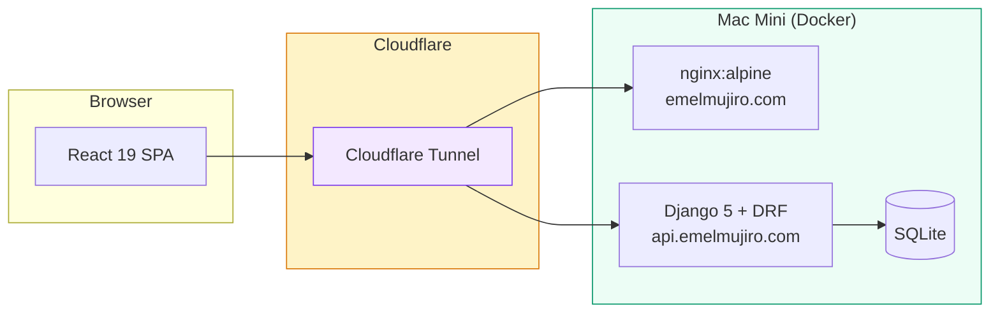

# Emelmujiro

<div align="center">

[](https://github.com/researcherhojin/emelmujiro/actions/workflows/main-ci-cd.yml)
[](https://www.typescriptlang.org/)
[](LICENSE)

**[Live Site](https://emelmujiro.com)** | **[Issues](https://github.com/researcherhojin/emelmujiro/issues)**

</div>

A full-stack monorepo for an AI education & consulting platform, built with React 19, Django 5, and self-hosted on a Mac Mini via Docker + Cloudflare Tunnel.

## Tech Stack

**Frontend**<br/>


**Backend**<br/>


**Testing**<br/>


**Infra**<br/>


## Getting Started

```bash
git clone https://github.com/researcherhojin/emelmujiro.git
cd emelmujiro && npm install
npm run dev              # Frontend (localhost:5173) + Backend (localhost:8000)
```

```bash
# Backend (separate setup, requires uv)
cd backend && uv sync && uv run python manage.py migrate
uv run python manage.py runserver
```

## Architecture



## Key Features

- **Bilingual (i18n)** — URL-based language routing (`/about` for Korean, `/en/about` for English)
- **SSG Prerendering** — 12 static HTML pages (6 routes × 2 languages) for SEO
- **Blog** — Django-backed blog with premium UI, Article structured data, image protection
- **Auth** — httpOnly cookie JWT with automatic token refresh
- **Monitoring** — Sentry error tracking + Google Analytics
- **SEO** — Search Console, sitemap, hreflang, JSON-LD structured data
- **Auto-deploy** — GitHub Actions → webhook → Mac Mini build

## Roadmap

- [ ] Publish first blog posts (LLM, AI agents, RAG)
- [ ] KakaoTalk channel integration

## License

[Apache License 2.0](LICENSE)
