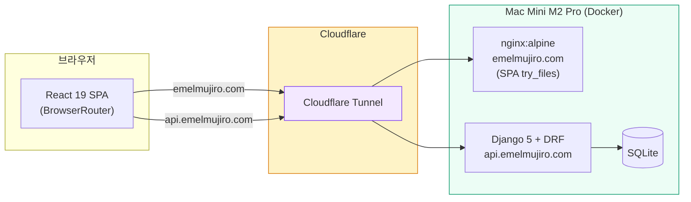
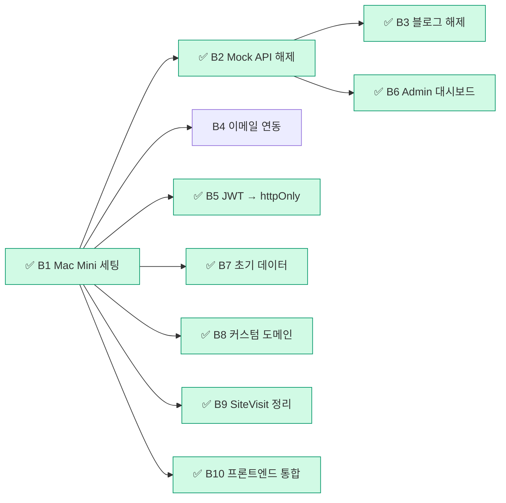

# 에멜무지로 (Emelmujiro) - AI 교육 & 컨설팅 플랫폼

<div align="center">

[](https://github.com/researcherhojin/emelmujiro/actions/workflows/main-ci-cd.yml)
[](https://www.typescriptlang.org/)
[](LICENSE)

**[Live Site](https://emelmujiro.com)** | **[Report Bug](https://github.com/researcherhojin/emelmujiro/issues)**

</div>

## 프로젝트 개요

**에멜무지로**는 2022년부터 축적한 AI 교육 노하우와 실무 프로젝트 경험을 바탕으로, 기업 맞춤형 AI 솔루션을 제공하는 전문 컨설팅 플랫폼입니다.

### 핵심 서비스

- **AI 교육 & 강의** - 기업 맞춤 AI 교육 프로그램 설계 및 운영
- **AI 컨설팅** - AI 도입 전략 수립부터 기술 자문까지
- **LLM/생성형 AI** - LLM 기반 서비스 설계 및 개발
- **Computer Vision** - 영상 처리 및 비전 AI 솔루션

## 현재 상태 (v0.9.10)

| 항목       | 상태    | 세부사항                                                   |
| ---------- | ------- | ---------------------------------------------------------- |
| **빌드**   | ✅ 정상 | Vite 8 (oxc/rolldown) 빌드                                 |
| **CI/CD**  | ✅ 정상 | GitHub Actions (Node 24, Python 3.12) ~2분                 |
| **테스트** | ✅ 통과 | Frontend 1048 통과 (67 파일), Backend 90 통과              |
| **타입**   | ✅ 100% | TypeScript Strict Mode                                     |
| **보안**   | ✅ 안전 | 취약점 0건                                                 |
| **배포**   | ✅ 정상 | Mac Mini Docker + Cloudflare Tunnel (프론트 + 백엔드 통합) |
| **도메인** | ✅ 활성 | `emelmujiro.com` (프론트) + `api.emelmujiro.com` (백엔드)  |

## 빠른 시작

```bash
# 설치
git clone https://github.com/researcherhojin/emelmujiro.git
cd emelmujiro
npm install

# 실행
npm run dev              # 전체 실행 (Frontend + Backend)
npm run dev:clean        # 포트 정리 후 실행

# 접속
# Frontend: http://localhost:5173
# Backend: http://localhost:8000
```

### 백엔드 (별도 설치 필요)

```bash
cd backend
uv sync                  # 의존성 설치 (uv 필요)
uv run python manage.py migrate
uv run python manage.py runserver
```

## 기술 스택

**Frontend**<br/>


**Testing**<br/>


**Backend**<br/>


**Infra**<br/>


## 아키텍처

### 시스템 구성도



### 핵심 설계 결정

| 영역           | 선택                                                                | 이유                                                            |
| -------------- | ------------------------------------------------------------------- | --------------------------------------------------------------- |
| 라우팅         | `createBrowserRouter` + `React.lazy`                                | 클린 URL (`/about`), nginx `try_files` SPA 폴백, 코드 스플리팅  |
| 상태 관리      | React Context 5개 (UI, Auth, Blog, Form, Chat)                      | `useMemo`/`useCallback`으로 리렌더 방지, 외부 라이브러리 불필요 |
| API 클라이언트 | Axios + Mock/Real 자동 전환                                         | `VITE_API_URL` 유무로 결정, httpOnly 쿠키 JWT, 401 자동 갱신    |
| i18n           | `react-i18next` + 크롤러 한국어 강제                                | 브라우저 언어 감지, SEO 봇은 `htmlTag`(`ko`) 고정               |
| 테스트         | Vitest (1048) + Playwright E2E (5 spec)                             | 전역 모킹(`setupTests.ts`) + `renderWithProviders` 자동화       |
| 빌드           | sitemap → `tsc` → Vite 8 (oxc/rolldown)                             | 프로덕션 시 `console`/`debugger` 자동 제거                      |
| 배포           | 프론트 + 백엔드: Mac Mini (Docker + Cloudflare Tunnel)              | 전체 자체 호스팅으로 비용 최소화, nginx SPA 라우팅 200 보장     |
| Provider 계층  | `HelmetProvider > ErrorBoundary > UI > Auth > Blog > Form > Router` | ChatProvider는 under construction으로 제외                      |

### 프로젝트 구조

```
emelmujiro/
├── frontend/               # React 19 + TypeScript + Vite + Tailwind 3.x
│   ├── src/
│   │   ├── components/     # common/ home/ blog/ chat/ layout/ pages/ profile/
│   │   ├── contexts/       # React Context 5개 (UI, Auth, Blog, Form, Chat)
│   │   ├── services/       # API 클라이언트 (Mock + Real, Axios)
│   │   ├── i18n/           # 다국어 (ko/en JSON)
│   │   ├── config/         # 환경변수 (env.ts)
│   │   ├── hooks/          # useScrollAnimation, useDebounce 등
│   │   ├── data/           # 정적 데이터 (blogPosts, services, footerData)
│   │   ├── types/          # TypeScript 타입 정의
│   │   ├── utils/          # logger, sentry, webVitals
│   │   └── test-utils/     # renderWithProviders, MSW
│   ├── e2e/                # Playwright E2E 테스트 (5 spec)
│   └── vitest.config.ts
├── backend/                # Django 5 + DRF + JWT
│   ├── api/                # 단일 앱: models, views, serializers, urls
│   ├── config/             # settings.py, urls.py, asgi.py
│   └── pyproject.toml      # uv 의존성 관리
├── .github/workflows/      # main-ci-cd.yml, pr-checks.yml
├── docker-compose.yml      # 프로덕션 (backend + SQLite, PostgreSQL은 --profile postgres)
└── docker-compose.dev.yml  # 개발 (hot-reload)
```

## 주요 기능

| 기능                 | 상태           | 설명                                              |
| -------------------- | -------------- | ------------------------------------------------- |
| **홈페이지**         | ✅ 완료        | Hero, 서비스 소개, 통계, CTA                      |
| **프로필**           | ✅ 완료        | CEO 경력/학력/프로젝트 포트폴리오                 |
| **다크 모드**        | ✅ 완료        | 시스템 설정 연동                                  |
| **다국어 (i18n)**    | ✅ 완료        | 전체 컴포넌트 i18n 전환 완료 (ko/en)              |
| **반응형**           | ✅ 완료        | 모바일/태블릿/데스크톱 최적화                     |
| **SEO**              | ✅ 완료        | React Helmet, 사이트맵, 구조화 데이터             |
| **블로그**           | ✅ 활성        | 실제 백엔드 API 연동 (Mac Mini)                   |
| **문의하기**         | ✅ Google Form | Google Form 임베드 (자동 메일 설정 TODO)          |
| **JWT 인증**         | ✅ 완료        | httpOnly 쿠키 기반 JWT (XSS 방어 강화)            |
| **관리자 대시보드**  | ✅ 완료        | 실제 백엔드 API 연동 (통계 + 콘텐츠 관리)         |
| **Google Analytics** | ✅ 완료        | 페이지 뷰 + CTA 클릭 추적 (`VITE_GA_TRACKING_ID`) |
| **Sentry**           | ✅ 준비 완료   | ErrorBoundary 연동 완료, DSN 설정만 하면 활성화   |
| **실시간 채팅**      | ⏸️ 1.0 이후    | WebSocket/Redis 필요, 1.0 범위에서 제외           |

## 주요 명령어

| 명령어                   | 설명                                              |
| ------------------------ | ------------------------------------------------- |
| `npm run dev`            | 개발 서버 시작                                    |
| `npm run build`          | 프로덕션 빌드 (sitemap → tsc → vite)              |
| `npm test`               | 테스트 실행 (watch)                               |
| `npm run test:run`       | 테스트 단일 실행                                  |
| `npm run test:ci`        | CI 테스트 실행                                    |
| `npm run deploy`         | GitHub Pages 수동 배포 (백업, 현재 Mac Mini 사용) |
| `npm run type-check`     | TypeScript 체크                                   |
| `npm run lint:fix`       | ESLint 자동 수정                                  |
| `npm run validate`       | lint + type-check + test                          |
| `npm run test:coverage`  | 테스트 커버리지 리포트                            |
| `npm run analyze:bundle` | 번들 크기 분석                                    |

### 백엔드 명령어

| 명령어                              | 설명                        |
| ----------------------------------- | --------------------------- |
| `uv sync`                           | 의존성 설치                 |
| `uv run python manage.py runserver` | 개발 서버                   |
| `uv run python manage.py test`      | 테스트 실행                 |
| `uv run black .`                    | 코드 포맷 (line-length 120) |
| `uv run flake8 .`                   | 린트                        |
| `uv run isort .`                    | import 정렬                 |
| `uv run ruff check .`               | 빠른 린트                   |

### Makefile 단축 명령어

| 명령어            | 설명                  |
| ----------------- | --------------------- |
| `make install`    | 전체 의존성 설치      |
| `make dev-local`  | 로컬 개발 서버        |
| `make dev-docker` | Docker 개발 환경      |
| `make test`       | 프론트/백 전체 테스트 |
| `make lint`       | 프론트/백 전체 린트   |

## 앞으로 할 것

> **코드 품질 작업은 19차 감사로 전량 완료.** 아래는 기능 구현 및 배포 관련 남은 작업입니다.
>
> **1.0 범위**: Blog ✅ + Contact (Google Form) ✅ + Auth (httpOnly JWT) ✅ + Admin Dashboard ✅ — 남은 작업: A1 (Google Form 자동 메일), A4 (OG 이미지), B4 (이메일 연동) | **1.0 이후**: 실시간 채팅, Notification, SSG

### 즉시 실행 가능 (백엔드 배포 불필요)

| #   | 작업                           | 우선순위 | 설명                                                                      |
| --- | ------------------------------ | -------- | ------------------------------------------------------------------------- |
| A1  | **Google Form 자동 메일 설정** | 높음     | Apps Script 트리거 등록 → 신청자 확인 메일 + 운영자 알림 메일 (하단 참조) |
| A2  | ~~**Google Analytics 연동**~~  | ✅ 완료  | `analytics.ts` 구현, 페이지 뷰 + CTA 클릭 추적, CSP 업데이트 완료         |
| A3  | ~~**Sentry 활성화**~~          | ✅ 완료  | ErrorBoundary → `reportErrorBoundary()` 연동 완료, DSN 설정만 하면 활성화 |
| A4  | **OG 이미지 제작**             | 낮음     | 1200x630 전용 이미지 디자인 (현재 `logo512.png` 사용 중)                  |
| A5  | ~~**Lighthouse CI 자동화**~~   | ✅ 완료  | `pr-checks.yml`에 LHCI job 추가 완료                                      |

### 배포 (Mac Mini)

> **배포 전략**: 프론트엔드 + 백엔드 모두 Mac Mini M2 Pro/32GB에서 Docker로 배포. Cloudflare Tunnel로 외부 노출 (HTTPS 자동). 프론트엔드는 nginx `try_files`로 SPA 라우팅 처리 (HTTP 200 보장).



| #   | 작업                             | 의존성  | 설명                                                                       |
| --- | -------------------------------- | ------- | -------------------------------------------------------------------------- |
| B1  | ~~**Mac Mini 백엔드 배포**~~     | ✅ 완료 | Docker Compose (Django + SQLite), Cloudflare Tunnel (`api.emelmujiro.com`) |
| B2  | ~~**Mock API → Real API 전환**~~ | ✅ 완료 | `VITE_API_URL=https://api.emelmujiro.com/api` 설정 완료                    |
| B3  | ~~**블로그 공사 중 해제**~~      | ✅ 완료 | `App.tsx` 라우트 복원, 실제 블로그 데이터 API 연동                         |
| B4  | **이메일 발송 연동**             | B1      | Contact 폼 SMTP/SendGrid 연동 (현재 Google Form 임베드 사용 중)            |
| B5  | ~~**JWT → httpOnly 쿠키**~~      | ✅ 완료 | `CookieJWTAuthentication` 구현, 프론트/백 완전 이전, localStorage 제거     |
| B6  | ~~**Admin 대시보드 API 연동**~~  | ✅ 완료 | `/api/admin/stats/` + `/api/admin/content/` 엔드포인트, 프론트엔드 연동    |
| B7  | ~~**초기 데이터**~~              | ✅ 완료 | `createsuperuser` + Django Admin으로 블로그 포스트 생성                    |
| B8  | ~~**커스텀 도메인**~~            | ✅ 완료 | `emelmujiro.com` + `api.emelmujiro.com` Cloudflare Tunnel DNS              |
| B9  | ~~**SiteVisit 정기 정리**~~      | ✅ 완료 | `scripts/cleanup-sitevisits.sh` cron 스크립트 작성, 명령어 구현 완료       |
| B10 | ~~**프론트엔드 Mac Mini 통합**~~ | ✅ 완료 | GitHub Pages → nginx Docker, Cloudflare Tunnel로 SPA 라우팅 200 보장       |

<details>
<summary>Mac Mini vs 클라우드 비교</summary>

| 항목      | Mac Mini (선택)                      | 클라우드 (AWS/GCP 등)    |
| --------- | ------------------------------------ | ------------------------ |
| 월 비용   | 전기세만 (~₩3,000~5,000)             | 월 ₩30,000~수십만원      |
| 성능      | M2 Pro + 32GB (클라우드 ₩100,000+급) | 돈 내는 만큼 확장        |
| 안정성    | 정전/인터넷 끊김에 취약 (UPS 권장)   | 99.9% 가용성             |
| 외부 접근 | Cloudflare Tunnel (무료, HTTPS 자동) | 기본 제공                |
| 확장성    | 트래픽 폭증 시 한계                  | 자동 확장 가능           |
| 적합 용도 | 개인 프로젝트, 소규모 서비스         | 상용 서비스, 글로벌 대상 |

**현재 선택 이유**: 개인 프로젝트 + 소규모 트래픽 + 비용 최소화. SQLite로 운영 부담 최소화 (DB 컨테이너 불필요, 백업은 파일 복사 한 줄). 서비스가 커지면 같은 Docker 이미지를 클라우드에 올리고 `DATABASE_URL`만 바꿔 PostgreSQL로 전환 가능.

</details>

### 코드 품질 (20차 감사 결과)

> 20차 전체 코드베이스 감사로 식별된 항목입니다. D1-D7 완료 (2026-03-17).

#### 테스트 커버리지 보완 ✅

| #   | 작업                                | 상태 | 설명                                                                |
| --- | ----------------------------------- | ---- | ------------------------------------------------------------------- |
| D1  | **Admin API 엔드포인트 테스트**     | ✅   | 백엔드 8개 테스트 추가 (권한 검증 + 응답 데이터 확인)               |
| D2  | **CookieJWTAuthentication 테스트**  | ✅   | 5개 테스트 추가 (쿠키 인증, 헤더 폴백, 만료 토큰)                   |
| D3  | **token_refresh 엔드포인트 테스트** | ✅   | 8개 테스트 추가 (쿠키/본문 리프레시, 로테이션, 블랙리스트)          |
| D4  | **analytics.ts 유틸리티 테스트**    | ✅   | 7개 테스트 추가 (`initAnalytics`, `trackPageView`, `trackCtaClick`) |

#### Admin 대시보드 기능 완성 ✅

| #   | 작업                             | 상태 | 설명                                                                                 |
| --- | -------------------------------- | ---- | ------------------------------------------------------------------------------------ |
| D5  | **Admin 네비게이션 연결**        | ✅   | `onCreate`/`onView`/`onEdit` → `useNavigate` 연결 완료                               |
| D6  | **AdminDashboard 컴포넌트 분리** | ✅   | AdminSidebar, AdminOverview, AdminContentTable, DeleteConfirmModal 서브컴포넌트 추출 |

#### 데드 코드 정리

| #   | 작업                                 | 상태 | 설명                                                                           |
| --- | ------------------------------------ | ---- | ------------------------------------------------------------------------------ |
| D7  | **ChatContext 미사용 state → const** | ✅   | `agentAvailable`, `agentName`, `agentAvatar`, `settings` → 상수로 전환 완료    |
| D8  | **SiteVisit cron 실제 등록**         | 🔲   | `scripts/cleanup-sitevisits.sh` 스크립트 작성 완료, Mac Mini crontab 등록 필요 |

### 장기 개선 사항

| #   | 작업                       | 설명                                                                                   |
| --- | -------------------------- | -------------------------------------------------------------------------------------- |
| C1  | ~~**BrowserRouter 전환**~~ | ✅ 완료 — `/#/about` → `/about`, nginx `try_files` SPA 라우팅 (HTTP 200), SEO 클린 URL |
| C2  | **SSG / Prerendering**     | 정적 HTML 생성 → 크롤러 완성된 HTML 수신 (react-snap 또는 Next.js)                     |
| C3  | **`hreflang` 다국어 SEO**  | `/ko/about`, `/en/about` + `hreflang` 태그                                             |
| C4  | **실시간 채팅**            | WebSocket/Redis/Channels 구현, `ChatWidget` AppLayout 복원 (프론트엔드 UI 완성 상태)   |
| C5  | **Notification 모델**      | `consumers.py:224,230` 스텁 → Django 모델 + REST API + WebSocket 핸들러                |

## 배포 가이드

<details>
<summary>Mac Mini 보안 체크리스트 (클릭하여 펼치기)</summary>

> Mac Mini를 외부에 노출하면 보안이 중요합니다. Cloudflare Tunnel을 사용하면 공유기 포트를 열 필요가 없어 공격 표면이 크게 줄어들지만, 아래 항목들을 반드시 점검해야 합니다.

#### 네트워크 보안

| 항목                    | 설정                                   | 이유                                                           |
| ----------------------- | -------------------------------------- | -------------------------------------------------------------- |
| **포트 직접 노출 금지** | 공유기 포트포워딩 사용하지 않음        | Cloudflare Tunnel만 사용하면 외부에서 Mac Mini IP를 알 수 없음 |
| **DDoS 방어**           | Cloudflare 기본 제공                   | 터널 경유 트래픽은 Cloudflare 프록시를 거침                    |
| **macOS 방화벽**        | 시스템 설정 → 네트워크 → 방화벽 → 켜기 | 불필요한 인바운드 연결 차단                                    |
| **공유기 방화벽**       | 외부 → 내부 차단 기본값 유지           | 포트포워딩 설정 절대 하지 않음                                 |

#### SSH 보안

| 항목                    | 설정                                                   | 이유                                             |
| ----------------------- | ------------------------------------------------------ | ------------------------------------------------ |
| **키 기반 인증만 허용** | `/etc/ssh/sshd_config`에서 `PasswordAuthentication no` | 브루트포스 공격 차단                             |
| **root 로그인 금지**    | `PermitRootLogin no`                                   | 기본값이지만 확인 필수                           |
| **SSH 포트**            | 기본 22번 유지 (외부 미노출이므로)                     | Cloudflare Tunnel 경유 시 SSH도 터널로 접근 가능 |

```bash
# MacBook에서 SSH 키 생성 (아직 없는 경우)
ssh-keygen -t ed25519 -C "your-email@example.com"

# Mac Mini에 공개키 복사
ssh-copy-id user@mac-mini.local

# Mac Mini에서 비밀번호 로그인 비활성화
sudo sed -i '' 's/#PasswordAuthentication yes/PasswordAuthentication no/' /etc/ssh/sshd_config
sudo launchctl stop com.openssh.sshd
sudo launchctl start com.openssh.sshd
```

#### 애플리케이션 보안

| 항목                     | 설정                                    | 이유                                   |
| ------------------------ | --------------------------------------- | -------------------------------------- |
| **SECRET_KEY**           | `secrets.token_urlsafe(50)` 이상        | 약한 키는 세션 위조/CSRF 우회 가능     |
| **DEBUG=False**          | 프로덕션 필수                           | True일 경우 스택 트레이스, 설정값 노출 |
| **ALLOWED_HOSTS**        | `api.emelmujiro.com` 만 허용            | Host 헤더 공격 방지                    |
| **CORS**                 | `emelmujiro.com` 만 허용                | 임의 도메인에서 API 호출 차단          |
| **CSRF_TRUSTED_ORIGINS** | CORS와 동일                             | Django CSRF 검증                       |
| **Rate Limiting**        | 이미 구현됨 (anon 100/hr, contact 5/hr) | 무차별 대입 방지                       |
| **HTTPS 강제**           | Cloudflare Tunnel이 자동 처리           | 평문 통신 차단                         |

#### Docker 보안

| 항목                  | 설정                                                                | 이유                         |
| --------------------- | ------------------------------------------------------------------- | ---------------------------- |
| **SQLite 파일 보호**  | Docker 볼륨(`sqlite_data`)에 저장, 컨테이너 외부에서 직접 접근 불가 | DB 파일 변조 방지            |
| **non-root 컨테이너** | Dockerfile에서 `USER appuser` (이미 적용됨)                         | 컨테이너 탈출 시 피해 최소화 |
| **이미지 업데이트**   | 정기적으로 `docker compose pull && docker compose up -d`            | 베이스 이미지 보안 패치      |
| **볼륨 백업**         | `sqlite_data` 볼륨 정기 백업                                        | 데이터 유실 방지             |

```bash
# SQLite 백업 (cron 등록 권장) — 파일 하나 복사하면 끝
docker cp emelmujiro-backend:/app/data/db.sqlite3 ~/backups/emelmujiro_$(date +%Y%m%d).sqlite3
```

#### 물리/운영 보안

| 항목                     | 설정                                                  | 이유                            |
| ------------------------ | ----------------------------------------------------- | ------------------------------- |
| **UPS (무정전전원장치)** | 소형 UPS 연결                                         | 정전 시 DB 손상 방지, 안전 종료 |
| **자동 업데이트**        | macOS 자동 업데이트 활성화                            | OS 보안 패치                    |
| **FileVault**            | 시스템 설정 → 개인 정보 보호 및 보안 → FileVault 켜기 | 디스크 암호화 (도난 대비)       |
| **자동 잠금**            | 화면 보호기 + 즉시 암호 요구                          | 물리적 접근 차단                |

</details>

<details>
<summary>개발/배포 워크플로우 (클릭하여 펼치기)</summary>

> **원칙**: 코드 작업은 MacBook에서, Mac Mini는 배포만 담당. Mac Mini에서 직접 코드를 수정하지 않음.

```
MacBook (개발)                          Mac Mini (배포)
┌─────────────────────┐                ┌───────────────────────────────┐
│ 코드 작성/테스트     │                │ git pull                      │
│ git push → GitHub   │───────────────→│ npm run build (frontend)      │
│ CI 통과 확인        │                │ docker compose up -d (backend)│
└─────────────────────┘                └───────────────────────────────┘
                                                │
                                                ▼
                                        Cloudflare Tunnel
                                        ├── emelmujiro.com → nginx:8080
                                        └── api.emelmujiro.com → Django:8000
```

**배포 과정:**

1. MacBook에서 코드 작성, 테스트, `git push`
2. GitHub Actions CI 통과 확인
3. Mac Mini에서 프론트엔드 + 백엔드 업데이트:

```bash
# 프론트엔드 업데이트 (nginx가 build/ 볼륨 마운트 → 컨테이너 재시작 불필요)
cd ~/workspace/emelmujiro/frontend
git pull && VITE_API_URL=https://api.emelmujiro.com/api npm run build

# 백엔드 업데이트 (코드 변경 시)
cd ~/workspace/emelmujiro
docker compose up -d --build
```

</details>

<details>
<summary>Mac Mini 배포 가이드 (클릭하여 펼치기)</summary>

### Phase 1: Mac Mini 기본 세팅

```bash
# 1. SSH 활성화
# 시스템 설정 → 일반 → 공유 → 원격 로그인 켜기

# 2. Docker Desktop 설치
# https://www.docker.com/products/docker-desktop/ 에서 Apple Silicon 버전 다운로드

# 3. 프로젝트 클론
git clone https://github.com/researcherhojin/emelmujiro.git
cd emelmujiro

# 4. 환경변수 설정
cp backend/.env.example backend/.env
# backend/.env 편집 — SECRET_KEY 생성, ALLOWED_HOSTS 등 설정

# 5. Docker Compose 실행 (SQLite — DB 컨테이너 불필요)
SECRET_KEY=$(python3 -c "import secrets; print(secrets.token_urlsafe(50))") \
docker compose up -d

# 6. DB 마이그레이션 + 관리자 계정
docker exec emelmujiro-backend uv run python manage.py migrate
docker exec -it emelmujiro-backend uv run python manage.py createsuperuser

# 7. 동작 확인
curl http://localhost:8000/api/health/

# 참고: PostgreSQL이 필요해지면 프로필로 추가 가능
# docker compose --profile postgres up -d
# DATABASE_URL=postgresql://postgres:postgres@db:5432/emelmujiro
```

### Phase 2: Cloudflare Tunnel (외부 접근)

```bash
# 1. cloudflared 설치
brew install cloudflared

# 2. Cloudflare 로그인
cloudflared tunnel login

# 3. 터널 생성
cloudflared tunnel create emelmujiro

# 4. DNS 연결
cloudflared tunnel route dns emelmujiro api.emelmujiro.com
cloudflared tunnel route dns emelmujiro emelmujiro.com

# 5. 설정 파일 (~/.cloudflared/config.yml)
cat > ~/.cloudflared/config.yml << 'EOF'
tunnel: <터널 ID>
credentials-file: ~/.cloudflared/<터널 ID>.json

ingress:
  - hostname: api.emelmujiro.com
    service: http://localhost:8000
  - hostname: emelmujiro.com
    service: http://localhost:8080
  - service: http_status:404
EOF

# 6. 시스템 config에 복사
sudo cp ~/.cloudflared/config.yml /etc/cloudflared/config.yml

# 7. 서비스 등록 (자동 시작)
sudo cloudflared service install

# 8. 터널 재시작
sudo launchctl kickstart -k system/com.cloudflare.cloudflared
```

### Phase 3: 프론트엔드 배포 (nginx)

```bash
# 1. 프론트엔드 빌드
cd ~/workspace/emelmujiro/frontend
VITE_API_URL=https://api.emelmujiro.com/api npm run build

# 2. nginx 컨테이너 시작 (build/ 볼륨 마운트)
docker run -d \
  --name emelmujiro-frontend \
  --restart unless-stopped \
  --network emelmujiro_emelmujiro-network \
  --network-alias frontend \
  -p 8080:80 \
  -v $(pwd)/build:/usr/share/nginx/html:ro \
  -v $(pwd)/nginx.conf:/etc/nginx/nginx.conf:ro \
  nginx:alpine

# 3. 확인 (모든 SPA 라우트가 200 반환)
curl -s -o /dev/null -w "%{http_code}" https://emelmujiro.com/about  # → 200
```

> **업데이트 시**: `git pull && VITE_API_URL=https://api.emelmujiro.com/api npm run build`만 실행하면 nginx가 즉시 반영 (컨테이너 재시작 불필요)

### Phase 4: 운영

```bash
# Docker 자동 시작 (Docker Desktop → Settings → General → Start Docker Desktop when you sign in)

# UPS(무정전전원장치) 연결 권장 — 정전 시 안전 종료

# 상태 확인
docker ps  # emelmujiro-backend, emelmujiro-frontend 확인
curl https://api.emelmujiro.com/api/health/
curl -s -o /dev/null -w "%{http_code}" https://emelmujiro.com/about

# MacBook에서 접근 (같은 네트워크)
# http://mac-mini.local:8080/ (프론트엔드)
# http://mac-mini.local:8000/api/health/ (백엔드)
```

### 커스텀 도메인 (✅ 완료)

- Cloudflare Tunnel DNS: `emelmujiro.com` → Mac Mini nginx (`:8080`)
- Cloudflare Tunnel DNS: `api.emelmujiro.com` → Mac Mini Django (`:8000`)
- `frontend/src/utils/constants.ts` → `SITE_URL = 'https://emelmujiro.com'`
- `frontend/public/CNAME` → `emelmujiro.com` (GitHub Pages 백업용)
- `vite.config.ts` → `base: '/'`

</details>

<details>
<summary>Google Form 자동 메일 설정 (클릭하여 펼치기)</summary>

현재 `/contact` 페이지는 Google Form 임베드 사용 중. 아래 설정을 완료하면 신청자 + 운영자 양쪽에 자동 메일 발송:

- [ ] **Google Forms 설정** → 응답 → "응답자에게 응답 사본 보내기" → "항상" 활성화
- [ ] **Google Forms 설정** → 응답 → "새로운 응답에 대한 이메일 알림 받기" 체크
- [ ] **Apps Script 등록** — Google Forms 편집 → ⋮ → 스크립트 편집기 → 아래 코드 추가:

```javascript
function onFormSubmit(e) {
  var responses = e.namedValues;
  var email = responses['이메일 (필수)'][0];
  var name = responses['성함 / 기관명 (필수)'][0];
  var field = responses['상담 분야 (필수)'][0];
  var request = responses['요청 내용 (필수)'][0];
  var schedule = responses['희망 일정 (필수)'][0];

  // 1. Confirmation email to the submitter
  var userSubject = '[에멜무지로] 온라인 미팅 신청이 접수되었습니다';
  var userBody =
    name +
    '님, 안녕하세요.\n\n' +
    '에멜무지로에 문의해 주셔서 감사합니다.\n' +
    '접수하신 내용을 확인 후, 기재하신 연락처로 빠른 시일 내에 회신드리겠습니다.\n\n' +
    '── 접수 내용 ──\n' +
    '상담 분야: ' +
    field +
    '\n' +
    '요청 내용: ' +
    request +
    '\n' +
    '희망 일정: ' +
    schedule +
    '\n\n' +
    '감사합니다.\n에멜무지로 드림';
  MailApp.sendEmail(email, userSubject, userBody);

  // 2. Notification email to the operator
  var adminEmail = 'researcherhojin@gmail.com';
  var adminSubject = '[에멜무지로] 새 미팅 신청: ' + name + ' (' + field + ')';
  var adminBody =
    '새로운 온라인 미팅 신청이 접수되었습니다.\n\n' +
    '성함/기관명: ' +
    name +
    '\n' +
    '이메일: ' +
    email +
    '\n' +
    '연락처: ' +
    (responses['연락처 (선택)'] || ['미입력'])[0] +
    '\n' +
    '상담 분야: ' +
    field +
    '\n' +
    '요청 내용: ' +
    request +
    '\n' +
    '희망 일정: ' +
    schedule +
    '\n' +
    '예산 범위: ' +
    (responses['예산 범위 (선택)'] || ['미입력'])[0] +
    '\n' +
    '기타 의견: ' +
    (responses['기타 의견이나 제안사항이 있다면 자유롭게 적어 주십시오.'] || [
      '없음',
    ])[0];
  MailApp.sendEmail(adminEmail, adminSubject, adminBody);
}
```

- [ ] **트리거 설정** — 스크립트 편집기 → 시계 아이콘 → + 트리거 추가 → 함수: `onFormSubmit`, 이벤트: "양식 제출 시" → 저장
- [ ] **테스트 제출** — 양식 제출 후 신청자 메일 + 운영자 메일(researcherhojin@gmail.com) 수신 확인

</details>

## 리팩토링 백로그

> **전량 해소 완료.** 18차에 걸친 코드 감사를 통해 식별된 모든 항목을 해결했습니다.

| 감사  | 날짜        | 해결 건수 | 주요 내용                                                                                                                                                                                                                          |
| ----- | ----------- | --------- | ---------------------------------------------------------------------------------------------------------------------------------------------------------------------------------------------------------------------------------- |
| 19차  | 2026.03.13  | 4건       | KakaoTalk 흰화면 근본 원인 수정 — `AppLoaded`를 AppLayout 내부로 이동 (`__appLoaded` 조기 설정 → 에러 핸들러 무력화 버그 해결), 미사용 redirect div/script 제거, `__legacyFailed`·`__isInAppBrowser` 플래그 제거, CLAUDE.md 동기화 |
| 18차  | 2026.03.12  | 10건      | KakaoTalk 리다이렉트 제거→React 정상 로딩, og-image→logo512 교체, SEO 강화, ContactRateThrottle 수정, docker SECRET_KEY, email 정규화, SW try-catch, iOS 배너 전용화, Android 에러 가시성 강화                                     |
| 17차  | 2026.03.10  | 3건       | KakaoTalk Android 흰 화면 근본 수정 — 다층 폴백 → `document.write()` 즉시 리다이렉트 전환, `main.tsx` React 초기화 차단, 5초 폴백 `#root` 직접 타겟으로 수정                                                                       |
| 16차  | 2026.03.10  | 7건       | cleanup_sitevisits 필드명 버그 수정, 미도달 WebSocket 핸들러 제거, 미사용 swagger 파라미터/sentry 함수/constants 제거, API 테스트 4파일→2파일 통합 (-955줄)                                                                        |
| 15차  | 2026.03.10  | 6건       | Prettier 설정 충돌 해소, MessageList XSS 강화(innerHTML→DOM, 파일명 sanitize), CSP frame-src reCAPTCHA 허용, 페이지네이션 MAX_PAGE_SIZE 보호, SiteVisit 정리 명령어                                                                |
| 14차  | 2026.03.10  | 8건       | WebSocket timezone.now() 통일, ContactAttempt 원자적 증가(F()), 잘못된 메시지 타입 거부, 클립보드 실패 시 복사 표시 방지, SESSION_SAVE_EVERY_REQUEST 제거, tsconfig.ci strict, Dependabot 루트 npm, Dockerfile.dev non-root        |
| 13차  | 2026.03.10  | 9건       | GH Actions 최신 안정 버전 통일 (checkout/setup-node@v6, cache@v5, artifact@v6), Lighthouse URL 프리뷰 포트, Dependabot vitest+백엔드 그룹, Codecov 플래그 분리, 이메일 설정 안전장치                                               |
| 12차  | 2026.03.10  | 5건       | SEO 하드코딩 영어→i18n 전환 (StructuredData/SEOHelmet), ESLint 9→10 업그레이드, global.d.ts 타입 보강, backend uv.lock 동기화                                                                                                      |
| 11차  | 2026.03.10  | 7건       | CI 파이프라인 수정 (uv --extra dev, Trivy 0.35.0, SECRET_KEY), Django 5.2.12 보안패치, react-helmet-async v3, 백엔드 black/flake8 수정                                                                                             |
| 10차  | 2026.03.10  | 8건       | KakaoTalk 인앱 브라우저 백지 문제 해결 (다층 폴백), 배너 i18n 전환, Android intent 스킴, 인라인 스타일 스켈레톤                                                                                                                    |
| 9차   | 2026.03.09  | 5건       | CSP localhost 제거, sitemap/Lighthouse에 /contact 추가, UnderConstruction dead type/test 제거                                                                                                                                      |
| 8차   | 2026.03.09  | 8건       | TS 빌드 오류, ESLint 워크스페이스 호이스팅, ESLint 경고 21건 → 0건                                                                                                                                                                 |
| 7차   | 2026.03.09  | 18건      | SEO 크롤러 한국어 강제, slug 원자성, MD5→SHA256, Docker non-root                                                                                                                                                                   |
| 6차   | 2026.03.08  | 7건       | i18n fallback 제거 50+건, `title→aria-label`, `onKeyPress→onKeyDown`                                                                                                                                                               |
| 5차   | 2026.03.07  | 확인      | 3~4차 전량 해소 확인, 배포 대기 항목만 잔여                                                                                                                                                                                        |
| 4차   | 2026.03.07  | 15건      | 비밀번호 정책, `key={index}` 19곳 교체, `crypto.randomUUID()` 통일                                                                                                                                                                 |
| 3차   | 2026.03.07  | 47건      | 미들웨어 미등록, ObjectURL 누수, JWT 블랙리스트, 컴포넌트 분할                                                                                                                                                                     |
| 1~2차 | ~2026.03.07 | 21건      | HashRouter 버그, Zustand 제거, i18n 전환, Sentry 초기화, Docker 버전 통일                                                                                                                                                          |

**총 해결: Critical 13 / High 29 / Medium 59 / Low 41 / Backend 7 / 이슈 아님 6건**

<details>
<summary>감사 상세 기록 (클릭하여 펼치기)</summary>

### 19차 감사 (2026.03.13)

- **H1** KakaoTalk Android 흰화면 근본 원인 수정 — `AppLoaded` 컴포넌트가 `RouterProvider` 형제로 배치되어 provider 마운트 시점에 `__appLoaded = true` 설정 → 5초 폴백 + `__showError()` 전부 무력화. `AppLoaded`를 `AppLayout`(router layout) 내부 `useEffect`로 이동하여 실제 화면 렌더링 후에만 설정
- **M1** 미사용 kakao-redirect 정적 div + redirect links 빌드 스크립트 제거 (~50줄) — 이전 redirect-before-React 접근의 잔여 코드
- **L1** `global.d.ts`에서 미사용 `__legacyFailed`, `__isInAppBrowser` 타입 제거, `__errors` 타입 추가
- **L2** CLAUDE.md KakaoTalk 섹션 업데이트 — `AppLayout` 기반 `__appLoaded` 규칙 문서화, pitfall #28 강화

### 18차 감사 (2026.03.12)

- **H1** KakaoTalk Android 리다이렉트 제거 — `document.write()` 차단 + `main.tsx` 가드 삭제, React 앱이 모든 브라우저에서 정상 로딩 (`@vitejs/plugin-legacy` nomodule 폴백이 구형 WebView 커버). Layout.tsx 배너는 유지
- **M1** 깨진 `og-image.png` 삭제 (UTF-8 텍스트 파일이었음) → 모든 OG/Twitter 이미지 참조를 `logo512.png`로 교체 (index.html, SEOHelmet, StructuredData, constants)
- **M2** SEO 강화 — FAQPage 구조화 데이터 4개 Q&A (Google 리치 스니펫), Course 스키마 (교육 프로그램), Organization `alternateName`에 검색 변형 추가, 메타 title/description 키워드 보강, `og:image:type`/`og:image:alt` 추가, noscript 내비게이션 링크
- **M3** `ContactRateThrottle.rate` 불일치 수정 — views.py `"3/hour"` → `"5/hour"` (settings.py `"contact": "5/hour"`와 일치)
- **M4** docker-compose.yml `SECRET_KEY` — 약한 플레이스홀더 기본값 → `${SECRET_KEY:?SECRET_KEY must be set}` (미설정 시 에러)
- **L1** `ContactAttempt._log_contact_attempt` email 정규화 — `(email or "").strip().lower()` 적용 (empty string vs None 일관성, unique_together 제약조건 보호)
- **L2** `main.tsx` serviceWorker 해제 코드 try-catch 래핑 — 인앱 브라우저에서 `navigator.serviceWorker` 접근 시 예외 발생 가능, Promise `.catch()` 추가
- **L3** `Layout.tsx` 배너를 iOS KakaoTalk 전용으로 변경 — `__isKakaoInApp && !__isKakaoAndroid` 조건, `kakaotalk://web/openExternal` 스킴 사용
- **L4** Android KakaoTalk 에러 가시성 강화 — `window.onerror` + `unhandledrejection` → `__showError()`로 에러 텍스트 + `intent://` 외부 브라우저 버튼 표시, 5초 폴백도 동일 UI 사용
- **L5** CLAUDE.md KakaoTalk 섹션 업데이트 — 리다이렉트 전략 → 정상 로딩 전략 반영, iOS 배너/Android 에러 가시성 문서화, OG 이미지/StructuredData 피트폴 추가 (#28~#30)

### 17차 감사 (2026.03.10)

- **H1** KakaoTalk Android 흰 화면 근본 수정 — 기존 다층 폴백(legacy 번들 강제 로딩, 2초/5초 타임아웃) 실패: module 스크립트가 부분 실행되어 React가 `#root` 스켈레톤을 제거한 후 크래시 → 모든 폴백 무력화. `document.write()` 즉시 정적 "외부 브라우저에서 열기" 페이지 + `intent://` 스킴으로 전환. iOS KakaoTalk(WKWebView)은 정상이므로 Android만 적용
- **M1** `main.tsx`에 `window.__isKakaoAndroid` 가드 추가 — Android KakaoTalk에서 React 초기화 완전 차단 (불필요한 리소스 사용 방지)
- **M2** 5초 일반 폴백이 `#loading-fallback` 대신 `#root`를 직접 타겟하도록 수정 — React가 이미 `#root` 내용을 교체한 경우에도 폴백 정상 표시

### 16차 감사 (2026.03.10)

- **C1** `cleanup_sitevisits.py` 필드명 오류: `visited_at` → `visit_time` (모델 필드명과 불일치, 런타임 FieldError)
- **L1** ChatConsumer 미도달 핸들러 `file_upload`/`system_message` 제거 — `ALLOWED_MESSAGE_TYPES` 화이트리스트에 없어 도달 불가
- **L2** `swagger.py` 미사용 파라미터 정의 5개 제거 (`auth_header`, `page_param`, `page_size_param`, `search_param`, `category_param`)
- **L3** `sentry.ts` 미사용 함수 6개 제거 (`setSentryUser`, `setSentryContext`, `captureMessage`, `addBreadcrumb`, `startTransaction`, `measurePerformance`)
- **L4** `constants.ts` 미사용 상수 4개 제거 (`ANIMATION_DURATION`, `BREAKPOINTS`, `API_ENDPOINTS`, `STORAGE_KEYS`) + 해당 테스트 제거
- **L5** API 테스트 4파일 → 2파일 통합: `api.comprehensive.test.ts`, `api.integration.test.ts` 삭제, CRUD 테스트는 `api.additional.test.ts`로 병합
- **L6** CLAUDE.md/README.md 테스트 수 업데이트: 69파일/1109 → 67파일/1060

### 15차 감사 (2026.03.10)

- **M1** `frontend/.prettierrc` printWidth: 80 → 100 — 루트 설정과 일치시켜 충돌 제거
- **M2** MessageList.tsx `innerHTML = ''` → DOM `removeChild` 루프로 XSS 안전하게 변경
- **M3** MessageList.tsx 파일명 sanitize 강화 — `<>` 뿐 아니라 `"'&`도 제거
- **M4** 백엔드 CSP `frame-src 'none'` → `frame-src https://www.google.com https://recaptcha.google.com` (reCAPTCHA iframe 허용)
- **L1** DRF 페이지네이션 `MAX_PAGE_SIZE=100` 보호 — 커스텀 `StandardPagination` 클래스로 `page_size` 쿼리 파라미터 + 상한 적용
- **L2** `manage.py cleanup_sitevisits` 명령어 추가 — `--days 90` (기본), `--dry-run` 옵션으로 SiteVisit 테이블 정리

### 14차 감사 (2026.03.10)

- **H1** WebSocket `datetime.now()` → `timezone.now()` 통일 — USE_TZ=True 설정과 일치 (consumers.py 7곳)
- **H2** ContactAttempt 경쟁 조건 수정 — `attempt_count += 1` → `F("attempt_count") + 1` 원자적 증가 (views.py)
- **M1** 잘못된 WebSocket 메시지 타입 → 기본값 할당 대신 에러 반환 + 거부 (consumers.py)
- **M2** BlogInteractions 클립보드 복사 실패 시 "복사됨" 상태 표시 방지 + logger.warn 추가
- **M3** `SESSION_SAVE_EVERY_REQUEST` 제거 — 불필요한 매 요청 DB 세션 저장 (settings.py)
- **L1** tsconfig.ci.json `strict: true` 추가 — CLAUDE.md 문서와 실제 설정 일치
- **L2** Dependabot: 루트 npm 엔트리 추가 (eslint, husky, prettier 등 루트 의존성 업데이트)
- **L3** Backend Dockerfile.dev: non-root 사용자 추가 — 프로덕션 Dockerfile과 보안 일관성

### 13차 감사 (2026.03.10)

- **H1** GitHub Actions 최신 안정 버전 통일: checkout@v6, setup-node@v6, cache@v5, upload-artifact@v7, download-artifact@v8, configure-pages@v5 (main-ci-cd.yml + pr-checks.yml)
- **H2** `DEFAULT_FROM_EMAIL` None 방지 — `EMAIL_HOST_USER or "noreply@emelmujiro.com"` 폴백 추가, `ADMIN_EMAIL` 기본값 실제 이메일로 수정
- **M1** Lighthouse CI URL: dev 포트 5173 → preview 포트 4173 (프로덕션 빌드 테스트)
- **M2** Dependabot: frontend testing 그룹에 `vitest*` 추가
- **M3** Dependabot: backend pip 의존성 그룹핑 (django, testing, dev-tools)
- **M4** Codecov: project status를 frontend/backend 별도 플래그로 분리 (프론트만 변경 시 백엔드 커버리지 불요)
- **M5** Codecov: ignore 패턴에 `*.spec.tsx`, `*.test.jsx` 추가
- **L1** 백엔드 미사용 import 제거 (admin.py, tests.py), CategoryListView dict 캐싱
- **L2** Docker Node 24→22 LTS (Dockerfile + Dockerfile.dev)

### 12차 감사 (2026.03.10)

- **H1** StructuredData.tsx 하드코딩 영어 6건 → i18n `t()` 호출 전환 (contactType, countryName, personAlternateName, personJobTitle, knowsAbout)
- **H2** SEOHelmet.tsx 하드코딩 영어 2건 → i18n `t()` 호출 전환 (contactType, countryName)
- **M1** ESLint 9 → 10 업그레이드 (root + frontend package.json 동기화, CLAUDE.md 문서 반영)
- **M2** `global.d.ts` Window 인터페이스에 `__legacyFailed` 타입 추가 (KakaoTalk fallback용)
- **L1** backend `uv.lock` redis 7.2.1 → 7.3.0 동기화, en.json/ko.json SEO i18n 키 추가

### 11차 감사 (2026.03.10)

- **H1** CI `uv sync --frozen` → `uv sync --frozen --extra dev` — black/flake8/pytest가 `[project.optional-dependencies]`에 있어 설치 누락
- **H2** Django 5.2.11 → 5.2.12 보안 패치 (CVE-2026-25673: DoS via slow URL normalization)
- **H3** PR backend tests에 `SECRET_KEY`/`DEBUG`/`DATABASE_URL` 환경변수 누락 → `ImproperlyConfigured` 에러
- **M1** Trivy action 0.34.1 → 0.35.0 (설치 실패 해결)
- **M2** 백엔드 코드 black 포맷팅 수정 (7파일) + flake8 에러 수정 (F541, F841, E402 noqa)
- **M3** react-helmet-async 2.0.5 → 3.0.0 + `@types/react-helmet-async` 제거 (v3 자체 타입 제공)
- **L1** Dependabot PR 7건 처리 (4건 머지, 2건 직접 적용 후 닫음, 1건 Python 3.14 미정식으로 닫음)

### 10차 감사 (2026.03.10)

- **H1** KakaoTalk 인앱 WebView 백지 문제 — `type="module"` 미실행 시 plain `<script>`에서 legacy 번들 강제 로딩 (2초 `__appLoaded` 체크)
- **H2** Layout.tsx 카카오 배너 하드코딩 한국어 → `t('common.kakaoBanner')` / `t('common.openExternal')` i18n 키 전환
- **H3** `window.open()` → Android `intent://` 스킴으로 외부 브라우저 강제 열기
- **M1** `index.html` 로딩 스켈레톤 Tailwind 클래스 → 인라인 스타일 (CSS 로드 전 가시성)
- **M2** `index.html` 인라인 스크립트 `localStorage`/네트워크 감지 try-catch 래핑
- **M3** `window.onerror` 에러 핸들러 추가 (인라인 스크립트 에러 시각화)
- **M4** Critical CSS 미사용 클래스 6개 제거 (`.min-h-screen`, `.flex`, `.items-center` 등)
- **L1** `vite.config.ts`에 `build.target: ['chrome64', ...]` 안전장치 추가

### 9차 감사 (2026.03.09)

- **H1** `UnderConstruction` featureKey 타입에서 `'contact'` 제거 (dead type — /contact는 Google Form 사용)
- **H2** `UnderConstruction.test.tsx` contact feature 테스트 제거 (dead test)
- **H3** `generate-sitemap.js`에 `/#/contact` 추가 (실제 운영 중인 페이지 누락)
- **M1** `vite.config.ts`에 `stripLocalhostCsp` 플러그인 추가 — 프로덕션 빌드에서 CSP `localhost` 항목 자동 제거
- **M2** `lighthouserc.js`에 `/#/contact` URL 추가

### 8차 감사 (2026.03.09)

- **E1** `BlogFlow.test.tsx` 수동 타입캐스트 → `vi.mocked()` (TS 빌드 수정)
- **E2** `eslint-plugin-react` 워크스페이스 호이스팅 → root에 eslint devDep 추가
- **E3** `SharePage.tsx`, `FormContext.tsx` `no-useless-assignment` 오류
- **W1** 미사용 `index` 파라미터 7건 제거
- **W2** ChatContext 10개 함수 `useCallback` 래핑
- **W3** AdminDashboard `fetchDashboardData` → `useCallback`
- **W4** ContactPage 에러 div `role="alert"`, `onKeyDown`, `tabIndex`
- **W5** Layout.test.tsx mock SkipLink `href` 추가

### 7차 감사 (2026.03.09)

- **H1~H5** Layout sr-only i18n 전환, BlogFlow 실질 assertion, dead test-utils 삭제, BlogInteractions 정밀 assertion
- **M1~M7** slug IntegrityError retry, spam fail-closed, user_agent CharField, Node engines 22, env.ts MODE 통합, ChatContext setTimeout useRef
- **L1~L6** MD5→SHA256, Dockerfile.dev non-root, Node 24-alpine, AudioContext close, BlogSearch waitFor, React.memo 적용

### 6차 감사 (2026.03.08)

i18n fallback 50+건, `title→aria-label` 6개 버튼, `onKeyPress→onKeyDown` 3곳, Backend 한국어 주석 100+건 영어 전환, 테스트 i18n 키 통일 34+ assertion, BlogComments aria-label i18n

### 5차 감사 (2026.03.07)

3~4차 전량 해소 확인. 잔여: AdminDashboard 분리(→배포 #6), Notification 스텁(→1.0 이후), 대형 서비스 파일 분리(현재 이슈 아님)

### 4차 감사 (2026.03.07)

- **H1~H5** 비밀번호 12자 통일, 미사용 import, get_client_ip 중복, process.env→env.IS_DEVELOPMENT, 백엔드 69 테스트
- **M1~M6** key={index} 19곳 교체, WebSocket 큐 100 cap, crypto.randomUUID, useScrollToSection 훅
- **L1~L4** 매직넘버 상수화, Bell aria-label, date 필드 문서화, serializer camelCase 문서화

### 3차 감사 (2026.03.07)

- **C1~C5** 미들웨어 등록, security_check 필드명, NotificationConsumer JSON 검증, ObjectURL revoke
- **H1~H8** str(e) 노출 제거, 뉴스레터 재구독, BlogPost 인덱스, logger.ts env 전환
- **M1~M12** dead test-utils, window.alert→toast, ChatContext 분할(709→310줄), setupTests lucide Proxy, Sentry 정리, api.ts dead code
- **L1~L7** 인라인 스타일 제거, AboutPage/BlogComments 분리, Swagger CONTACT_EMAIL, E2E 8개 테스트

### 1~2차 감사

- **C1~C7** HashRouter 버그, 동적 Tailwind, TS 컴파일 8건, FileUpload i18n, docker-compose VITE_API_URL
- **H1~H7** Zustand 제거, types 정리, performanceMonitor 삭제, Sentry init, 한국어→영어, MemoryRouter, Dockerfile 3.12
- **M1~M9** api.ts i18n 에러맵, 인라인 스타일→Tailwind, hex→Tailwind, process.env 통일, Footer 테스트 정리
- **L1~L3** window.confirm→모달, BlogSearch aria-label, 컴포넌트 분할(AdminPanel/MessageList/BlogEditor)
- **BE1~BE7** bare except, ChatConsumer 인증, 하드코딩 자격증명, 카테고리 수정, django-ratelimit 제거, urlparse

</details>

## 변경 이력

### 0.9.10 (2026.03.17)

- **JWT httpOnly 쿠키 이전** (B5 완료)
  - `localStorage` 토큰 → httpOnly 쿠키 기반 인증으로 완전 이전 (XSS 방어 강화)
  - `CookieJWTAuthentication` 커스텀 클래스 (`api/authentication.py`) — 쿠키 우선, Authorization 헤더 폴백
  - 모든 auth 엔드포인트에 쿠키 자동 설정/해제 (`_set_jwt_cookies`, `_clear_jwt_cookies`)
  - 프론트엔드: localStorage 토큰 관리 코드 전면 제거, `withCredentials: true`로 쿠키 자동 전송
- **Admin 대시보드 API 연동** (B6 완료)
  - 백엔드: `/api/admin/stats/` (통계), `/api/admin/content/` (콘텐츠 목록) 엔드포인트 추가 (`IsAdminUser`)
  - UserSerializer에 `role` 필드 추가 (admin/staff/user)
  - 프론트엔드: AdminDashboard가 실제 API 데이터 사용 (하드코딩 제거)
- **Google Analytics 연동** (A2 완료)
  - `analytics.ts` — `initAnalytics()`, `trackPageView()`, `trackCtaClick()` 구현
  - 페이지 뷰 자동 추적 (ScrollToTop), CTA 버튼 클릭 추적 (Hero, CTASection)
  - CSP 업데이트: `script-src`에 googletagmanager, `connect-src`에 GA 도메인 추가
- **Sentry ErrorBoundary 연동** (A3 완료)
  - `ErrorBoundary.componentDidCatch` → `reportErrorBoundary()` 호출 추가
  - React 19 `ErrorInfo.componentStack` 타입 호환성 수정 (`string | null | undefined`)
- **SiteVisit 정리 스크립트** (B9 완료)
  - `scripts/cleanup-sitevisits.sh` — Docker exec 기반 cron 스크립트
- **블로그 다크 모드** — BlogCard, BlogDetail, BlogComments, BlogInteractions, BlogSearch 다크 모드 지원
- **20차 감사 D1-D7 완료**
  - D1-D3: 백엔드 테스트 21개 추가 (admin API 8, CookieJWT 5, token_refresh 8) → 90 tests
  - D4: `analytics.ts` 테스트 7개 추가 → 67 파일 1048 tests
  - D5: AdminDashboard 네비게이션 핸들러 `useNavigate` 연결
  - D6: AdminDashboard 서브컴포넌트 추출 (AdminSidebar, AdminOverview, AdminContentTable, DeleteConfirmModal)
  - D7: ChatContext 미사용 useState → 상수 전환
- **테스트**: 67 파일, 1048 테스트, 0 실패 / Backend 90 테스트, 0 실패

### 0.9.9 (2026.03.17)

- **프론트엔드 Mac Mini 통합 배포**
  - GitHub Pages → Mac Mini nginx Docker 컨테이너로 전환
  - Cloudflare Tunnel: `emelmujiro.com` → `localhost:8080` (nginx)
  - nginx `try_files $uri $uri/ /index.html`로 SPA 라우팅 HTTP 200 보장 (GitHub Pages 404 문제 해결)
  - 빌드 결과물 볼륨 마운트 → 재빌드 시 컨테이너 재시작 불필요
- **BrowserRouter 전환** (C1 완료)
  - `createHashRouter` → `createBrowserRouter` — 클린 URL (`/#/about` → `/about`)
  - SEO 관련 23개 파일 URL 패턴 업데이트 (SEOHelmet, StructuredData, sitemap, E2E 등)
- **CSP 수정**: `data:` 를 `script-src`에 추가 (`@vitejs/plugin-legacy` 모듈 감지 스크립트 허용)
- **SQLite + Mac Mini 배포 설정**: Docker Compose SQLite 볼륨, cloudflared 서비스 등록
- **테스트**: 66 파일, 1041 테스트, 0 실패

### 0.9.8 (2026.03.07 ~ 03.17)

- **KakaoTalk 인앱 브라우저 최종 수정**
  - ~~기존: `document.write()` 리다이렉트로 React 차단~~ → **React 정상 로딩으로 전환** (`@vitejs/plugin-legacy` nomodule 폴백이 구형 WebView 커버)
  - **근본 원인**: `AppLoaded`가 provider 레벨에서 `__appLoaded = true`를 너무 일찍 설정 → 모든 에러 핸들러 무력화. `AppLayout` 내부로 이동하여 해결
  - Layout.tsx 배너로 외부 브라우저 안내 (선택적, iOS만)
  - 5초 폴백 + `__showError()` 에러 디버그 정보(에러 메시지 + UA) 표시
- **OG 이미지 및 SEO 개선**
  - 깨진 `og-image.png` (UTF-8 텍스트 파일) 삭제, `logo512.png`로 교체
  - FAQPage 구조화 데이터 (4개 Q&A → Google 리치 스니펫)
  - Course 스키마 (AI 교육 프로그램)
  - Organization `alternateName` 검색 변형, 메타 태그 키워드 강화
- **백엔드 버그 수정**
  - ContactRateThrottle `"3/hour"` → `"5/hour"` (settings 불일치)
  - docker-compose SECRET_KEY 플레이스홀더 → 필수 변수로 변경
  - ContactAttempt email 정규화 (strip + lowercase)
- **배포 방식 정리**: GitHub Pages 소스를 `deploy-pages@v4` (GitHub Actions) 확인, `gh-pages` 브랜치는 `main`과 동기화하여 백업용으로 유지
- **Prettier 일괄 포맷팅**: 124개 소스 파일 코드 스타일 통일
- **17차 코드 감사 완료** (상세 → 리팩토링 백로그 참조)
- **로고 시스템 리뉴얼**
  - 파트너사 로고 20개 최신화 및 파일명 통일 (`상호명+Logo.확장자`)
  - LogosSection 리팩토링: LogoItem/ScrollRow 서브컴포넌트 추출, 3x 복제 무한 스크롤, 그라디언트 페이드 마스크
  - 스크롤 속도 32s, Row 1(대기업 중심) / Row 2(교육/공공) 재배치
- **컴포넌트 분할**: ProfilePage (497→120줄, 5개 서브컴포넌트), ServiceModal을 Footer에서 분리
- **API 패턴 통일**: AuthContext가 axiosInstance 대신 `api` 객체 사용으로 전환
- **데드 코드 제거**: `cacheOptimization.ts`(155줄), `blogCache.ts`(231줄), ChatProvider를 App.tsx에서 제거
- **리팩토링 백로그 전량 해소** — 18차 감사 완료 (상세 → 리팩토링 백로그 참조)
- **i18n 완성도 강화**: BlogEditor + FileUpload 하드코딩 한국어 → i18n 키 전환
- **코드 품질 개선**
  - 소스 코드 한국어 주석 → 영어 전환 (15+ 파일)
  - setTimeout 메모리 누수 전수 수정 (UIContext, FormContext, Navbar, Footer, BlogInteractions, BlogSearch, ChatContext)
- **CLAUDE.md 업데이트**: React 19 useRef 패턴, Docker 빌드 arg, ChatConsumer 보안, 글로벌 lucide-react mock testid 등 반영
- **Vite 8 마이그레이션**
  - Vite 7→8 (oxc/rolldown 번들러), `@vitejs/plugin-react` 5→6, `@vitejs/plugin-legacy` 7→8
  - `manualChunks` 객체 → 함수로 변환, `vite-tsconfig-paths` 제거 → 네이티브 `resolve.tsconfigPaths`
  - tailwindcss `^3.4.19`로 고정 (4.x는 PostCSS 플러그인 구조 변경으로 blocked)
- **Lighthouse CI 자동화** (A5)
  - `lighthouserc.js` 수정: `startServerCommand` + `/emelmujiro/` base path URL 반영
  - `pr-checks.yml`에 Lighthouse CI job 추가, PR 코멘트에 결과 표시
- **보안 패치**: black 26.1.0→26.3.1 (CVE-2026-32274), PyJWT 2.11.0→2.12.1 (CVE-2026-32597)
- **Node.js 22→24 LTS**: CI, Docker, engines 전체 업그레이드
- **의존성 업데이트**: `actions/upload-artifact` v6→v7, `actions/download-artifact` v6→v8, `actions/configure-pages` v4→v5, @sentry/react, axios, framer-motion, i18next, vitest, jsdom 28→29 등
- **코드베이스 정리**
  - Dependabot Node 24 ignore 규칙 제거 (npm + Docker) — Node 24가 프로젝트 표준
  - `contact.services.*` dead i18n 키 제거 (ko.json, en.json 각 30줄)
  - `BlogPost.link` 미사용 모델 필드 제거 + 마이그레이션
  - `create_blog_posts.py` 미사용 시드 스크립트 삭제 (1,452줄)
- **도메인 확보**: `emelmujiro.com` — 백엔드 배포 시 사용 예정
- **테스트**: 66 파일, 1042 테스트, 0 실패

### 0.9.7 (2026.03.04 ~ 03.05)

- **Android(갤럭시) 호환성 개선**
  - Viewport: `viewport-fit=cover`, `100dvh` 동적 뷰포트 단위 적용
  - CSS: `-webkit-text-size-adjust`, `-webkit-backface-visibility` 접두사 추가
  - `prefers-reduced-motion` 미디어 쿼리 추가 (저사양 기기 성능 개선)
  - CSP `connect-src`에 `cdn.jsdelivr.net` 추가, 무효 `frame-ancestors` 제거
  - 카카오톡 Android 인앱 브라우저: `document.write()` 즉시 리다이렉트 (React 초기화 차단, `intent://` 외부 브라우저). iOS KakaoTalk은 WKWebView로 정상 동작
  - 로딩 스켈레톤 인라인 스타일 전환 (Tailwind CSS 로드 전 가시성 보장)
  - 배너 하드코딩 한국어 → i18n 키 전환, `window.onerror` 에러 핸들러 추가
- **PWA 제거**: 서비스 워커 캐시 이슈로 PWA 전체 제거 (vite-plugin-pwa, SW, 오프라인 지원)
- **코드베이스 딥 오딧** (-3,580 lines)
  - 고립된 컴포넌트 21개 삭제 (Loading, PageLoading, ScrollProgress, ScrollToTop, Section, ErrorMessage, LazyImage, SEOHead, layout/SEO, i18nFormatters, common/index)
  - index.html: CRA `%PUBLIC_URL%` → Vite 경로 수정, Zustand 테마 감지 수정, dead script 제거
  - Dead CSS 20개 클래스 + 미사용 CSS 변수 제거 (btn-primary/secondary, card, section-heading 등)
  - stale `REACT_APP_` 환경변수 참조 수정 (logger.ts, handlers.ts, api.test.ts)
  - 미사용 타입 3개 삭제 (ContactApiData, MockEvent, UnknownError)
  - 미사용 i18n 키, 고립된 locale 하위 디렉토리(16파일), stale 코멘트 제거
- **README 리팩토링**: 기술 스택 테이블 형식 전환, CONTRIBUTING.md 최신화
- **버전 동기화**: root/frontend package.json 버전 통일 (0.9.7)

### 0.9.6 (2026.03.04)

- ProfilePage UX 리팩토링, Hero CTA mailto 전환, break-keep 적용

### 0.9.5 (2026.03.03)

- Django 보안 강화, 파일 업로드 검증, Mock API 자동 전환, Docker Redis 옵셔널화

### 0.9.0 ~ 0.9.4 (2026.02.28 ~ 03.02)

- i18n 전체 전환, P0 보안 수정, 접근성 개선, dead code 정리, 테스트 정리 (1718 → 1233)
- Blog/Contact/Chat 공사 중 전환, Admin ProtectedRoute, Pre-commit 훅

### 0.8.0 이전 (2025.09 ~ 2026.02)

- Jest → Vitest, Tailwind 3.x 전환, CI/CD 구축, 번들 52% 감소, Node 22 + Python 3.12

## 라이선스

Apache License 2.0 — 자세한 내용은 [LICENSE](LICENSE) 파일을 참조하세요.

---

**문의**: [Issues](https://github.com/researcherhojin/emelmujiro/issues) | **사이트**: [emelmujiro.com](https://emelmujiro.com)
