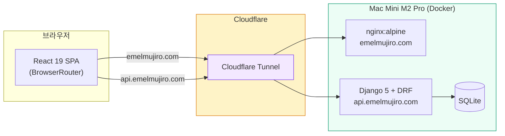

# 에멜무지로 (Emelmujiro) - AI 교육 & 컨설팅 플랫폼

<div align="center">

[](https://github.com/researcherhojin/emelmujiro/actions/workflows/main-ci-cd.yml)
[](https://www.typescriptlang.org/)
[](LICENSE)

**[Live Site](https://emelmujiro.com)** | **[Report Bug](https://github.com/researcherhojin/emelmujiro/issues)**

</div>

## 프로젝트 개요

**에멜무지로**는 2022년부터 축적한 AI 교육 노하우와 실무 프로젝트 경험을 바탕으로, 기업 맞춤형 AI 솔루션을 제공하는 전문 컨설팅 플랫폼입니다.

### 핵심 서비스

- **AI 교육 & 강의** — 기업 맞춤 AI 교육 프로그램 설계 및 운영
- **AI 컨설팅** — AI 도입 전략 수립부터 기술 자문까지
- **LLM/생성형 AI** — LLM 기반 서비스 설계 및 개발
- **Computer Vision** — 영상 처리 및 비전 AI 솔루션

## 현재 상태 (v1.0)

| 항목         | 상태    | 세부사항                                        |
| ------------ | ------- | ----------------------------------------------- |
| **빌드**     | ✅ 정상 | Vite 8 + SSG 프리렌더 12 routes                 |
| **CI/CD**    | ✅ 정상 | GitHub Actions → Mac Mini 자동 배포             |
| **테스트**   | ✅ 통과 | Frontend 880 (58 파일), Backend 104             |
| **모니터링** | ✅ 활성 | Sentry 에러 모니터링 + Google Analytics         |
| **SEO**      | ✅ 완료 | Search Console + 사이트맵 + 구조화 데이터       |
| **배포**     | ✅ 정상 | Mac Mini Docker + Cloudflare Tunnel + 자동 배포 |

## 빠른 시작

```bash
git clone https://github.com/researcherhojin/emelmujiro.git
cd emelmujiro && npm install
npm run dev              # Frontend (5173) + Backend (8000)
```

```bash
# 백엔드 (별도)
cd backend && uv sync && uv run python manage.py migrate
uv run python manage.py runserver
```

## 기술 스택

**Frontend**<br/>


**Testing**<br/>


**Backend**<br/>


**Infra**<br/>


## 아키텍처



## 주요 기능

| 기능                 | 상태    | 설명                                            |
| -------------------- | ------- | ----------------------------------------------- |
| **홈페이지**         | ✅      | Hero, 서비스 소개, 통계, CTA                    |
| **프로필**           | ✅      | CEO 경력/학력/프로젝트 포트폴리오               |
| **블로그**           | ✅      | 실제 백엔드 API 연동, 프리미엄 UI               |
| **문의하기**         | ✅      | Google Form 임베드                              |
| **다국어 (i18n)**    | ✅      | URL 기반 언어 라우팅 (`/about`, `/en/about`)    |
| **SEO**              | ✅      | SSG 프리렌더, hreflang, 사이트맵, 구조화 데이터 |
| **JWT 인증**         | ✅      | httpOnly 쿠키 기반 (XSS 방어)                   |
| **관리자 대시보드**  | ✅      | 통계 + 콘텐츠 관리                              |
| **Google Analytics** | ✅      | 페이지 뷰 + CTA 클릭 추적                       |
| **Sentry**           | ✅      | 에러 모니터링 + ErrorBoundary 연동              |
| **알림 시스템**      | ✅ (BE) | Notification 모델 + REST API + WebSocket        |

## 앞으로 할 것

| 작업               | 유형   | 설명                                    |
| ------------------ | ------ | --------------------------------------- |
| 블로그 글 작성     | 콘텐츠 | LLM, AI 에이전트, RAG 등 테크 블로그 글 |
| 카카오톡 채널 연동 | 마케팅 | 문의 채널 다변화                        |

## 라이선스

Apache License 2.0 — [LICENSE](LICENSE)

---

**문의**: [Issues](https://github.com/researcherhojin/emelmujiro/issues) | **사이트**: [emelmujiro.com](https://emelmujiro.com)
