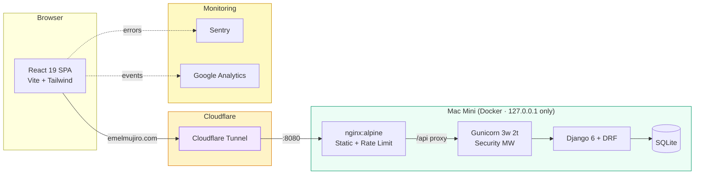

# Emelmujiro

<div align="center">

[](https://github.com/researcherhojin/emelmujiro/actions/workflows/main-ci-cd.yml)
[](https://codecov.io/gh/researcherhojin/emelmujiro)
[](LICENSE)

**[Live Site](https://emelmujiro.com)** | **[Contributing](CONTRIBUTING.md)** | **[Issues](https://github.com/researcherhojin/emelmujiro/issues)**

</div>

AI education, consulting & development — React 19 + Django 6 monorepo, self-hosted on Mac Mini via Docker + Cloudflare Tunnel.

<p align="center">
  
  
</p>

## Tech Stack

**Frontend**<br/>


**Backend**<br/>


**Testing**<br/>


**Infra**<br/>


## Getting Started

**Prerequisites**: Node >= 24, Python 3.12, [uv](https://docs.astral.sh/uv/)

```bash
git clone https://github.com/researcherhojin/emelmujiro.git
cd emelmujiro

# Install all dependencies
make install

# Backend first-time setup
cd backend && uv run python manage.py migrate && cd ..

# Start both servers (Frontend :5173 + Backend :8000)
npm run dev
```

### Useful Commands

```bash
make test                  # Run all tests (frontend + backend)
make lint                  # Run all linters
make lint-fix              # Auto-fix lint issues
npm run validate           # lint + type-check + test:coverage (frontend)

# Single test (from frontend/)
CI=true npm test -- --run src/components/common/__tests__/Navbar.test.tsx

# E2E tests (from frontend/)
npm run test:e2e           # Headless
npm run test:e2e:ui        # Interactive UI
npm run test:e2e:debug     # Debug mode

# Docker dev with optional PostgreSQL
docker compose -f docker-compose.dev.yml --profile postgres up
```

## Architecture



## Key Features

- **Bilingual (i18n)** — URL-based routing: Korean default (`/contact`), English `/en/contact`
- **Teaching History** — 35 entries across 5 years (2022–2026), org type filter (4 categories), alternating section backgrounds
- **Insights (Blog)** — TipTap rich text editor, slug URLs (`/insights/:slug`), image upload, IP-based likes, nested comments
- **Service Modals** — Clickable service cards with detail modals
- **Auth** — httpOnly cookie JWT with shared-promise refresh queue (prevents concurrent 401 cascade)
- **Testimonials** — Enterprise + K-Digital training reviews, auto-scroll carousel (2 rows, 8 items each)
- **Monitoring** — Sentry error tracking + Google Analytics
- **SEO** — Search Console, sitemap, hreflang, JSON-LD structured data, SSG prerendering
- **Performance** — 7 vendor chunks by update frequency, Lighthouse CI assertions, < 10MB bundle budget
- **Security** — DOMPurify HTML sanitization, CI `${{ }}` injection prevention, uuid4 uploads, rate limiting, IP blocking
- **Privacy Policy** — 13-section bilingual page compliant with Korean PIPA Article 30, with TOC navigation
- **Testing** — 100% coverage target: Vitest (1189 tests) + Django unittest (353 tests) + Playwright E2E (5 profiles)
- **CI/CD** — GitHub Actions: lint, type-check, test, Trivy security scan, bundle size, Lighthouse, Codecov, auto-deploy via webhook

## Development

Operational rules, conventions, and gotchas for both human contributors and AI sessions. Mirrored in [CLAUDE.md](CLAUDE.md) (auto-loaded by Claude Code) — both files are kept in lockstep as a single source of truth so any change to one must be applied to the other. UI/page-level conventions and code architecture details (provider order, blog data model, scroll carousel mechanics, etc.) live only in CLAUDE.md to keep this section focused on cross-cutting rules.

### Constraints

Build, runtime, and infrastructure rules. Violating these breaks deploys, security, or production.

**SEO**: `main.tsx` uses `createRoot()` (never `hydrateRoot`). Do NOT add static meta/title/OG tags to `index.html` — `SEOHelmet` handles everything. `SEOHelmet` auto-computes canonical URL from `location.pathname` — do NOT pass `url` props to `SEOHelmet` (it causes English pages to have wrong canonical). Page titles must NOT include `| 에멜무지로` suffix (appended automatically).

**KakaoTalk WebView**: `window.__appLoaded` must be set in `AppLayout` (router layout), NOT at provider level. iOS banner uses `kakaotalk://web/openExternal` scheme (NOT `window.open()`). Android uses `intent://` scheme with `#Intent;scheme=kakaotalk;end` suffix. Android WebView is Chrome-based so banner is hidden — only error fallback uses the intent scheme.

**Local dev vs Docker**: `npm run dev` runs local backend (`DEBUG=True`, SQLite, no throttle) + Vite. Docker runs production backend (`DEBUG=False`, throttle enabled). Don't run both — Docker backend occupies port 8000. For local development: stop Docker backend (`docker compose stop backend`) then `npm run dev`. Blog content in local SQLite and Docker DB are separate — changes to one don't affect the other.

**ENV file structure**: Root `.env` contains Docker Compose orchestration only (ports, tags, build flags — NO secrets). Backend app config is in `backend/.env` (local dev, loaded by `load_dotenv()`) and `backend/.env.production` (Docker production, loaded via `env_file` in docker-compose.yml). Both are gitignored. On new servers, create `backend/.env.production` from `backend/.env.example`.

**Deployment**: Never `rm -rf frontend/build` (breaks nginx volume mount) — use `rm -rf frontend/build/*`. Docker ports bound to `127.0.0.1` only. `SECRET_KEY` loaded via `env_file` — do NOT set in docker-compose `environment` section.

**CSP**: `'unsafe-inline'` required — index.html inline scripts (error handler, KakaoTalk detection, theme detection). `'unsafe-eval'` removed after `plugin-legacy` removal. Cloudflare Tunnel does not require CSP changes (transparent proxy).

**Tailwind 3.x**: PostCSS uses `tailwindcss: {}` (NOT `@tailwindcss/postcss`). Dark mode is `class`-based (not media query). Never use dynamic class interpolation (`bg-${color}-600`).

**Production keys**: `SECRET_KEY` and `RECAPTCHA_PRIVATE_KEY` raise `ImproperlyConfigured` if missing in production (DEBUG bypasses reCAPTCHA).

**Bundle size**: Build output must be < 10MB (enforced in `pr-checks.yml`). When adding large dependencies, check impact with `npm run analyze:bundle`.

**CI optimization**: `pr-checks.yml` uses `tj-actions/changed-files` to detect affected directories — frontend tests only run if `frontend/` changed, backend tests only if `backend/` changed. Trivy (`aquasecurity/trivy-action`) runs filesystem security scanning for dependency vulnerabilities on every PR.

**README drift gates**: 7 package badges are validated in `pr-checks.yml` quick-checks (compared to `package.json` on every PR). Vitest/Django test counts are validated in `main-ci-cd.yml` `frontend-test`/`backend-test` jobs by parsing the actual test runner stdout (`Tests N passed` for Vitest, `Ran N tests` for Django) and comparing to README — `pr-checks.yml` only checks that the count _exists_, not its value. On any drift failure, run `make update-test-counts` (or `./scripts/update-test-counts.sh`) which executes the real Vitest/Django and rewrites README. Do NOT use grep-over-test-files for Vitest counts — `it.each([...])` rows expand into N tests at runtime, so grep undercounts (e.g. grep returns 1163 while reality is 1189).

**Backend constants**: `api/constants.py` centralizes `ONE_HOUR`, `ONE_DAY`, `SPAM_KEYWORDS`, `SPAM_THRESHOLD`, `is_spam()`, and cache key constants (`CACHE_BLOG_CATEGORIES`, `CACHE_BLOG_POST_LIST`, `CACHE_ADMIN_STATS`). Do NOT re-define time constants or cache keys in views or middleware — import from here. `django-extensions` and `ipython` are dev-only dependencies (`uv sync --extra dev`).

**Backend utilities**: `api/utils.py` contains `get_client_ip()`, `_is_valid_ip()`, and `toggle_like()`. IP extraction is used by both views and middleware — import from utils, not views.

### Code Conventions

Cross-cutting rules for how code is written. Enforced by linters and CI where possible.

- **Conventional commits** required: `type(scope): description`. Allowed types: `feat`, `fix`, `docs`, `style`, `refactor`, `test`, `chore`, `deps`, `ci`.
- **Branch naming**: `feature/name` or `fix/description`.
- **ESLint flat config** (`eslint.config.mjs`, NOT `.eslintrc`). Zero warnings policy — CI fails on any warning.
- **English comments only** — no Korean comments in source.
- **All UI strings use i18n** — `useTranslation()` in components, `i18n.t()` in data files. No hardcoded user-facing text.
- **No `window.alert()` / `window.prompt()`** — use toast pattern or inline inputs.
- **Logger import**: `import logger from '../utils/logger'` — default export only. Use `env.IS_DEVELOPMENT` for environment checks.

### Testing

Global mocks in `setupTests.ts` (do NOT re-mock): `lucide-react`, `framer-motion`, `react-helmet-async`, browser APIs.

i18n mock — required in every test using `useTranslation()`:

```typescript
vi.mock('react-i18next', () => ({
  useTranslation: () => ({
    t: (key: string) => key,
    i18n: { language: 'ko', changeLanguage: vi.fn() },
  }),
  Trans: ({ children }: { children: React.ReactNode }) => children,
  initReactI18next: { type: '3rdParty', init: vi.fn() },
}));
```

Non-React: `vi.mock('../../i18n', () => ({ default: { t: (key: string) => key, language: 'ko' } }));`

Use `renderWithProviders` from `test-utils/` for component tests needing context (wraps MemoryRouter + providers). E2E tests: Playwright in `frontend/e2e/` — runs on 5 profiles (chromium, firefox, webkit, mobile chrome, mobile safari); PR checks run chromium only.

Coverage target: 100%.

**Backend test output is intentionally noisy** — `ERROR`/`WARNING` lines come from negative-path tests (XSS/SQL/path-traversal detection middleware, SMTP/DB failure simulations, JWT invalid/blacklisted token paths, reCAPTCHA network/JSON fallbacks, suspicious email patterns, blocked IPs). Trust `Ran N tests OK` + `exit code 0` as the success signal, not the absence of error logs.

### Security

**Blog HTML**: `content_html` (TipTap) is always sanitized with `DOMPurify.sanitize()` before rendering via `dangerouslySetInnerHTML`. Comments render as plain text only. Image right-click/drag prevention uses shared `preventImageAction` from `utils/imageUtils.ts`.

**CI workflows**: Never use `${{ }}` expressions directly inside `run:` blocks — always bind to `env:` first, then reference as `"$VAR"`. This prevents script injection via user-controllable values like branch names. Node setup/cache/install is extracted to `.github/actions/setup-node` composite action — use `uses: ./.github/actions/setup-node` instead of repeating the 3-step pattern.

**Shell scripts**: No `eval` with variables, no `source` of untrusted files (use `read` loop parsing), validate Make variables that reach shell commands.

**File uploads**: Backend uses `uuid4` for filenames (no user-supplied paths). Validated against extension whitelist + MIME type check + 5MB limit.

### Gotchas

Quick code-level traps that cost time when missed.

1. **`VITE_` prefix** for env vars (legacy `REACT_APP_` works via `config/env.ts` shim). Analytics var is `VITE_GA_TRACKING_ID` (env.ts reads `REACT_APP_GA_TRACKING_ID` → `VITE_GA_TRACKING_ID`).
2. **`useRef<T>(null)`** — React 19 requires initial value.
3. **`minimatch>=10.2.1`** override in `package.json` — don't remove.
4. **`tsconfig.build.json`** excludes test types — don't add `@testing-library/jest-dom`.
5. **`DATABASE_URL=""`** for backend tests — Docker PostgreSQL breaks SQLite tests.
6. **Never run `npm audit fix` (or `--force`)** — `make install` shows `8 vulnerabilities (4 low, 1 moderate, 3 high)` and that is the _expected_ state. The 3 high are transitive build-tool deps (`lodash`, `lodash-es`, `path-to-regexp`) with no production impact (nginx serves static `build/` without them). `--force` tries to downgrade `@lhci/cli` to 0.1.0 and would destroy Lighthouse CI. Update direct deps manually like vite 8.0.3 → 8.0.7 in `afd314e`; let dependabot handle transitives upstream.

## License

[GNU Affero General Public License v3.0](LICENSE)
