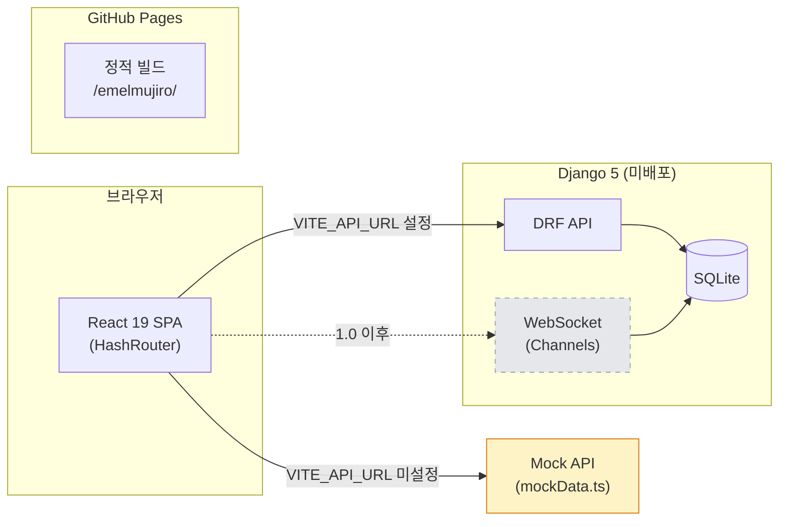
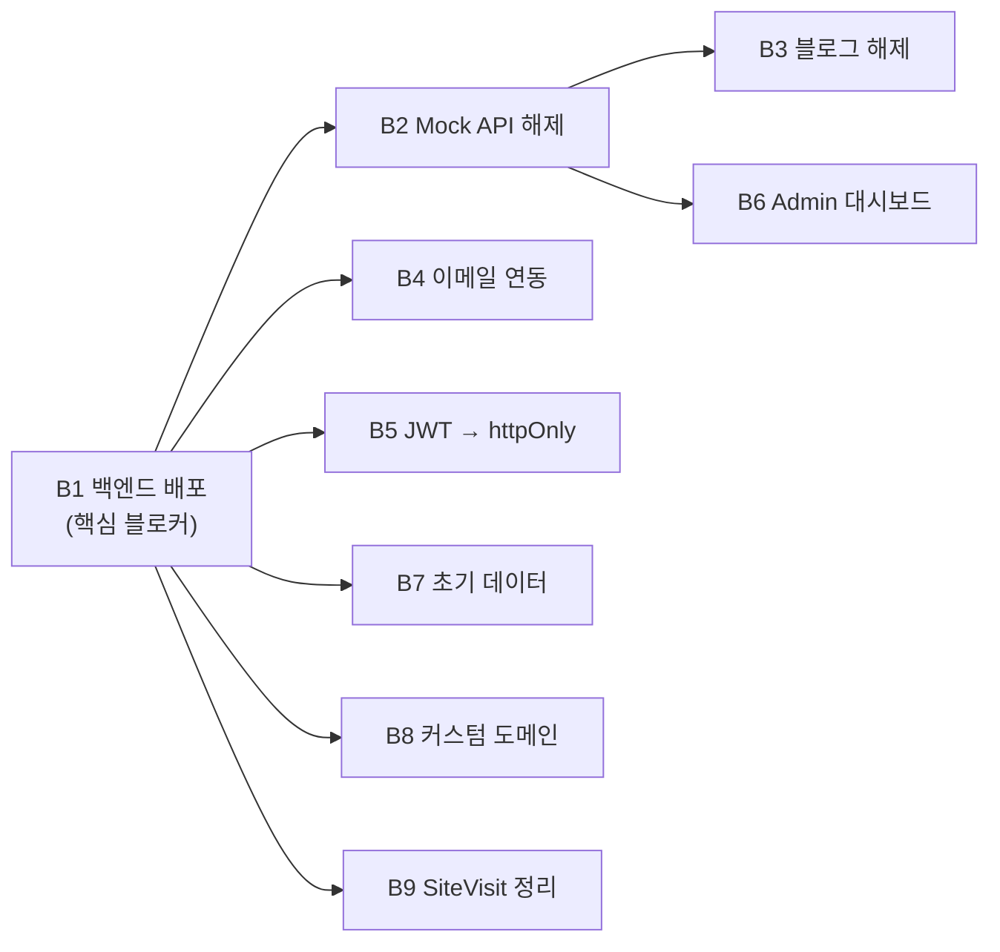

# 에멜무지로 (Emelmujiro) - AI 교육 & 컨설팅 플랫폼

<div align="center">

[](https://github.com/researcherhojin/emelmujiro/actions/workflows/main-ci-cd.yml)
[](https://www.typescriptlang.org/)
[](LICENSE)

**[Live Site](https://researcherhojin.github.io/emelmujiro)** | **[Report Bug](https://github.com/researcherhojin/emelmujiro/issues)**

</div>

## 프로젝트 개요

**에멜무지로**는 2022년부터 축적한 AI 교육 노하우와 실무 프로젝트 경험을 바탕으로, 기업 맞춤형 AI 솔루션을 제공하는 전문 컨설팅 플랫폼입니다.

### 핵심 서비스

- **AI 교육 & 강의** - 기업 맞춤 AI 교육 프로그램 설계 및 운영
- **AI 컨설팅** - AI 도입 전략 수립부터 기술 자문까지
- **LLM/생성형 AI** - LLM 기반 서비스 설계 및 개발
- **Computer Vision** - 영상 처리 및 비전 AI 솔루션

## 현재 상태 (v0.9.8)

| 항목       | 상태    | 세부사항                                      |
| ---------- | ------- | --------------------------------------------- |
| **빌드**   | ✅ 정상 | Vite + esbuild 빌드                           |
| **CI/CD**  | ✅ 정상 | GitHub Actions (Node 22, Python 3.12) ~2분    |
| **테스트** | ✅ 통과 | Frontend 1060 통과 (67 파일), Backend 69 통과 |
| **타입**   | ✅ 100% | TypeScript Strict Mode                        |
| **보안**   | ✅ 안전 | 취약점 0건                                    |
| **배포**   | ✅ 정상 | GitHub Pages                                  |
| **백엔드** | ⚠️ Mock | 프로덕션 Mock API 사용 중                     |

## 빠른 시작

```bash
# 설치
git clone https://github.com/researcherhojin/emelmujiro.git
cd emelmujiro
npm install

# 실행
npm run dev              # 전체 실행 (Frontend + Backend)
npm run dev:clean        # 포트 정리 후 실행

# 접속
# Frontend: http://localhost:5173
# Backend: http://localhost:8000
```

### 백엔드 (별도 설치 필요)

```bash
cd backend
uv sync                  # 의존성 설치 (uv 필요)
uv run python manage.py migrate
uv run python manage.py runserver
```

## 기술 스택

**Frontend**<br/>


**Testing**<br/>


**Backend**<br/>


**Infra**<br/>


## 아키텍처

### 시스템 구성도



### 핵심 설계 결정

| 영역           | 선택                                                                | 이유                                                            |
| -------------- | ------------------------------------------------------------------- | --------------------------------------------------------------- |
| 라우팅         | `createHashRouter` + `React.lazy`                                   | GitHub Pages 호환, 코드 스플리팅                                |
| 상태 관리      | React Context 5개 (UI, Auth, Blog, Form, Chat)                      | `useMemo`/`useCallback`으로 리렌더 방지, 외부 라이브러리 불필요 |
| API 클라이언트 | Axios + Mock/Real 자동 전환                                         | `VITE_API_URL` 유무로 결정, JWT 401 자동 갱신                   |
| i18n           | `react-i18next` + 크롤러 한국어 강제                                | 브라우저 언어 감지, SEO 봇은 `htmlTag`(`ko`) 고정               |
| 테스트         | Vitest (1060) + Playwright E2E (5 spec)                             | 전역 모킹(`setupTests.ts`) + `renderWithProviders` 자동화       |
| 빌드           | sitemap → `tsc` → Vite (esbuild)                                    | 프로덕션 시 `console`/`debugger` 자동 제거                      |
| 배포           | GitHub Actions → `deploy-pages@v4` → GitHub Pages                   | `main` push 시 자동 배포, `base: '/emelmujiro/'` 서브패스       |
| Provider 계층  | `HelmetProvider > ErrorBoundary > UI > Auth > Blog > Form > Router` | ChatProvider는 under construction으로 제외                      |

### 프로젝트 구조

```
emelmujiro/
├── frontend/               # React 19 + TypeScript + Vite + Tailwind 3.x
│   ├── src/
│   │   ├── components/     # common/ home/ blog/ chat/ layout/ pages/ profile/
│   │   ├── contexts/       # React Context 5개 (UI, Auth, Blog, Form, Chat)
│   │   ├── services/       # API 클라이언트 (Mock + Real, Axios)
│   │   ├── i18n/           # 다국어 (ko/en JSON)
│   │   ├── config/         # 환경변수 (env.ts)
│   │   ├── hooks/          # useScrollAnimation, useDebounce 등
│   │   ├── data/           # 정적 데이터 (blogPosts, services, footerData)
│   │   ├── types/          # TypeScript 타입 정의
│   │   ├── utils/          # logger, sentry, webVitals
│   │   └── test-utils/     # renderWithProviders, MSW
│   ├── e2e/                # Playwright E2E 테스트 (5 spec)
│   └── vitest.config.ts
├── backend/                # Django 5 + DRF + JWT
│   ├── api/                # 단일 앱: models, views, serializers, urls
│   ├── config/             # settings.py, urls.py, asgi.py
│   └── pyproject.toml      # uv 의존성 관리
├── .github/workflows/      # main-ci-cd.yml, pr-checks.yml
├── docker-compose.yml      # 프로덕션 (backend + nginx + PostgreSQL)
└── docker-compose.dev.yml  # 개발 (hot-reload)
```

## 주요 기능

| 기능                | 상태            | 설명                                         |
| ------------------- | --------------- | -------------------------------------------- |
| **홈페이지**        | ✅ 완료         | Hero, 서비스 소개, 통계, CTA                 |
| **프로필**          | ✅ 완료         | CEO 경력/학력/프로젝트 포트폴리오            |
| **다크 모드**       | ✅ 완료         | 시스템 설정 연동                             |
| **다국어 (i18n)**   | ✅ 완료         | 전체 컴포넌트 i18n 전환 완료 (ko/en)         |
| **반응형**          | ✅ 완료         | 모바일/태블릿/데스크톱 최적화                |
| **SEO**             | ✅ 완료         | React Helmet, 사이트맵, 구조화 데이터        |
| **블로그**          | 🚧 공사 중      | 백엔드 연동 전까지 공사 중 페이지 표시       |
| **문의하기**        | ✅ Google Form  | Google Form 임베드 (자동 메일 설정 TODO)     |
| **실시간 채팅**     | ⏸️ 1.0 이후     | WebSocket/Redis 필요, 1.0 범위에서 제외      |
| **관리자 대시보드** | 🚧 플레이스홀더 | UI + ProtectedRoute 인증 가드, API 연동 필요 |

## 주요 명령어

| 명령어                   | 설명                                                |
| ------------------------ | --------------------------------------------------- |
| `npm run dev`            | 개발 서버 시작                                      |
| `npm run build`          | 프로덕션 빌드 (sitemap → tsc → vite)                |
| `npm test`               | 테스트 실행 (watch)                                 |
| `npm run test:run`       | 테스트 단일 실행                                    |
| `npm run test:ci`        | CI 테스트 실행                                      |
| `npm run deploy`         | GitHub Pages 수동 배포 (보통 main push로 자동 배포) |
| `npm run type-check`     | TypeScript 체크                                     |
| `npm run lint:fix`       | ESLint 자동 수정                                    |
| `npm run validate`       | lint + type-check + test                            |
| `npm run test:coverage`  | 테스트 커버리지 리포트                              |
| `npm run analyze:bundle` | 번들 크기 분석                                      |

### 백엔드 명령어

| 명령어                              | 설명                        |
| ----------------------------------- | --------------------------- |
| `uv sync`                           | 의존성 설치                 |
| `uv run python manage.py runserver` | 개발 서버                   |
| `uv run python manage.py test`      | 테스트 실행                 |
| `uv run black .`                    | 코드 포맷 (line-length 120) |
| `uv run flake8 .`                   | 린트                        |
| `uv run isort .`                    | import 정렬                 |
| `uv run ruff check .`               | 빠른 린트                   |

### Makefile 단축 명령어

| 명령어            | 설명                  |
| ----------------- | --------------------- |
| `make install`    | 전체 의존성 설치      |
| `make dev-local`  | 로컬 개발 서버        |
| `make dev-docker` | Docker 개발 환경      |
| `make test`       | 프론트/백 전체 테스트 |
| `make lint`       | 프론트/백 전체 린트   |

## 앞으로 할 것

> **코드 품질 작업은 17차 감사로 전량 완료.** 아래는 기능 구현 및 배포 관련 남은 작업입니다.
>
> **1.0 범위**: Blog + Contact + Auth + Admin Dashboard | **1.0 이후**: 실시간 채팅, Notification

### 즉시 실행 가능 (백엔드 배포 불필요)

| #   | 작업                           | 우선순위 | 설명                                                                      |
| --- | ------------------------------ | -------- | ------------------------------------------------------------------------- |
| A1  | **Google Form 자동 메일 설정** | 높음     | Apps Script 트리거 등록 → 신청자 확인 메일 + 운영자 알림 메일 (하단 참조) |
| A2  | **Google Analytics 연동**      | 중간     | `VITE_GA_TRACKING_ID` 설정, gtag 이벤트 추적 (CTA 클릭, 페이지 뷰)        |
| A3  | **Sentry 활성화**              | 중간     | `VITE_SENTRY_DSN` + `VITE_ENABLE_SENTRY=true` 설정                        |
| A4  | **OG 이미지 최신화**           | 낮음     | `public/og-image.png` 디자인 업데이트                                     |
| A5  | **Lighthouse CI 자동화**       | 낮음     | GitHub Actions에 LHCI 스텝 추가 (`npm run preview` → lhci autorun)        |

### 백엔드 배포 후 실행



| #   | 작업                         | 의존성 | 설명                                                                                      |
| --- | ---------------------------- | ------ | ----------------------------------------------------------------------------------------- |
| B1  | **백엔드 프로덕션 배포**     | —      | Django + SQLite 배포 (Railway / Render / Fly.io), `ALLOWED_HOSTS`, `CSRF_TRUSTED_ORIGINS` |
| B2  | **Mock API → Real API 전환** | B1     | `VITE_API_URL=https://api.emelmujiro.com/api` 설정 → Mock 자동 비활성화                   |
| B3  | **블로그 공사 중 해제**      | B2     | `App.tsx` 라우트 복원, sitemap/manifest/E2E 업데이트                                      |
| B4  | **이메일 발송 연동**         | B1     | Contact 폼 SMTP/SendGrid 연동 (현재 Google Form 임베드 사용 중)                           |
| B5  | **JWT → httpOnly 쿠키**      | B1     | `localStorage` → `httpOnly` 쿠키 이전 (XSS 방어 강화)                                     |
| B6  | **Admin 대시보드 API 연동**  | B2     | 실제 통계 API 연결, 컴포넌트 분리 권장                                                    |
| B7  | **초기 데이터 fixture**      | B1     | `createsuperuser` + 블로그 포스트 fixture (`manage.py loaddata`)                          |
| B8  | **커스텀 도메인**            | B1     | GitHub Pages CNAME + DNS (`emelmujiro.com`), `SITE_URL` 업데이트                          |
| B9  | **SiteVisit 정기 정리**      | B1     | `manage.py cleanup_sitevisits --days 90` cron 등록 (명령어 구현 완료)                     |

<details>
<summary>배포 플랫폼 비교</summary>

| 플랫폼  | 무료 티어    | SQLite 지원            | 장점             | 단점                     |
| ------- | ------------ | ---------------------- | ---------------- | ------------------------ |
| Railway | $5 크레딧/월 | Persistent Volume      | 가장 간편한 배포 | 무료 크레딧 소진 가능    |
| Render  | 750시간/월   | Persistent Disk (유료) | GitHub 자동 배포 | 무료 인스턴스 15분 sleep |
| Fly.io  | 256MB VM     | Persistent Volume      | 글로벌 엣지      | 설정 다소 복잡           |

</details>

### 장기 개선 사항

| #   | 작업                      | 설명                                                                                 |
| --- | ------------------------- | ------------------------------------------------------------------------------------ |
| C1  | **BrowserRouter 전환**    | `/#/about` → `/about` — 서버 사이드 catch-all 필요, SEO 개선                         |
| C2  | **SSG / Prerendering**    | 정적 HTML 생성 → 크롤러 완성된 HTML 수신 (react-snap 또는 Next.js)                   |
| C3  | **`hreflang` 다국어 SEO** | `/ko/about`, `/en/about` + `hreflang` 태그                                           |
| C4  | **실시간 채팅**           | WebSocket/Redis/Channels 구현, `ChatWidget` AppLayout 복원 (프론트엔드 UI 완성 상태) |
| C5  | **Notification 모델**     | `consumers.py:251,256` 스텁 → Django 모델 + REST API + WebSocket 핸들러              |

## 배포 가이드

<details>
<summary>백엔드 배포 후 전환 가이드 (클릭하여 펼치기)</summary>

### 1단계: 백엔드 설정

```bash
# 배포 플랫폼에서 환경변수 설정
SECRET_KEY=<생성된 시크릿 키>
DEBUG=False
ALLOWED_HOSTS=api.emelmujiro.com
CSRF_TRUSTED_ORIGINS=https://emelmujiro.com,https://researcherhojin.github.io
CORS_ALLOWED_ORIGINS=https://emelmujiro.com,https://researcherhojin.github.io
DATABASE_URL=  # SQLite 사용 시 비워두기, Persistent Volume 경로 설정 필요

# 초기 데이터
python manage.py migrate
python manage.py createsuperuser
python manage.py loaddata <fixture파일>  # 블로그 초기 포스트 (선택)
```

### 2단계: 프론트엔드 Mock API 해제

```bash
# frontend/.env 또는 GitHub Actions secrets에 설정
VITE_API_URL=https://api.emelmujiro.com/api

# 이 값이 설정되면 Mock API가 자동으로 비활성화됨
# (src/config/env.ts → USE_MOCK_API = false)
```

### 3단계: 블로그 공사 중 페이지 해제

```tsx
// frontend/src/App.tsx — UnderConstruction을 원본 컴포넌트로 교체
const BlogListPage = lazy(() => import('./components/blog/BlogListPage'));
const BlogDetail = lazy(() => import('./components/blog/BlogDetail'));
const BlogEditor = lazy(() => import('./components/blog/BlogEditor'));

// 라우트 변경
{ path: 'blog', element: <BlogListPage /> },
{ path: 'blog/new', element: <BlogEditor /> },
{ path: 'blog/:id', element: <BlogDetail /> },
```

### 4단계: 추가 업데이트

- `generate-sitemap.js` — 블로그 URL 활성화
- `manifest.json` — 블로그 관련 shortcut 복원
- `e2e/blog.spec.ts`, `e2e/contact.spec.ts` — E2E 테스트 업데이트
- 이메일 발송: `EMAIL_HOST`, `EMAIL_HOST_USER`, `EMAIL_HOST_PASSWORD` 설정 (또는 SendGrid)
- Contact 페이지: Google Form → 백엔드 API 전환 여부 결정

### 5단계: 커스텀 도메인 (선택)

- DNS: `emelmujiro.com` CNAME → `researcherhojin.github.io`
- GitHub Pages: Settings → Custom domain → `emelmujiro.com`
- `frontend/src/utils/constants.ts` → `SITE_URL` 업데이트
- `frontend/public/CNAME` 파일 생성

</details>

<details>
<summary>Google Form 자동 메일 설정 (클릭하여 펼치기)</summary>

현재 `/contact` 페이지는 Google Form 임베드 사용 중. 아래 설정을 완료하면 신청자 + 운영자 양쪽에 자동 메일 발송:

- [ ] **Google Forms 설정** → 응답 → "응답자에게 응답 사본 보내기" → "항상" 활성화
- [ ] **Google Forms 설정** → 응답 → "새로운 응답에 대한 이메일 알림 받기" 체크
- [ ] **Apps Script 등록** — Google Forms 편집 → ⋮ → 스크립트 편집기 → 아래 코드 추가:

```javascript
function onFormSubmit(e) {
  var responses = e.namedValues;
  var email = responses['이메일 (필수)'][0];
  var name = responses['성함 / 기관명 (필수)'][0];
  var field = responses['상담 분야 (필수)'][0];
  var request = responses['요청 내용 (필수)'][0];
  var schedule = responses['희망 일정 (필수)'][0];

  // 1. Confirmation email to the submitter
  var userSubject = '[에멜무지로] 온라인 미팅 신청이 접수되었습니다';
  var userBody =
    name +
    '님, 안녕하세요.\n\n' +
    '에멜무지로에 문의해 주셔서 감사합니다.\n' +
    '접수하신 내용을 확인 후, 기재하신 연락처로 빠른 시일 내에 회신드리겠습니다.\n\n' +
    '── 접수 내용 ──\n' +
    '상담 분야: ' +
    field +
    '\n' +
    '요청 내용: ' +
    request +
    '\n' +
    '희망 일정: ' +
    schedule +
    '\n\n' +
    '감사합니다.\n에멜무지로 드림';
  MailApp.sendEmail(email, userSubject, userBody);

  // 2. Notification email to the operator
  var adminEmail = 'researcherhojin@gmail.com';
  var adminSubject = '[에멜무지로] 새 미팅 신청: ' + name + ' (' + field + ')';
  var adminBody =
    '새로운 온라인 미팅 신청이 접수되었습니다.\n\n' +
    '성함/기관명: ' +
    name +
    '\n' +
    '이메일: ' +
    email +
    '\n' +
    '연락처: ' +
    (responses['연락처 (선택)'] || ['미입력'])[0] +
    '\n' +
    '상담 분야: ' +
    field +
    '\n' +
    '요청 내용: ' +
    request +
    '\n' +
    '희망 일정: ' +
    schedule +
    '\n' +
    '예산 범위: ' +
    (responses['예산 범위 (선택)'] || ['미입력'])[0] +
    '\n' +
    '기타 의견: ' +
    (responses['기타 의견이나 제안사항이 있다면 자유롭게 적어 주십시오.'] || [
      '없음',
    ])[0];
  MailApp.sendEmail(adminEmail, adminSubject, adminBody);
}
```

- [ ] **트리거 설정** — 스크립트 편집기 → 시계 아이콘 → + 트리거 추가 → 함수: `onFormSubmit`, 이벤트: "양식 제출 시" → 저장
- [ ] **테스트 제출** — 양식 제출 후 신청자 메일 + 운영자 메일(researcherhojin@gmail.com) 수신 확인

</details>

## 리팩토링 백로그

> **전량 해소 완료.** 17차에 걸친 코드 감사를 통해 식별된 모든 항목을 해결했습니다.

| 감사  | 날짜        | 해결 건수 | 주요 내용                                                                                                                                                                                                                   |
| ----- | ----------- | --------- | --------------------------------------------------------------------------------------------------------------------------------------------------------------------------------------------------------------------------- |
| 17차  | 2026.03.10  | 3건       | KakaoTalk Android 흰 화면 근본 수정 — 다층 폴백 → `document.write()` 즉시 리다이렉트 전환, `main.tsx` React 초기화 차단, 5초 폴백 `#root` 직접 타겟으로 수정                                                                |
| 16차  | 2026.03.10  | 7건       | cleanup_sitevisits 필드명 버그 수정, 미도달 WebSocket 핸들러 제거, 미사용 swagger 파라미터/sentry 함수/constants 제거, API 테스트 4파일→2파일 통합 (-955줄)                                                                 |
| 15차  | 2026.03.10  | 6건       | Prettier 설정 충돌 해소, MessageList XSS 강화(innerHTML→DOM, 파일명 sanitize), CSP frame-src reCAPTCHA 허용, 페이지네이션 MAX_PAGE_SIZE 보호, SiteVisit 정리 명령어                                                         |
| 14차  | 2026.03.10  | 8건       | WebSocket timezone.now() 통일, ContactAttempt 원자적 증가(F()), 잘못된 메시지 타입 거부, 클립보드 실패 시 복사 표시 방지, SESSION_SAVE_EVERY_REQUEST 제거, tsconfig.ci strict, Dependabot 루트 npm, Dockerfile.dev non-root |
| 13차  | 2026.03.10  | 9건       | GH Actions 최신 안정 버전 통일 (checkout/setup-node@v6, cache@v5, artifact@v6), Lighthouse URL 프리뷰 포트, Dependabot vitest+백엔드 그룹, Codecov 플래그 분리, 이메일 설정 안전장치                                        |
| 12차  | 2026.03.10  | 5건       | SEO 하드코딩 영어→i18n 전환 (StructuredData/SEOHelmet), ESLint 9→10 업그레이드, global.d.ts 타입 보강, backend uv.lock 동기화                                                                                               |
| 11차  | 2026.03.10  | 7건       | CI 파이프라인 수정 (uv --extra dev, Trivy 0.35.0, SECRET_KEY), Django 5.2.12 보안패치, react-helmet-async v3, 백엔드 black/flake8 수정                                                                                      |
| 10차  | 2026.03.10  | 8건       | KakaoTalk 인앱 브라우저 백지 문제 해결 (다층 폴백), 배너 i18n 전환, Android intent 스킴, 인라인 스타일 스켈레톤                                                                                                             |
| 9차   | 2026.03.09  | 5건       | CSP localhost 제거, sitemap/Lighthouse에 /contact 추가, UnderConstruction dead type/test 제거                                                                                                                               |
| 8차   | 2026.03.09  | 8건       | TS 빌드 오류, ESLint 워크스페이스 호이스팅, ESLint 경고 21건 → 0건                                                                                                                                                          |
| 7차   | 2026.03.09  | 18건      | SEO 크롤러 한국어 강제, slug 원자성, MD5→SHA256, Docker non-root                                                                                                                                                            |
| 6차   | 2026.03.08  | 7건       | i18n fallback 제거 50+건, `title→aria-label`, `onKeyPress→onKeyDown`                                                                                                                                                        |
| 5차   | 2026.03.07  | 확인      | 3~4차 전량 해소 확인, 배포 대기 항목만 잔여                                                                                                                                                                                 |
| 4차   | 2026.03.07  | 15건      | 비밀번호 정책, `key={index}` 19곳 교체, `crypto.randomUUID()` 통일                                                                                                                                                          |
| 3차   | 2026.03.07  | 47건      | 미들웨어 미등록, ObjectURL 누수, JWT 블랙리스트, 컴포넌트 분할                                                                                                                                                              |
| 1~2차 | ~2026.03.07 | 21건      | HashRouter 버그, Zustand 제거, i18n 전환, Sentry 초기화, Docker 버전 통일                                                                                                                                                   |

**총 해결: Critical 13 / High 26 / Medium 52 / Low 33 / Backend 7 / 이슈 아님 6건**

<details>
<summary>감사 상세 기록 (클릭하여 펼치기)</summary>

### 17차 감사 (2026.03.10)

- **H1** KakaoTalk Android 흰 화면 근본 수정 — 기존 다층 폴백(legacy 번들 강제 로딩, 2초/5초 타임아웃) 실패: module 스크립트가 부분 실행되어 React가 `#root` 스켈레톤을 제거한 후 크래시 → 모든 폴백 무력화. `document.write()` 즉시 정적 "외부 브라우저에서 열기" 페이지 + `intent://` 스킴으로 전환. iOS KakaoTalk(WKWebView)은 정상이므로 Android만 적용
- **M1** `main.tsx`에 `window.__isKakaoAndroid` 가드 추가 — Android KakaoTalk에서 React 초기화 완전 차단 (불필요한 리소스 사용 방지)
- **M2** 5초 일반 폴백이 `#loading-fallback` 대신 `#root`를 직접 타겟하도록 수정 — React가 이미 `#root` 내용을 교체한 경우에도 폴백 정상 표시

### 16차 감사 (2026.03.10)

- **C1** `cleanup_sitevisits.py` 필드명 오류: `visited_at` → `visit_time` (모델 필드명과 불일치, 런타임 FieldError)
- **L1** ChatConsumer 미도달 핸들러 `file_upload`/`system_message` 제거 — `ALLOWED_MESSAGE_TYPES` 화이트리스트에 없어 도달 불가
- **L2** `swagger.py` 미사용 파라미터 정의 5개 제거 (`auth_header`, `page_param`, `page_size_param`, `search_param`, `category_param`)
- **L3** `sentry.ts` 미사용 함수 6개 제거 (`setSentryUser`, `setSentryContext`, `captureMessage`, `addBreadcrumb`, `startTransaction`, `measurePerformance`)
- **L4** `constants.ts` 미사용 상수 4개 제거 (`ANIMATION_DURATION`, `BREAKPOINTS`, `API_ENDPOINTS`, `STORAGE_KEYS`) + 해당 테스트 제거
- **L5** API 테스트 4파일 → 2파일 통합: `api.comprehensive.test.ts`, `api.integration.test.ts` 삭제, CRUD 테스트는 `api.additional.test.ts`로 병합
- **L6** CLAUDE.md/README.md 테스트 수 업데이트: 69파일/1109 → 67파일/1060

### 15차 감사 (2026.03.10)

- **M1** `frontend/.prettierrc` printWidth: 80 → 100 — 루트 설정과 일치시켜 충돌 제거
- **M2** MessageList.tsx `innerHTML = ''` → DOM `removeChild` 루프로 XSS 안전하게 변경
- **M3** MessageList.tsx 파일명 sanitize 강화 — `<>` 뿐 아니라 `"'&`도 제거
- **M4** 백엔드 CSP `frame-src 'none'` → `frame-src https://www.google.com https://recaptcha.google.com` (reCAPTCHA iframe 허용)
- **L1** DRF 페이지네이션 `MAX_PAGE_SIZE=100` 보호 — 커스텀 `StandardPagination` 클래스로 `page_size` 쿼리 파라미터 + 상한 적용
- **L2** `manage.py cleanup_sitevisits` 명령어 추가 — `--days 90` (기본), `--dry-run` 옵션으로 SiteVisit 테이블 정리

### 14차 감사 (2026.03.10)

- **H1** WebSocket `datetime.now()` → `timezone.now()` 통일 — USE_TZ=True 설정과 일치 (consumers.py 7곳)
- **H2** ContactAttempt 경쟁 조건 수정 — `attempt_count += 1` → `F("attempt_count") + 1` 원자적 증가 (views.py)
- **M1** 잘못된 WebSocket 메시지 타입 → 기본값 할당 대신 에러 반환 + 거부 (consumers.py)
- **M2** BlogInteractions 클립보드 복사 실패 시 "복사됨" 상태 표시 방지 + logger.warn 추가
- **M3** `SESSION_SAVE_EVERY_REQUEST` 제거 — 불필요한 매 요청 DB 세션 저장 (settings.py)
- **L1** tsconfig.ci.json `strict: true` 추가 — CLAUDE.md 문서와 실제 설정 일치
- **L2** Dependabot: 루트 npm 엔트리 추가 (eslint, husky, prettier 등 루트 의존성 업데이트)
- **L3** Backend Dockerfile.dev: non-root 사용자 추가 — 프로덕션 Dockerfile과 보안 일관성

### 13차 감사 (2026.03.10)

- **H1** GitHub Actions 최신 안정 버전 통일: checkout@v6, setup-node@v6, cache@v5, upload-artifact@v6, download-artifact@v6 (main-ci-cd.yml + pr-checks.yml)
- **H2** `DEFAULT_FROM_EMAIL` None 방지 — `EMAIL_HOST_USER or "noreply@emelmujiro.com"` 폴백 추가, `ADMIN_EMAIL` 기본값 실제 이메일로 수정
- **M1** Lighthouse CI URL: dev 포트 5173 → preview 포트 4173 (프로덕션 빌드 테스트)
- **M2** Dependabot: frontend testing 그룹에 `vitest*` 추가
- **M3** Dependabot: backend pip 의존성 그룹핑 (django, testing, dev-tools)
- **M4** Codecov: project status를 frontend/backend 별도 플래그로 분리 (프론트만 변경 시 백엔드 커버리지 불요)
- **M5** Codecov: ignore 패턴에 `*.spec.tsx`, `*.test.jsx` 추가
- **L1** 백엔드 미사용 import 제거 (admin.py, tests.py), CategoryListView dict 캐싱
- **L2** Docker Node 24→22 LTS (Dockerfile + Dockerfile.dev)

### 12차 감사 (2026.03.10)

- **H1** StructuredData.tsx 하드코딩 영어 6건 → i18n `t()` 호출 전환 (contactType, countryName, personAlternateName, personJobTitle, knowsAbout)
- **H2** SEOHelmet.tsx 하드코딩 영어 2건 → i18n `t()` 호출 전환 (contactType, countryName)
- **M1** ESLint 9 → 10 업그레이드 (root + frontend package.json 동기화, CLAUDE.md 문서 반영)
- **M2** `global.d.ts` Window 인터페이스에 `__legacyFailed` 타입 추가 (KakaoTalk fallback용)
- **L1** backend `uv.lock` redis 7.2.1 → 7.3.0 동기화, en.json/ko.json SEO i18n 키 추가

### 11차 감사 (2026.03.10)

- **H1** CI `uv sync --frozen` → `uv sync --frozen --extra dev` — black/flake8/pytest가 `[project.optional-dependencies]`에 있어 설치 누락
- **H2** Django 5.2.11 → 5.2.12 보안 패치 (CVE-2026-25673: DoS via slow URL normalization)
- **H3** PR backend tests에 `SECRET_KEY`/`DEBUG`/`DATABASE_URL` 환경변수 누락 → `ImproperlyConfigured` 에러
- **M1** Trivy action 0.34.1 → 0.35.0 (설치 실패 해결)
- **M2** 백엔드 코드 black 포맷팅 수정 (7파일) + flake8 에러 수정 (F541, F841, E402 noqa)
- **M3** react-helmet-async 2.0.5 → 3.0.0 + `@types/react-helmet-async` 제거 (v3 자체 타입 제공)
- **L1** Dependabot PR 7건 처리 (4건 머지, 2건 직접 적용 후 닫음, 1건 Python 3.14 미정식으로 닫음)

### 10차 감사 (2026.03.10)

- **H1** KakaoTalk 인앱 WebView 백지 문제 — `type="module"` 미실행 시 plain `<script>`에서 legacy 번들 강제 로딩 (2초 `__appLoaded` 체크)
- **H2** Layout.tsx 카카오 배너 하드코딩 한국어 → `t('common.kakaoBanner')` / `t('common.openExternal')` i18n 키 전환
- **H3** `window.open()` → Android `intent://` 스킴으로 외부 브라우저 강제 열기
- **M1** `index.html` 로딩 스켈레톤 Tailwind 클래스 → 인라인 스타일 (CSS 로드 전 가시성)
- **M2** `index.html` 인라인 스크립트 `localStorage`/네트워크 감지 try-catch 래핑
- **M3** `window.onerror` 에러 핸들러 추가 (인라인 스크립트 에러 시각화)
- **M4** Critical CSS 미사용 클래스 6개 제거 (`.min-h-screen`, `.flex`, `.items-center` 등)
- **L1** `vite.config.ts`에 `build.target: ['chrome64', ...]` 안전장치 추가

### 9차 감사 (2026.03.09)

- **H1** `UnderConstruction` featureKey 타입에서 `'contact'` 제거 (dead type — /contact는 Google Form 사용)
- **H2** `UnderConstruction.test.tsx` contact feature 테스트 제거 (dead test)
- **H3** `generate-sitemap.js`에 `/#/contact` 추가 (실제 운영 중인 페이지 누락)
- **M1** `vite.config.ts`에 `stripLocalhostCsp` 플러그인 추가 — 프로덕션 빌드에서 CSP `localhost` 항목 자동 제거
- **M2** `lighthouserc.js`에 `/#/contact` URL 추가

### 8차 감사 (2026.03.09)

- **E1** `BlogFlow.test.tsx` 수동 타입캐스트 → `vi.mocked()` (TS 빌드 수정)
- **E2** `eslint-plugin-react` 워크스페이스 호이스팅 → root에 eslint devDep 추가
- **E3** `SharePage.tsx`, `FormContext.tsx` `no-useless-assignment` 오류
- **W1** 미사용 `index` 파라미터 7건 제거
- **W2** ChatContext 10개 함수 `useCallback` 래핑
- **W3** AdminDashboard `fetchDashboardData` → `useCallback`
- **W4** ContactPage 에러 div `role="alert"`, `onKeyDown`, `tabIndex`
- **W5** Layout.test.tsx mock SkipLink `href` 추가

### 7차 감사 (2026.03.09)

- **H1~H5** Layout sr-only i18n 전환, BlogFlow 실질 assertion, dead test-utils 삭제, BlogInteractions 정밀 assertion
- **M1~M7** slug IntegrityError retry, spam fail-closed, user_agent CharField, Node engines 22, env.ts MODE 통합, ChatContext setTimeout useRef
- **L1~L6** MD5→SHA256, Dockerfile.dev non-root, Node 24-alpine, AudioContext close, BlogSearch waitFor, React.memo 적용

### 6차 감사 (2026.03.08)

i18n fallback 50+건, `title→aria-label` 6개 버튼, `onKeyPress→onKeyDown` 3곳, Backend 한국어 주석 100+건 영어 전환, 테스트 i18n 키 통일 34+ assertion, BlogComments aria-label i18n

### 5차 감사 (2026.03.07)

3~4차 전량 해소 확인. 잔여: AdminDashboard 분리(→배포 #6), Notification 스텁(→1.0 이후), 대형 서비스 파일 분리(현재 이슈 아님)

### 4차 감사 (2026.03.07)

- **H1~H5** 비밀번호 12자 통일, 미사용 import, get_client_ip 중복, process.env→env.IS_DEVELOPMENT, 백엔드 69 테스트
- **M1~M6** key={index} 19곳 교체, WebSocket 큐 100 cap, crypto.randomUUID, useScrollToSection 훅
- **L1~L4** 매직넘버 상수화, Bell aria-label, date 필드 문서화, serializer camelCase 문서화

### 3차 감사 (2026.03.07)

- **C1~C5** 미들웨어 등록, security_check 필드명, NotificationConsumer JSON 검증, ObjectURL revoke
- **H1~H8** str(e) 노출 제거, 뉴스레터 재구독, BlogPost 인덱스, logger.ts env 전환
- **M1~M12** dead test-utils, window.alert→toast, ChatContext 분할(709→310줄), setupTests lucide Proxy, Sentry 정리, api.ts dead code
- **L1~L7** 인라인 스타일 제거, AboutPage/BlogComments 분리, Swagger CONTACT_EMAIL, E2E 8개 테스트

### 1~2차 감사

- **C1~C7** HashRouter 버그, 동적 Tailwind, TS 컴파일 8건, FileUpload i18n, docker-compose VITE_API_URL
- **H1~H7** Zustand 제거, types 정리, performanceMonitor 삭제, Sentry init, 한국어→영어, MemoryRouter, Dockerfile 3.12
- **M1~M9** api.ts i18n 에러맵, 인라인 스타일→Tailwind, hex→Tailwind, process.env 통일, Footer 테스트 정리
- **L1~L3** window.confirm→모달, BlogSearch aria-label, 컴포넌트 분할(AdminPanel/MessageList/BlogEditor)
- **BE1~BE7** bare except, ChatConsumer 인증, 하드코딩 자격증명, 카테고리 수정, django-ratelimit 제거, urlparse

</details>

## 변경 이력

### 0.9.8 (2026.03.07)

- **로고 시스템 리뉴얼**
  - 파트너사 로고 20개 최신화 및 파일명 통일 (`상호명+Logo.확장자`)
  - LogosSection 리팩토링: LogoItem/ScrollRow 서브컴포넌트 추출, 3x 복제 무한 스크롤, 그라디언트 페이드 마스크
  - 스크롤 속도 32s, Row 1(대기업 중심) / Row 2(교육/공공) 재배치
- **컴포넌트 분할**: ProfilePage (497→120줄, 5개 서브컴포넌트), ServiceModal을 Footer에서 분리
- **API 패턴 통일**: AuthContext가 axiosInstance 대신 `api` 객체 사용으로 전환
- **데드 코드 제거**: `cacheOptimization.ts`(155줄), `blogCache.ts`(231줄), ChatProvider를 App.tsx에서 제거
- **리팩토링 백로그 전량 해소** — 16건 완료, 2건 이슈 아님 (상세 → 리팩토링 백로그 참조)
- **i18n 완성도 강화**: BlogEditor + FileUpload 하드코딩 한국어 → i18n 키 전환
- **코드 품질 개선**
  - 소스 코드 한국어 주석 → 영어 전환 (15+ 파일)
  - setTimeout 메모리 누수 전수 수정 (UIContext, FormContext, Navbar, Footer, BlogInteractions, BlogSearch, ChatContext)
- **CLAUDE.md 업데이트**: React 19 useRef 패턴, Docker 빌드 arg, ChatConsumer 보안, 글로벌 lucide-react mock testid 등 반영
- **도메인 확보**: `emelmujiro.com` — 백엔드 배포 시 사용 예정
- **테스트**: 67 파일, 1060 테스트, 0 실패

### 0.9.7 (2026.03.04 ~ 03.05)

- **Android(갤럭시) 호환성 개선**
  - Viewport: `viewport-fit=cover`, `100dvh` 동적 뷰포트 단위 적용
  - CSS: `-webkit-text-size-adjust`, `-webkit-backface-visibility` 접두사 추가
  - `prefers-reduced-motion` 미디어 쿼리 추가 (저사양 기기 성능 개선)
  - CSP `connect-src`에 `cdn.jsdelivr.net` 추가, 무효 `frame-ancestors` 제거
  - 카카오톡 Android 인앱 브라우저: `document.write()` 즉시 리다이렉트 (React 초기화 차단, `intent://` 외부 브라우저). iOS KakaoTalk은 WKWebView로 정상 동작
  - 로딩 스켈레톤 인라인 스타일 전환 (Tailwind CSS 로드 전 가시성 보장)
  - 배너 하드코딩 한국어 → i18n 키 전환, `window.onerror` 에러 핸들러 추가
- **PWA 제거**: 서비스 워커 캐시 이슈로 PWA 전체 제거 (vite-plugin-pwa, SW, 오프라인 지원)
- **코드베이스 딥 오딧** (-3,580 lines)
  - 고립된 컴포넌트 21개 삭제 (Loading, PageLoading, ScrollProgress, ScrollToTop, Section, ErrorMessage, LazyImage, SEOHead, layout/SEO, i18nFormatters, common/index)
  - index.html: CRA `%PUBLIC_URL%` → Vite 경로 수정, Zustand 테마 감지 수정, dead script 제거
  - Dead CSS 20개 클래스 + 미사용 CSS 변수 제거 (btn-primary/secondary, card, section-heading 등)
  - stale `REACT_APP_` 환경변수 참조 수정 (logger.ts, handlers.ts, api.test.ts)
  - 미사용 타입 3개 삭제 (ContactApiData, MockEvent, UnknownError)
  - 미사용 i18n 키, 고립된 locale 하위 디렉토리(16파일), stale 코멘트 제거
- **README 리팩토링**: 기술 스택 테이블 형식 전환, CONTRIBUTING.md 최신화
- **버전 동기화**: root/frontend package.json 버전 통일 (0.9.7)

### 0.9.6 (2026.03.04)

- ProfilePage UX 리팩토링, Hero CTA mailto 전환, break-keep 적용

### 0.9.5 (2026.03.03)

- Django 보안 강화, 파일 업로드 검증, Mock API 자동 전환, Docker Redis 옵셔널화

### 0.9.0 ~ 0.9.4 (2026.02.28 ~ 03.02)

- i18n 전체 전환, P0 보안 수정, 접근성 개선, dead code 정리, 테스트 정리 (1718 → 1233)
- Blog/Contact/Chat 공사 중 전환, Admin ProtectedRoute, Pre-commit 훅

### 0.8.0 이전 (2025.09 ~ 2026.02)

- Jest → Vitest, Tailwind 3.x 전환, CI/CD 구축, 번들 52% 감소, Node 22 + Python 3.12

## 라이선스

Apache License 2.0 — 자세한 내용은 [LICENSE](LICENSE) 파일을 참조하세요.

---

**문의**: [Issues](https://github.com/researcherhojin/emelmujiro/issues) | **사이트**: [emelmujiro](https://researcherhojin.github.io/emelmujiro)
