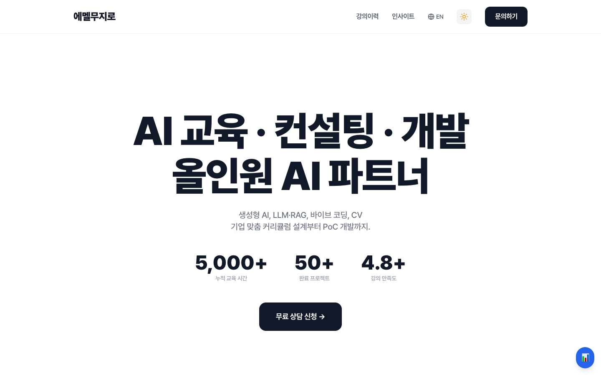
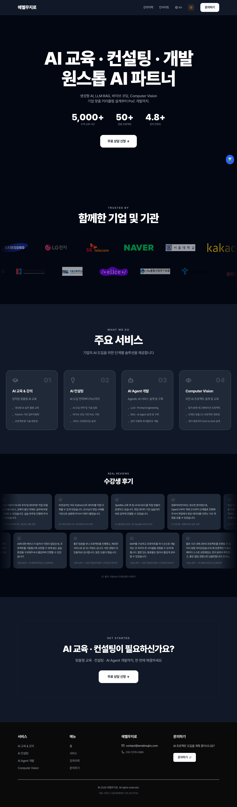
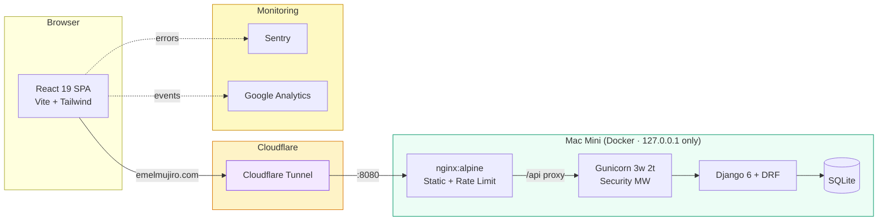

# Emelmujiro

<div align="center">

[](https://github.com/researcherhojin/emelmujiro/actions/workflows/main-ci-cd.yml)
[](https://codecov.io/gh/researcherhojin/emelmujiro)
[](LICENSE)

**[Live Site](https://emelmujiro.com)** | **[Contributing](CONTRIBUTING.md)** | **[Issues](https://github.com/researcherhojin/emelmujiro/issues)**

</div>

AI education, consulting & development — React 19 + Django 6 monorepo, self-hosted on Mac Mini via Docker + Cloudflare Tunnel.

<p align="center">
  
  
</p>

## Tech Stack

**Frontend**<br/>


**Backend**<br/>


**Testing**<br/>


**Infra**<br/>


## Getting Started

**Prerequisites**: Node >= 24, Python 3.12, [uv](https://docs.astral.sh/uv/)

```bash
git clone https://github.com/researcherhojin/emelmujiro.git
cd emelmujiro

# Install all dependencies
make install

# Backend first-time setup
cd backend && uv run python manage.py migrate && cd ..

# Start both servers (Frontend :5173 + Backend :8000)
npm run dev
```

### Useful Commands

Run from the repo root unless noted otherwise.

```bash
make test                  # All tests (frontend + backend)
make lint                  # All linters
make lint-fix              # Auto-fix lint issues
make update-test-counts    # Refresh README test-count badges from real runner output

# From frontend/
cd frontend
npm run validate           # lint + type-check + test:coverage
CI=true npm test -- --run src/components/common/__tests__/Navbar.test.tsx
npm run test:e2e           # Playwright headless (5 profiles)
npm run test:e2e:ui        # Playwright interactive UI
npm run test:e2e:debug     # Playwright debug mode

# Docker dev (optional PostgreSQL profile)
docker compose -f docker-compose.dev.yml --profile postgres up
```

## Architecture



## Key Features

- **Bilingual (i18n)** — URL-based routing: Korean default (`/contact`), English `/en/contact`
- **Teaching History** — 35 entries across 5 years (2022–2026), org type filter (4 categories)
- **Insights (Blog)** — TipTap rich text editor, slug URLs (`/insights/:slug`), image upload, IP-based likes, nested comments
- **Auth** — httpOnly cookie JWT with shared-promise refresh queue (prevents concurrent 401 cascade)
- **Testimonials** — Enterprise + 고용노동부 K-디지털 reviews, dual-row auto-scroll carousel
- **Monitoring** — Sentry error tracking + Google Analytics
- **SEO** — Search Console, sitemap, hreflang, JSON-LD structured data, SSG prerendering
- **Performance** — Vendor chunk splitting, Lighthouse CI assertions, < 10MB bundle budget
- **Security** — DOMPurify HTML sanitization, CI `${{ }}` injection prevention, uuid4 uploads, rate limiting, IP blocking
- **Privacy Policy** — 13-section bilingual page compliant with Korean PIPA Article 30
- **Tests** — Vitest (1216 tests) + Django unittest (358 tests) + Playwright E2E (5 profiles)
- **CI/CD** — GitHub Actions: lint, type-check, test, Trivy security scan, bundle size, Lighthouse, Codecov, auto-deploy via webhook

## Development

Detailed operational rules, architecture, and conventions live in [CLAUDE.md](CLAUDE.md) (auto-loaded by Claude Code). This section covers the essentials.

**Conventions**: [Conventional commits](https://www.conventionalcommits.org/) required (`feat|fix|docs|style|refactor|test|chore|deps|ci`). ESLint zero warnings. All UI strings via i18n. English comments only.

**Testing**: 100% coverage target — Vitest + Django unittest + Playwright E2E. Badge versions and test counts are CI-validated against `package.json` and actual test runner output on every PR/push.

**Security**: DOMPurify on all user HTML. CI `${{ }}` bound to `env:` only. `uuid4` upload filenames. httpOnly cookie JWT.

**Key gotchas**: `DATABASE_URL=""` for backend tests. Never `npm audit fix`. `VITE_` prefix for env vars. `minimatch>=10.2.1` override — don't remove.

## License

[GNU Affero General Public License v3.0](LICENSE)
