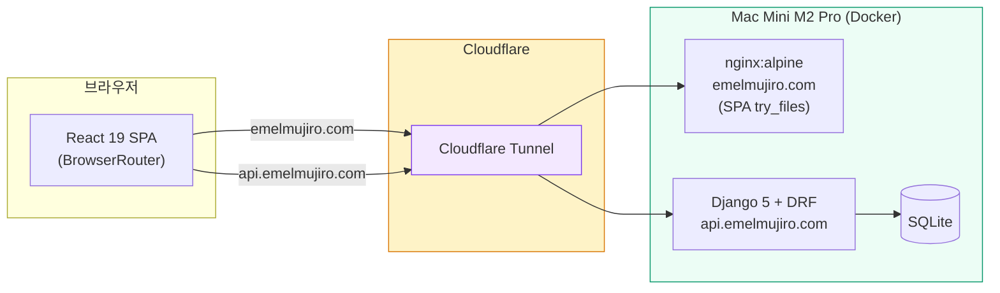

# 에멜무지로 (Emelmujiro) - AI 교육 & 컨설팅 플랫폼

<div align="center">

[](https://github.com/researcherhojin/emelmujiro/actions/workflows/main-ci-cd.yml)
[](https://www.typescriptlang.org/)
[](LICENSE)

**[Live Site](https://emelmujiro.com)** | **[Report Bug](https://github.com/researcherhojin/emelmujiro/issues)**

</div>

## 프로젝트 개요

**에멜무지로**는 2022년부터 축적한 AI 교육 노하우와 실무 프로젝트 경험을 바탕으로, 기업 맞춤형 AI 솔루션을 제공하는 전문 컨설팅 플랫폼입니다.

### 핵심 서비스

- **AI 교육 & 강의** - 기업 맞춤 AI 교육 프로그램 설계 및 운영
- **AI 컨설팅** - AI 도입 전략 수립부터 기술 자문까지
- **LLM/생성형 AI** - LLM 기반 서비스 설계 및 개발
- **Computer Vision** - 영상 처리 및 비전 AI 솔루션

## 현재 상태 (v0.9.11)

| 항목       | 상태    | 세부사항                                                   |
| ---------- | ------- | ---------------------------------------------------------- |
| **빌드**   | ✅ 정상 | Vite 8 (oxc/rolldown) 빌드                                 |
| **CI/CD**  | ✅ 정상 | GitHub Actions → Mac Mini 자동 배포 (webhook)              |
| **테스트** | ✅ 통과 | Frontend 1048 통과 (67 파일), Backend 104 통과             |
| **타입**   | ✅ 100% | TypeScript Strict Mode                                     |
| **보안**   | ✅ 안전 | 취약점 0건                                                 |
| **배포**   | ✅ 정상 | Mac Mini Docker + Cloudflare Tunnel (프론트 + 백엔드 통합) |
| **도메인** | ✅ 활성 | `emelmujiro.com` (프론트) + `api.emelmujiro.com` (백엔드)  |

## 빠른 시작

```bash
# 설치
git clone https://github.com/researcherhojin/emelmujiro.git
cd emelmujiro
npm install

# 실행
npm run dev              # 전체 실행 (Frontend + Backend)
npm run dev:clean        # 포트 정리 후 실행

# 접속
# Frontend: http://localhost:5173
# Backend: http://localhost:8000
```

### 백엔드 (별도 설치 필요)

```bash
cd backend
uv sync                  # 의존성 설치 (uv 필요)
uv run python manage.py migrate
uv run python manage.py runserver
```

## 기술 스택

**Frontend**<br/>


**Testing**<br/>


**Backend**<br/>


**Infra**<br/>


## 아키텍처

### 시스템 구성도



### 핵심 설계 결정

| 영역           | 선택                                                                | 이유                                                            |
| -------------- | ------------------------------------------------------------------- | --------------------------------------------------------------- |
| 라우팅         | `createBrowserRouter` + `React.lazy`                                | 클린 URL (`/about`), nginx `try_files` SPA 폴백, 코드 스플리팅  |
| 상태 관리      | React Context 4개 (UI, Auth, Blog, Form)                            | `useMemo`/`useCallback`으로 리렌더 방지, 외부 라이브러리 불필요 |
| API 클라이언트 | Axios + Mock/Real 자동 전환                                         | `VITE_API_URL` 유무로 결정, httpOnly 쿠키 JWT, 401 자동 갱신    |
| i18n           | `react-i18next` + URL 기반 언어 라우팅                              | `/about` (ko), `/en/about` (en), hreflang SEO                   |
| 테스트         | Vitest (1048) + Playwright E2E (5 spec)                             | 전역 모킹(`setupTests.ts`) + `renderWithProviders` 자동화       |
| 빌드           | sitemap → `tsc` → Vite 8 → Playwright 프리렌더                      | SSG: 12 정적 HTML (6 routes × 2 langs), hydration               |
| 배포           | 프론트 + 백엔드: Mac Mini (Docker + Cloudflare Tunnel)              | 전체 자체 호스팅으로 비용 최소화, nginx SPA 라우팅 200 보장     |
| Provider 계층  | `HelmetProvider > ErrorBoundary > UI > Auth > Blog > Form > Router` | 외부 라이브러리 없이 Context 기반 상태 관리                     |

### 프로젝트 구조

```
emelmujiro/
├── frontend/               # React 19 + TypeScript + Vite + Tailwind 3.x
│   ├── src/
│   │   ├── components/     # common/ home/ blog/ layout/ pages/ profile/
│   │   ├── contexts/       # React Context 4개 (UI, Auth, Blog, Form)
│   │   ├── services/       # API 클라이언트 (Mock + Real, Axios)
│   │   ├── i18n/           # 다국어 (ko/en JSON)
│   │   ├── config/         # 환경변수 (env.ts)
│   │   ├── hooks/          # useScrollAnimation, useDebounce 등
│   │   ├── data/           # 정적 데이터 (blogPosts, services, footerData)
│   │   ├── types/          # TypeScript 타입 정의
│   │   ├── utils/          # logger, sentry, webVitals
│   │   └── test-utils/     # renderWithProviders, MSW
│   ├── e2e/                # Playwright E2E 테스트 (5 spec)
│   └── vitest.config.ts
├── backend/                # Django 5 + DRF + JWT
│   ├── api/                # 단일 앱: models, views, serializers, urls
│   ├── config/             # settings.py, urls.py, asgi.py
│   └── pyproject.toml      # uv 의존성 관리
├── .github/workflows/      # main-ci-cd.yml, pr-checks.yml
├── docker-compose.yml      # 프로덕션 (backend + SQLite, PostgreSQL은 --profile postgres)
└── docker-compose.dev.yml  # 개발 (hot-reload)
```

## 주요 기능

| 기능                 | 상태           | 설명                                              |
| -------------------- | -------------- | ------------------------------------------------- |
| **홈페이지**         | ✅ 완료        | Hero, 서비스 소개, 통계, CTA                      |
| **프로필**           | ✅ 완료        | CEO 경력/학력/프로젝트 포트폴리오                 |
| **다크 모드**        | ✅ 완료        | 시스템 설정 연동                                  |
| **다국어 (i18n)**    | ✅ 완료        | URL 기반 언어 라우팅 (`/about`, `/en/about`)      |
| **반응형**           | ✅ 완료        | 모바일/태블릿/데스크톱 최적화                     |
| **SEO**              | ✅ 완료        | SSG 프리렌더, hreflang, 사이트맵, 구조화 데이터   |
| **알림 시스템**      | ✅ 백엔드 완료 | Notification 모델 + REST API + WebSocket          |
| **블로그**           | ✅ 활성        | 실제 백엔드 API 연동 (Mac Mini)                   |
| **문의하기**         | ✅ Google Form | Google Form 임베드 (자동 메일 설정 TODO)          |
| **JWT 인증**         | ✅ 완료        | httpOnly 쿠키 기반 JWT (XSS 방어 강화)            |
| **관리자 대시보드**  | ✅ 완료        | 실제 백엔드 API 연동 (통계 + 콘텐츠 관리)         |
| **Google Analytics** | ✅ 완료        | 페이지 뷰 + CTA 클릭 추적 (`VITE_GA_TRACKING_ID`) |
| **Sentry**           | ✅ 준비 완료   | ErrorBoundary 연동 완료, DSN 설정만 하면 활성화   |

## 주요 명령어

| 명령어                   | 설명                                              |
| ------------------------ | ------------------------------------------------- |
| `npm run dev`            | 개발 서버 시작                                    |
| `npm run build`          | 프로덕션 빌드 (sitemap → tsc → vite → prerender)  |
| `npm test`               | 테스트 실행 (watch)                               |
| `npm run test:run`       | 테스트 단일 실행                                  |
| `npm run test:ci`        | CI 테스트 실행                                    |
| `npm run deploy`         | GitHub Pages 수동 배포 (백업, 현재 Mac Mini 사용) |
| `npm run type-check`     | TypeScript 체크                                   |
| `npm run lint:fix`       | ESLint 자동 수정                                  |
| `npm run validate`       | lint + type-check + test                          |
| `npm run test:coverage`  | 테스트 커버리지 리포트                            |
| `npm run analyze:bundle` | 번들 크기 분석                                    |

### 백엔드 명령어

| 명령어                              | 설명                        |
| ----------------------------------- | --------------------------- |
| `uv sync`                           | 의존성 설치                 |
| `uv run python manage.py runserver` | 개발 서버                   |
| `uv run python manage.py test`      | 테스트 실행                 |
| `uv run black .`                    | 코드 포맷 (line-length 120) |
| `uv run flake8 .`                   | 린트                        |
| `uv run isort .`                    | import 정렬                 |
| `uv run ruff check .`               | 빠른 린트                   |

### Makefile 단축 명령어

| 명령어            | 설명                  |
| ----------------- | --------------------- |
| `make install`    | 전체 의존성 설치      |
| `make dev-local`  | 로컬 개발 서버        |
| `make dev-docker` | Docker 개발 환경      |
| `make test`       | 프론트/백 전체 테스트 |
| `make lint`       | 프론트/백 전체 린트   |

## 배포 가이드

<details>
<summary>Mac Mini 보안 체크리스트 (클릭하여 펼치기)</summary>

> Mac Mini를 외부에 노출하면 보안이 중요합니다. Cloudflare Tunnel을 사용하면 공유기 포트를 열 필요가 없어 공격 표면이 크게 줄어들지만, 아래 항목들을 반드시 점검해야 합니다.

#### 네트워크 보안

| 항목                    | 설정                                   | 이유                                                           |
| ----------------------- | -------------------------------------- | -------------------------------------------------------------- |
| **포트 직접 노출 금지** | 공유기 포트포워딩 사용하지 않음        | Cloudflare Tunnel만 사용하면 외부에서 Mac Mini IP를 알 수 없음 |
| **DDoS 방어**           | Cloudflare 기본 제공                   | 터널 경유 트래픽은 Cloudflare 프록시를 거침                    |
| **macOS 방화벽**        | 시스템 설정 → 네트워크 → 방화벽 → 켜기 | 불필요한 인바운드 연결 차단                                    |
| **공유기 방화벽**       | 외부 → 내부 차단 기본값 유지           | 포트포워딩 설정 절대 하지 않음                                 |

#### SSH 보안

| 항목                    | 설정                                                   | 이유                                             |
| ----------------------- | ------------------------------------------------------ | ------------------------------------------------ |
| **키 기반 인증만 허용** | `/etc/ssh/sshd_config`에서 `PasswordAuthentication no` | 브루트포스 공격 차단                             |
| **root 로그인 금지**    | `PermitRootLogin no`                                   | 기본값이지만 확인 필수                           |
| **SSH 포트**            | 기본 22번 유지 (외부 미노출이므로)                     | Cloudflare Tunnel 경유 시 SSH도 터널로 접근 가능 |

```bash
# MacBook에서 SSH 키 생성 (아직 없는 경우)
ssh-keygen -t ed25519 -C "your-email@example.com"

# Mac Mini에 공개키 복사
ssh-copy-id user@mac-mini.local

# Mac Mini에서 비밀번호 로그인 비활성화
sudo sed -i '' 's/#PasswordAuthentication yes/PasswordAuthentication no/' /etc/ssh/sshd_config
sudo launchctl stop com.openssh.sshd
sudo launchctl start com.openssh.sshd
```

#### 애플리케이션 보안

| 항목                     | 설정                                    | 이유                                   |
| ------------------------ | --------------------------------------- | -------------------------------------- |
| **SECRET_KEY**           | `secrets.token_urlsafe(50)` 이상        | 약한 키는 세션 위조/CSRF 우회 가능     |
| **DEBUG=False**          | 프로덕션 필수                           | True일 경우 스택 트레이스, 설정값 노출 |
| **ALLOWED_HOSTS**        | `api.emelmujiro.com` 만 허용            | Host 헤더 공격 방지                    |
| **CORS**                 | `emelmujiro.com` 만 허용                | 임의 도메인에서 API 호출 차단          |
| **CSRF_TRUSTED_ORIGINS** | CORS와 동일                             | Django CSRF 검증                       |
| **Rate Limiting**        | 이미 구현됨 (anon 100/hr, contact 5/hr) | 무차별 대입 방지                       |
| **HTTPS 강제**           | Cloudflare Tunnel이 자동 처리           | 평문 통신 차단                         |

#### Docker 보안

| 항목                  | 설정                                                                | 이유                         |
| --------------------- | ------------------------------------------------------------------- | ---------------------------- |
| **SQLite 파일 보호**  | Docker 볼륨(`sqlite_data`)에 저장, 컨테이너 외부에서 직접 접근 불가 | DB 파일 변조 방지            |
| **non-root 컨테이너** | Dockerfile에서 `USER appuser` (이미 적용됨)                         | 컨테이너 탈출 시 피해 최소화 |
| **이미지 업데이트**   | 정기적으로 `docker compose pull && docker compose up -d`            | 베이스 이미지 보안 패치      |
| **볼륨 백업**         | `sqlite_data` 볼륨 정기 백업                                        | 데이터 유실 방지             |

```bash
# SQLite 백업 (cron 등록 권장) — 파일 하나 복사하면 끝
docker cp emelmujiro-backend:/app/data/db.sqlite3 ~/backups/emelmujiro_$(date +%Y%m%d).sqlite3
```

#### 물리/운영 보안

| 항목                     | 설정                                                  | 이유                            |
| ------------------------ | ----------------------------------------------------- | ------------------------------- |
| **UPS (무정전전원장치)** | 소형 UPS 연결                                         | 정전 시 DB 손상 방지, 안전 종료 |
| **자동 업데이트**        | macOS 자동 업데이트 활성화                            | OS 보안 패치                    |
| **FileVault**            | 시스템 설정 → 개인 정보 보호 및 보안 → FileVault 켜기 | 디스크 암호화 (도난 대비)       |
| **자동 잠금**            | 화면 보호기 + 즉시 암호 요구                          | 물리적 접근 차단                |

</details>

<details>
<summary>개발/배포 워크플로우 (클릭하여 펼치기)</summary>

> **원칙**: 코드 작업은 MacBook에서, Mac Mini는 배포만 담당. Mac Mini에서 직접 코드를 수정하지 않음.

```
MacBook (개발)                     GitHub Actions                Mac Mini (배포)
┌─────────────────────┐          ┌──────────────┐          ┌───────────────────────┐
│ 코드 작성/테스트     │──push──→│ CI 테스트/빌드 │──webhook→│ auto-deploy.sh        │
│                     │          │              │          │ (git pull → build →   │
│                     │          │              │          │  docker rebuild)      │
└─────────────────────┘          └──────────────┘          └───────────────────────┘
                                                                    │
                                                                    ▼
                                                            Cloudflare Tunnel
                                                            ├── emelmujiro.com → nginx:8080
                                                            └── api.emelmujiro.com → Django:8000
```

**배포 과정:**

1. MacBook에서 코드 작성, 테스트, `git push`
2. GitHub Actions CI 통과 → Mac Mini webhook으로 자동 배포 (`scripts/auto-deploy.sh`)
3. 수동 배포가 필요한 경우:

```bash
# 프론트엔드 업데이트 (nginx가 build/ 볼륨 마운트 → 컨테이너 재시작 불필요)
cd ~/workspace/emelmujiro/frontend
git pull && VITE_API_URL=https://api.emelmujiro.com/api npm run build

# 백엔드 업데이트 (코드 변경 시)
cd ~/workspace/emelmujiro
docker compose up -d --build
```

</details>

<details>
<summary>Mac Mini 배포 가이드 (클릭하여 펼치기)</summary>

### Phase 1: Mac Mini 기본 세팅

```bash
# 1. SSH 활성화
# 시스템 설정 → 일반 → 공유 → 원격 로그인 켜기

# 2. Docker Desktop 설치
# https://www.docker.com/products/docker-desktop/ 에서 Apple Silicon 버전 다운로드

# 3. 프로젝트 클론
git clone https://github.com/researcherhojin/emelmujiro.git
cd emelmujiro

# 4. 환경변수 설정
cp backend/.env.example backend/.env
# backend/.env 편집 — SECRET_KEY 생성, ALLOWED_HOSTS 등 설정

# 5. Docker Compose 실행 (SQLite — DB 컨테이너 불필요)
SECRET_KEY=$(python3 -c "import secrets; print(secrets.token_urlsafe(50))") \
docker compose up -d

# 6. DB 마이그레이션 + 관리자 계정
docker exec emelmujiro-backend uv run python manage.py migrate
docker exec -it emelmujiro-backend uv run python manage.py createsuperuser

# 7. 동작 확인
curl http://localhost:8000/api/health/

# 참고: PostgreSQL이 필요해지면 프로필로 추가 가능
# docker compose --profile postgres up -d
# DATABASE_URL=postgresql://postgres:postgres@db:5432/emelmujiro
```

### Phase 2: Cloudflare Tunnel (외부 접근)

```bash
# 1. cloudflared 설치
brew install cloudflared

# 2. Cloudflare 로그인
cloudflared tunnel login

# 3. 터널 생성
cloudflared tunnel create emelmujiro

# 4. DNS 연결
cloudflared tunnel route dns emelmujiro api.emelmujiro.com
cloudflared tunnel route dns emelmujiro emelmujiro.com

# 5. 설정 파일 (~/.cloudflared/config.yml)
cat > ~/.cloudflared/config.yml << 'EOF'
tunnel: <터널 ID>
credentials-file: ~/.cloudflared/<터널 ID>.json

ingress:
  - hostname: api.emelmujiro.com
    service: http://localhost:8000
  - hostname: emelmujiro.com
    service: http://localhost:8080
  - service: http_status:404
EOF

# 6. 시스템 config에 복사
sudo cp ~/.cloudflared/config.yml /etc/cloudflared/config.yml

# 7. 서비스 등록 (자동 시작)
sudo cloudflared service install

# 8. 터널 재시작
sudo launchctl kickstart -k system/com.cloudflare.cloudflared
```

### Phase 3: 프론트엔드 배포 (nginx)

```bash
# 1. 프론트엔드 빌드
cd ~/workspace/emelmujiro/frontend
VITE_API_URL=https://api.emelmujiro.com/api npm run build

# 2. nginx 컨테이너 시작 (build/ 볼륨 마운트)
docker run -d \
  --name emelmujiro-frontend \
  --restart unless-stopped \
  --network emelmujiro_emelmujiro-network \
  --network-alias frontend \
  -p 8080:80 \
  -v $(pwd)/build:/usr/share/nginx/html:ro \
  -v $(pwd)/nginx.conf:/etc/nginx/nginx.conf:ro \
  nginx:alpine

# 3. 확인 (모든 SPA 라우트가 200 반환)
curl -s -o /dev/null -w "%{http_code}" https://emelmujiro.com/about  # → 200
```

> **업데이트 시**: `git pull && VITE_API_URL=https://api.emelmujiro.com/api npm run build`만 실행하면 nginx가 즉시 반영 (컨테이너 재시작 불필요)

### Phase 4: 운영

```bash
# Docker 자동 시작 (Docker Desktop → Settings → General → Start Docker Desktop when you sign in)

# UPS(무정전전원장치) 연결 권장 — 정전 시 안전 종료

# 상태 확인
docker ps  # emelmujiro-backend, emelmujiro-frontend 확인
curl https://api.emelmujiro.com/api/health/
curl -s -o /dev/null -w "%{http_code}" https://emelmujiro.com/about

# MacBook에서 접근 (같은 네트워크)
# http://mac-mini.local:8080/ (프론트엔드)
# http://mac-mini.local:8000/api/health/ (백엔드)
```

### 커스텀 도메인 (✅ 완료)

- Cloudflare Tunnel DNS: `emelmujiro.com` → Mac Mini nginx (`:8080`)
- Cloudflare Tunnel DNS: `api.emelmujiro.com` → Mac Mini Django (`:8000`)
- `frontend/src/utils/constants.ts` → `SITE_URL = 'https://emelmujiro.com'`
- `frontend/public/CNAME` → `emelmujiro.com` (GitHub Pages 백업용)
- `vite.config.ts` → `base: '/'`

</details>

## 라이선스

Apache License 2.0 — 자세한 내용은 [LICENSE](LICENSE) 파일을 참조하세요.

---

**문의**: [Issues](https://github.com/researcherhojin/emelmujiro/issues) | **사이트**: [emelmujiro.com](https://emelmujiro.com)
