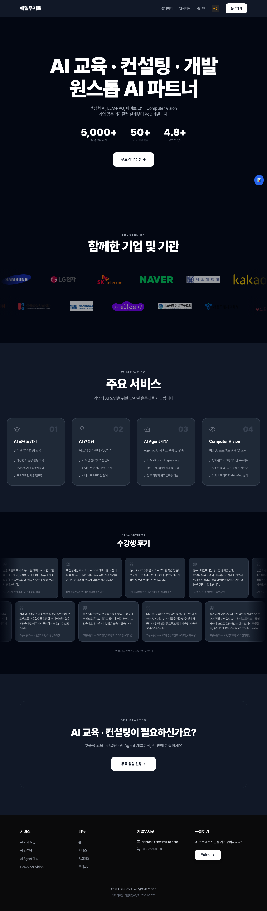
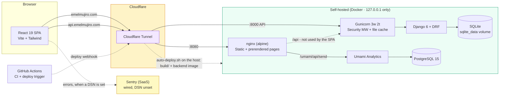

# Emelmujiro

<div align="center">

[](https://github.com/researcherhojin/emelmujiro/actions/workflows/main-ci-cd.yml)
[](https://codecov.io/gh/researcherhojin/emelmujiro)
[](LICENSE)

**[Live Site](https://emelmujiro.com)** | **[Contributing](CONTRIBUTING.md)** | **[Changelog](CHANGELOG.md)** | **[Issues](https://github.com/researcherhojin/emelmujiro/issues)**

</div>

AI education, consulting & development — React 19 + Django 6 monorepo, self-hosted via Docker behind a Cloudflare Tunnel.

<p align="center">
  
  
</p>

## Tech Stack

**Frontend**<br/>


**Backend**<br/>


**Testing**<br/>


**Infra**<br/>


## Getting Started

**Prerequisites**: Node >= 24, Python 3.12, [uv](https://docs.astral.sh/uv/)

```bash
git clone https://github.com/researcherhojin/emelmujiro.git
cd emelmujiro

make install                                              # npm install + uv sync --extra dev
cd backend && uv run python manage.py migrate && cd ..    # First-time DB setup
npm run dev                                               # Frontend :5173 + Backend :8000
```

**Fresh macOS machine?** `make setup-dev-machine` handles the full bootstrap (brew deps, `make install`, local `.env`, Django migrations). Re-runnable health check: `make verify-setup`.

Operational rules, architecture details, and conventions: [CLAUDE.md](CLAUDE.md).

### Useful Commands

Run from the repo root unless noted otherwise.

```bash
make test                  # All tests (frontend + backend)
make lint                  # All linters
make lint-fix              # Auto-fix lint issues
make update-test-counts    # Regenerate README test counts locally (CI auto-syncs on main)
make health                # Docker health diagnostic (containers, resources, endpoints)

# From frontend/: npm run validate (lint + type-check + coverage) and npm run test:e2e (Playwright, 5 profiles).
# Single-test, serve:build, bundle-analysis and route-check commands are listed once, in CLAUDE.md → Commands.

# Docker dev (optional PostgreSQL profile)
docker compose -f docker-compose.dev.yml --profile postgres up
```

## Architecture


```mermaid
graph LR
    subgraph Client["Browser"]
        React["React 19 SPA\nVite + Tailwind"]
    end

    subgraph CF["Cloudflare"]
        Tunnel["Cloudflare Tunnel"]
    end

    subgraph Host["Self-hosted (Docker · 127.0.0.1 only)"]
        Nginx["nginx (alpine)\nStatic + prerendered pages"]
        Gunicorn["Gunicorn 3w 2t\nSecurity MW + file cache"]
        DRF["Django 6 + DRF"]
        DB[(SQLite\nsqlite_data volume)]
        Umami["Umami Analytics"]
        UmamiDB[(PostgreSQL 15)]
    end

    Sentry["Sentry (SaaS)\nwired, DSN unset"]
    GHA["GitHub Actions\nCI + deploy trigger"]

    React -->|emelmujiro.com| Tunnel
    React -->|api.emelmujiro.com| Tunnel
    Tunnel -->|:8080| Nginx
    Tunnel -->|:8000 API| Gunicorn
    Nginx -.->|/api - not used by the SPA| Gunicorn
    Nginx -->|/umami/api/send| Umami
    Gunicorn --> DRF
    DRF --> DB
    Umami --> UmamiDB
    React -.->|errors, when a DSN is set| Sentry
    GHA -.->|deploy webhook| Tunnel
    Tunnel -.->|auto-deploy.sh on the host: build/ + backend image| Host

    style Tunnel fill:#F3E8FF,stroke:#7C3AED
    style Host fill:#ECFDF5,stroke:#059669
    style CF fill:#FEF3C7,stroke:#D97706
    style Sentry fill:#FEF9C3,stroke:#CA8A04
```

## Key Features

- **Bilingual (i18n)** — URL-based routing: Korean default (`/contact`), English `/en/contact`
- **Teaching History** — 45 entries across 5 years (2022–2026), org type filter (4 categories)
- **Insights (Blog)** — TipTap rich text editor, slug URLs (`/insights/:slug`), image upload, IP-based likes, nested comments
- **Auth** — httpOnly cookie JWT with shared-promise refresh queue (prevents concurrent 401 cascade)
- **Testimonials** — Enterprise + 고용노동부 K-디지털 reviews, dual-row auto-scroll carousel
- **Monitoring** — Umami analytics (self-hosted, zero external scripts) + Docker health check cron. Sentry is wired behind a lazy-loaded shim but inactive: `VITE_SENTRY_DSN` is unset in production, so `initSentry()` returns early and no DSN ships in the bundle
- **SEO** — Search Console, sitemap, hreflang, JSON-LD structured data, SSG prerendering
- **Performance** — Vendor chunk splitting, Lighthouse CI assertions, < 10MB bundle budget
- **Security** — DOMPurify HTML sanitization, CI `${{ }}` injection prevention, uuid4 uploads, rate limiting, IP blocking
- **Privacy Policy** — 13-section bilingual page compliant with Korean PIPA Article 30
- **Tests** — Vitest (1233 tests) + Django unittest (373 tests) + Playwright E2E (5 profiles)
- **CI/CD** — GitHub Actions: lint, type-check, test, Trivy security scan, bundle size, Lighthouse, Codecov, auto-deploy via webhook, plus self-healing guards that redeploy on production drift and alarm when a commit reaches `main` untested

## License

[GNU Affero General Public License v3.0](LICENSE)
